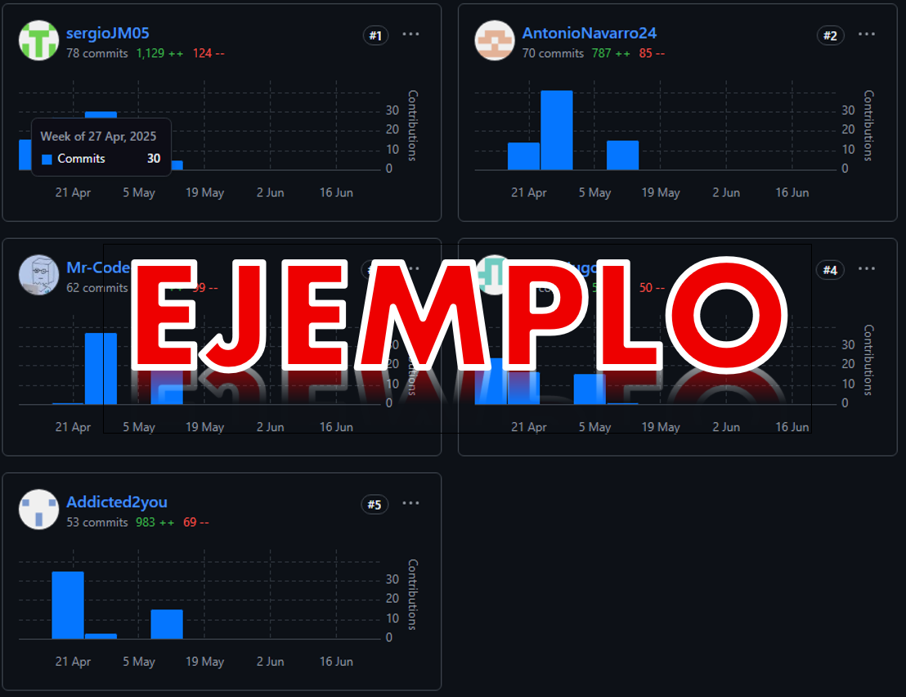
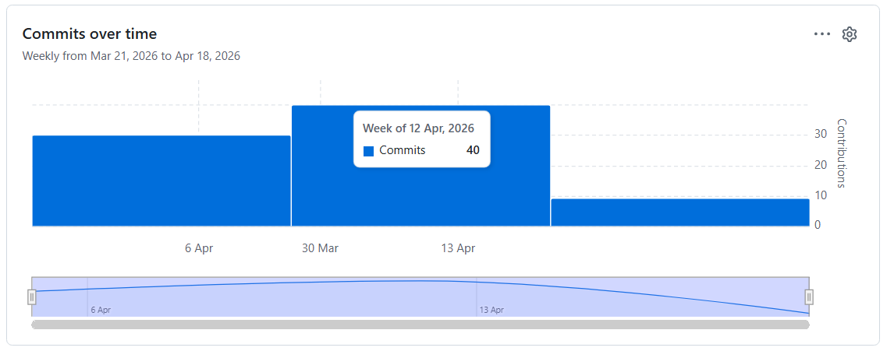

<!--Titulo principal-->
<h1 align="center">Informe de Trabajo Final</h1>

<!--Nombre de la universidad-->
<h3 align="center"> Universidad Peruana de Ciencias Aplicadas</h3>

<!--Carrera-->
<h3 align="center"> Ingeniería de software - 2610</h3>

<!--Logo de  la universidad-->

    </img>

<!-- Código del curso -->
<h4 align="center"> Código del curso: 1ASI0572</h4>

<!--Nombre del curso-->
<h4 align="center"> Nombre del curso: Desarrollo de Soluciones IOT</h4>

<!--NRC del curso-->
<h4 align="center">NRC: 6776</h4>

    <!--Docente-->
    <strong>Docente: </strong>Marco Antonio Leon Baca 
    <!--Startup-->
    <strong>Startup: </strong>Café Metrix 
    <!--Producto-->
    <strong>Producto: </strong>Café Lab 

<!--Integrantes del grupo-->

    <strong>Integrantes del grupo: </strong> 
    <ul align="left" style="margin-left: 10%;">
        <li>Donayre Alvarez, Adrian Ricardo - U202310187</li>
        <li>Fernandez Camayo, Carlos Fredy - U202320083</li>
        <li>Julca Minaya, Sergio Gino - U202318274</li>
        <li>Roman Cruz, Natalia Bertha - U202310148 </li>
        <li>Yum Gonzales, Jorge Suin - U202210838</li>
    </ul>

<!--Ciclo-->

Abril de 2026

<!-- Registro de versiones -->
# Registro de versiones del informe

| Versión | Fecha       | Autor                                | Descripción de Modificación                                                        |
|---------|-------------|--------------------------------------|------------------------------------------------------------------------------------|
| 1.0     | 01/04/2026  | Julca Minaya, Sergio Gino            | Creación del documento, estructura del informe y carátula                          |
| 1.1     | 01/04/2026  | Julca Minaya, Sergio Gino            | Creación del registro de versiones y project collaboration insights                |
| 1.2     | 02/04/2026  | Julca Minaya, Sergio Gino            | Refactorización de tabla de contenido y redirecciones                              |
| 1.3     | 02/04/2026  | Julca Minaya, Sergio Gino            | Actualización de lean ux hypothesis statements y canvas                            |
| 1.4     | 03/04/2026  | Julca Minaya, Sergio Gino            | Validación de segmentos objetivos                                                  |
| 1.5     | 03/04/2026  | Roman Cruz, Natalia Bertha           | Descripción detallada de la startup y recopilación de perfiles de los integrantes  |
| 1.6     | 04/04/2026  | Roman Cruz, Natalia Bertha           | Recopilación de antecendentes y problemáticas                                      |
| 1.7     | 04/04/2026  | Roman Cruz, Natalia Bertha           | Optimización de lean ux problem statements y assumptions                           |
| 1.8     | 05/04/2026  | Fernandez Camayo, Carlos Fredy       | Análisis e invetigación de competitividad                                          |
| 1.9     | 05/04/2026  | Fernandez Camayo, Carlos Fredy       | Creación de estrategias y tácticas frente a competidores                           |
| 1.10    | 06/04/2026  | Donayre Alvarez, Adrian Ricardo      | Diseño de entrevistas                                                              |
| 1.11    | 06/04/2026  | Donayre, Julca, Fernandez            | Registro y análisis de entrevistas.                                                |
| 1.12    | 07/04/2026  | Fernandez Camayo, Carlos Fredy       | Actualización de user personas                                                     |
| 1.13    | 07/04/2026  | Fernandez Camayo, Carlos Fredy       | Evaluación de user task matrix                                                     |
| 1.14    | 08/04/2026  | Yum Gonzales, Jorge Suin             | Actualización de user journey mapping                                              |
| 1.15    | 08/04/2026  | Yum Gonzales, Jorge Suin             | Evaluación del empathy mapping                                                     |
| 1.16    | 09/04/2026  | Roman, Yum, Donayre                  | Creación de big picture storming                                                   |
| 1.17    | 09/04/2026  | Donayre Alvarez, Adrian Ricardo      | Validación del ubiquitous language                                                 |
| 1.18    | 10/04/2026  | Roman, Yum                           | Revisión de user stories                                                           |
| 1.19    | 10/04/2026  | Yum Gonzales, Jorge Suin             | Validación del impact mapping                                                      |
| 1.20    | 11/04/2026  | Yum Gonzales, Jorge Suin             | Actualización del product backlog                                                  |

# Project Report Collaboration Insights
En esta sección se presenta la url del project report de GitHub en la organización del equipo. Asimismo, se evidencia el registro de commits y colaboración en github para cada desarrollo planteado en su respectivo repositorio; donde cada integrante demuestra su participación activa en el presente proyecto.

Link del project report: [https://github.com/CafeLab-IoT-Project](https://github.com/CafeLab-IoT-Project)

<!--Explicacion por integrante acerca de como se ha desarrollado las actividades de elaboración de informe, capturas de imagen analitico y commits en el informe
Expansión con descripciones y evidencias en cada entrega COHERENCIA CON EL REGISTRO DE VERSIOENS DE INFORME-->
<table>
  <tr>
    <td colSpan="3" align="center" style="font-weight: bold; font-size: 20px;">Evidencias y comentarios de la tb1</td>
  </tr>
  <tr>
    <td width="10%"><strong>Integrante</strong></td>
    <td width="50%"><strong>Descripción de actividades</strong></td>
    <td width="40%"><strong>Evidencias</strong></td>
  </tr>
  <tr>
    <td><strong>Donayre Alvarez, Adrian Ricardo</strong></td>
    <td>Participé activamente en la elaboración del informe, contribuyendo a la redacción de secciones clave como el diseño de entrevistas, el análisis de entrevistas y la validación del ubiquitous language. Además, colaboré en la revisión y optimización de los lean ux problem statements y assumptions para asegurar que reflejaran adecuadamente los desafíos y oportunidades identificados en nuestro proyecto.</td>
    <td></td>
  </tr>
  <tr>
    <td><strong>Roman Cruz, Natalia Bertha</strong></td>
    <td>Contribuí significativamente a la descripción detallada de la startup y a la recopilación de perfiles de los integrantes del equipo. Además, me encargué de recopilar antecedentes y problemáticas relevantes para nuestro proyecto, lo que nos permitió tener una base sólida para el desarrollo de nuestras soluciones.</td>
    <td></td>
  </tr>
  <tr>
    <td><strong>Jyum Gonzales, Jorge Suin</strong></td>
    <td>Me enfoqué en la actualización de la user journey mapping y en la validación del impact mapping. Trabajé en estrecha colaboración con el equipo para asegurar que estas herramientas reflejaran de manera precisa las experiencias y necesidades de nuestros usuarios, lo que nos permitió diseñar soluciones más efectivas.</td>
    <td></td>
  </tr>
  <tr>
    <td><strong>Fernandez Camayo, Carlos Fredy</strong></td>
    <td>Realicé un análisis exhaustivo de la competitividad en el mercado, lo que nos permitió identificar oportunidades y desafíos clave para nuestro proyecto. Además, colaboré en la creación de estrategias y tácticas frente a competidores, asegurando que nuestras soluciones fueran diferenciadoras y competitivas.</td>
    <td></td>
  </tr>
  <tr>
    <td><strong>Julca Minaya, Sergio Gino</strong></td>
    <td>Contribuí a la creación del registro de versiones del informe, asegurando que cada modificación estuviera documentada de manera clara y precisa. Además, participé en la refactorización de la tabla de contenido y en la optimización de los lean ux hypothesis statements y canvas para mejorar la claridad y coherencia del informe.</td>
    <td></td>
  </tr>
  <tr>
    <td><strong>Conclusión</strong></td>
    <td colspan="2">En general, todos los integrantes del equipo han demostrado una participación activa y comprometida en la elaboración del informe, contribuyendo con sus habilidades y conocimientos para asegurar que el documento refleje de manera precisa y completa el desarrollo de nuestro proyecto. La colaboración efectiva entre los miembros del equipo ha sido fundamental para el éxito de esta etapa del proyecto.</td>
  </tr>
    <tr>
    <td><strong>Evidencia</strong></td>
    <td colspan="2">
    
    </td>
  </tr>
</table>

<!--ÍNDICE-->
# Contenido 
[Student Outcome](#student-outcome)

[Capítulo I: Introducción](#capítulo-i-introducción)
- [Registro de versiones del informe](#registro-de-versiones-del-informe)
- [Project Report Collaboration Insights](#project-report-collaboration-insights)
- [Contenido](#contenido)
- [Student Outcome](#student-outcome)
- [Capítulo I: Introducción](#capítulo-i-introducción)
  - [1.1. Startup Profile](#11-startup-profile)
    - [1.1.1. Descripción de la Startup](#111-descripción-de-la-startup)
      - [Logo, isotipo y logotipo de Café Lab:](#logo-isotipo-y-logotipo-de-café-lab)
    - [1.1.2. Perfiles de integrantes del equipo](#112-perfiles-de-integrantes-del-equipo)
  - [1.2. Solution Profile](#12-solution-profile)
    - [1.2.1 Antecedentes y problemática](#121-antecedentes-y-problemática)
    - [1.2.2 Lean UX Process](#122-lean-ux-process)
      - [1.2.2.1. Lean UX Problem Statements](#1221-lean-ux-problem-statements)
      - [1.2.2.2. Lean UX Assumptions](#1222-lean-ux-assumptions)
      - [1.2.2.3. Lean UX Hypothesis Statements](#1223-lean-ux-hypothesis-statements)
      - [1.2.2.4. Lean UX Canvas](#1224-lean-ux-canvas)
  - [1.3. Segmentos objetivos](#13-segmentos-objetivos)
- [Capítulo II: Requirements Elicitation \& Analysis](#capítulo-ii-requirements-elicitation--analysis)
  - [2.1. Competidores](#21-competidores)
    - [2.1.1. Análisis competitivo](#211-análisis-competitivo)
      - [Competitive Analysis](#competitive-analysis)
    - [2.1.2. Estrategias y tácticas frente a competidores](#212-estrategias-y-tácticas-frente-a-competidores)
      - [Afrontando las fortalezas de nuestros competidores:](#afrontando-las-fortalezas-de-nuestros-competidores)
      - [Estrategias](#estrategias)
      - [Tácticas](#tácticas)
      - [Afrontando las debilidades de nuestros competidores:](#afrontando-las-debilidades-de-nuestros-competidores)
      - [Estrategias](#estrategias-1)
      - [Tácticas](#tácticas-1)
      - [Afrontando las oportunidades de nuestros competidores:](#afrontando-las-oportunidades-de-nuestros-competidores)
      - [Estrategias](#estrategias-2)
      - [Tácticas](#tácticas-2)
      - [Afrontando las amenazas de nuestros competidores:](#afrontando-las-amenazas-de-nuestros-competidores)
      - [Estrategias](#estrategias-3)
      - [Tácticas](#tácticas-3)
  - [2.2. Entrevistas](#22-entrevistas)
    - [2.2.1. Diseño de entrevistas](#221-diseño-de-entrevistas)
      - [Preguntas dirigidas a baristas profesionales:](#preguntas-dirigidas-a-baristas-profesionales)
      - [Preguntas dirigidas a dueños/administradores de cafeterías de especialidad:](#preguntas-dirigidas-a-dueñosadministradores-de-cafeterías-de-especialidad)
    - [2.2.2. Registro de entrevistas](#222-registro-de-entrevistas)
      - [Entrevistas a baristas profesionales](#entrevistas-a-baristas-profesionales)
      - [Entrevistas a dueños o administradores de cafeterías de especialidad](#entrevistas-a-dueños-o-administradores-de-cafeterías-de-especialidad)
    - [2.2.3. Análisis de entrevistas](#223-análisis-de-entrevistas)
  - [2.3. Needfinding](#23-needfinding)
    - [2.3.1. User Personas](#231-user-personas)
    - [2.3.2. User Task Matrix](#232-user-task-matrix)
      - [User Task Matrix](#user-task-matrix)
    - [2.3.3 User Journey Mapping](#233-user-journey-mapping)
    - [2.3.4. Empathy Mapping](#234-empathy-mapping)
  - [2.4. Big Picture EventStorming](#24-big-picture-eventstorming)
  - [2.5. Ubiquitous Language](#25-ubiquitous-language)
- [Capítulo III: Requirements Specification](#capítulo-iii-requirements-specification)
  - [3.1. User Stories](#31-user-stories)
  - [3.2. Impact Mapping.](#32-impact-mapping)
    - [3.2.1. Mapa de impacto de Freddy, el dueño de cafeteria.](#321-mapa-de-impacto-de-freddy-el-dueño-de-cafeteria)
    - [3.2.2. Mapa de impacto de Valeria, barrista.](#322-mapa-de-impacto-de-valeria-barrista)
  - [3.3. Product Backlog](#33-product-backlog)
- [Capítulo IV: Solution Software Design](#capítulo-iv-solution-software-design)
  - [4.1. Strategic-Level Domain-Driven Design](#41-strategic-level-domain-driven-design)
    - [4.1.1. Design-Level EventStorming](#411-design-level-eventstorming)
      - [4.1.1.1. Candidate Context Discovery](#4111-candidate-context-discovery)
      - [4.1.1.2. Domain Message Flows Modeling](#4112-domain-message-flows-modeling)
      - [4.1.1.3. Bounded Context Canvases](#4113-bounded-context-canvases)
    - [4.1.2. Context Mapping](#412-context-mapping)
    - [4.1.3. Software Architecture](#413-software-architecture)
      - [4.1.3.1. Software Architecture System Landscape Diagram](#4131-software-architecture-system-landscape-diagram)
      - [4.1.3.2. Software Architecture Context Level Diagrams](#4132-software-architecture-context-level-diagrams)
      - [4.1.3.3. Software Architecture Container Level Diagrams](#4133-software-architecture-container-level-diagrams)
      - [4.1.3.4. Software Architecture Deployment Diagrams](#4134-software-architecture-deployment-diagrams)
  - [4.2. Tactical-Level Domain-Driven Design](#42-tactical-level-domain-driven-design)
    - [4.2.1. Bounded Context: IAM](#421-bounded-context-iam)
      - [4.2.1.1. Domain Layer](#4211-domain-layer)
      - [4.2.1.2. Interface Layer](#4212-interface-layer)
      - [4.2.1.3. Application Layer](#4213-application-layer)
      - [4.2.1.4. Infrastructure Layer](#4214-infrastructure-layer)
      - [4.2.1.5.  Bounded Context Software Architecture Component Level Diagrams](#4215--bounded-context-software-architecture-component-level-diagrams)
      - [4.2.1.6. Bounded Context Software Architecture Code Level Diagrams](#4216-bounded-context-software-architecture-code-level-diagrams)
        - [4.2.1.6.1. Bounded Context Domain Layer Class Diagrams](#42161-bounded-context-domain-layer-class-diagrams)
        - [4.2.1.6.2. Bounded Context Database Design Diagram](#42162-bounded-context-database-design-diagram)
    - [4.2.2. Bounded Context: Management](#422-bounded-context-management)
      - [4.2.2.1. Domain Layer](#4221-domain-layer)
      - [4.2.2.2. Interface Layer](#4222-interface-layer)
      - [4.2.2.3. Application Layer](#4223-application-layer)
      - [4.2.2.4. Infrastructure Layer](#4224-infrastructure-layer)
      - [4.2.2.5.  Bounded Context Software Architecture Component Level Diagrams](#4225--bounded-context-software-architecture-component-level-diagrams)
      - [4.2.2.6. Bounded Context Software Architecture Code Level Diagrams](#4226-bounded-context-software-architecture-code-level-diagrams)
        - [4.2.2.6.1. Bounded Context Domain Layer Class Diagrams](#42261-bounded-context-domain-layer-class-diagrams)
        - [4.2.2.6.2. Bounded Context Database Design Diagram](#42262-bounded-context-database-design-diagram)
    - [4.2.3. Bounded Context: Costing](#423-bounded-context-costing)
      - [4.2.3.1. Domain Layer](#4231-domain-layer)
      - [4.2.3.2. Interface Layer](#4232-interface-layer)
      - [4.2.3.3. Application Layer](#4233-application-layer)
      - [4.2.3.4. Infrastructure Layer](#4234-infrastructure-layer)
      - [4.2.3.5.  Bounded Context Software Architecture Component Level Diagrams](#4235--bounded-context-software-architecture-component-level-diagrams)
      - [4.2.3.6. Bounded Context Software Architecture Code Level Diagrams](#4236-bounded-context-software-architecture-code-level-diagrams)
        - [4.2.3.6.1. Bounded Context Domain Layer Class Diagrams](#42361-bounded-context-domain-layer-class-diagrams)
        - [4.2.3.6.2. Bounded Context Database Design Diagram](#42362-bounded-context-database-design-diagram)
    - [4.2.4. Bounded Context: Procedure](#424-bounded-context-procedure)
      - [4.2.4.1. Domain Layer](#4241-domain-layer)
        - [Aggregates](#aggregates)
        - [Value Objects](#value-objects)
        - [Commands](#commands)
        - [Queries](#queries)
      - [4.2.4.2. Interface Layer](#4242-interface-layer)
        - [Controllers](#controllers)
        - [Resources](#resources)
        - [Transformers](#transformers)
      - [4.2.4.3. Application Layer](#4243-application-layer)
        - [Command Services](#command-services)
        - [Query Services](#query-services)
      - [4.2.4.4. Infrastructure Layer](#4244-infrastructure-layer)
        - [Repositories](#repositories)
      - [4.2.4.5.  Bounded Context Software Architecture Component Level Diagrams](#4245--bounded-context-software-architecture-component-level-diagrams)
      - [4.2.4.6. Bounded Context Software Architecture Code Level Diagrams](#4246-bounded-context-software-architecture-code-level-diagrams)
        - [4.2.4.6.1. Bounded Context Domain Layer Class Diagrams](#42461-bounded-context-domain-layer-class-diagrams)
        - [4.2.4.6.2. Bounded Context Database Design Diagram](#42462-bounded-context-database-design-diagram)
    - [4.2.5. Bounded Context: IoT Monitoring](#425-bounded-context-iot-monitoring)
      - [4.2.5.1. Domain Layer](#4251-domain-layer)
        - [Aggregates (`domain/model/aggregates`)](#aggregates-domainmodelaggregates)
        - [Commands (`domain/model/commands`)](#commands-domainmodelcommands)
        - [Queries (`domain/model/queries`)](#queries-domainmodelqueries)
        - [Value Objects (`domain/model/valueobjects`)](#value-objects-domainmodelvalueobjects)
        - [Services (`domain/services`)](#services-domainservices)
      - [4.2.5.2. Interface Layer](#4252-interface-layer)
        - [Controllers (`interfaces.rest`)](#controllers-interfacesrest)
      - [4.2.5.3. Application Layer](#4253-application-layer)
        - [Command Services (`application.internal/commandservices`)](#command-services-applicationinternalcommandservices)
        - [Query Services (`application.internal/queryservices`)](#query-services-applicationinternalqueryservices)
      - [4.2.5.4. Infrastructure Layer](#4254-infrastructure-layer)
        - [Repositories (`infrastructure/persistence.jpa.repositories`)](#repositories-infrastructurepersistencejparepositories)
        - [External Services (`infrastructure/external`)](#external-services-infrastructureexternal)
      - [4.2.5.5.  Bounded Context Software Architecture Component Level Diagrams](#4255--bounded-context-software-architecture-component-level-diagrams)
      - [4.2.5.6. Bounded Context Software Architecture Code Level Diagrams](#4256-bounded-context-software-architecture-code-level-diagrams)
        - [4.2.5.6.1. Bounded Context Domain Layer Class Diagrams](#42561-bounded-context-domain-layer-class-diagrams)
        - [4.2.5.6.2. Bounded Context Database Design Diagram](#42562-bounded-context-database-design-diagram)
- [Conclusiones](#conclusiones)
- [Bibliografía](#bibliografía)
- [Anexos](#anexos)

[Conclusiones](#conclusiones)  
[Bibliografía](#bibliografia)  
[Anexos](#anexos)  

# Student Outcome
<table>
  <tr>
    <td><strong>Criterio específico</strong></td>
    <td><strong>Acciones realizadas</strong></td>
    <td><strong>Conclusiones</strong></td>
  </tr>
  <tr>
    <td>Trabaja en equipo para proporcionar liderazgo en forma conjunta</td>
    <td>
      <strong>Donayre Alvarez, Adrian Ricardo </strong> <strong>TB1:</strong>
      lorem ipsum dolor sit amet, consectetur adipiscing elit.
       
      <strong>Fernandez Camayo, Carlos Fredy </strong> <strong>TB1:</strong>
      lorem ipsum dolor sit amet, consectetur adipiscing elit.
       
      <strong>Julca Minaya, Sergio Gino </strong> <strong>TB1:</strong>
      Desempeñó un papel clave en el tracking de las tareas para el equipo generando gran impacto, asegurando que todos comprendieran sus roles y mantuvieran el enfoque en las tareas asignadas.
       
      <strong>Roman Cruz, Natalia Bertha </strong> <strong>TB1:</strong>
      lorem ipsum dolor sit amet, consectetur adipiscing elit.
       
      <strong>Yum Gonzales, Jorge Suin </strong> <strong>TB1:</strong>
      lorem ipsum dolor sit amet, consectetur adipiscing elit.
       
    </td>
    <td>Los integrantes demostraron liderazgo constante, en cada tarea y responsabilidad. Del mismo modo, mostraron compromiso con los objetivos del equipo y comunicación constante para lograr una excelente retroalimentación y mejora continua. Afectando positivamente el desempeño del equipo.</td>
  </tr>
  <tr>
    <td>Crea un entorno colaborativo e inclusivo, establece metas, planifica tareas y cumple objetivos.</td>
    <td>
      <strong>Donayre Alvarez, Adrian Ricardo </strong> <strong>TB1:</strong>
      lorem ipsum dolor sit amet, consectetur adipiscing elit.
       
      <strong>Fernandez Camayo, Carlos Fredy </strong> <strong>TB1:</strong>
      lorem ipsum dolor sit amet, consectetur adipiscing elit.
       
      <strong>Julca Minaya, Sergio Gino </strong> <strong>TB1:</strong>
      Promovió un ambiente de trabajo positivo y colaborativo, fomentando la participación activa de todos los miembros del equipo, lo que contribuyó a una planificación efectiva y al cumplimiento de los objetivos establecidos.
       
      <strong>Roman Cruz, Natalia Bertha </strong> <strong>TB1:</strong>
      lorem ipsum dolor sit amet, consectetur adipiscing elit.
       
      <strong>Yum Gonzales, Jorge Suin </strong> <strong>TB1:</strong>
      lorem ipsum dolor sit amet, consectetur adipiscing elit.
       
    </td>
    <td>
      El equipo logró establecer un entorno colaborativo e inclusivo, donde cada integrante se sintió valorado y escuchado. Se establecieron metas claras y se planificaron tareas de manera efectiva, lo que permitió cumplir con los objetivos establecidos en cada fase del proyecto.
    </td>
  </tr>
</table>

# Capítulo I: Introducción

## 1.1. Startup Profile

En esta sección se brinda la descripción de nuestra startup, nuestro producto y de los miembros del equipo que llevará a cabo el proyecto.

### 1.1.1. Descripción de la Startup

**Café Metrix** es una startup enfocada en desarrollar soluciones tecnológicas para la industria del café de especialidad. Así, nace de la pasión por combinar tecnología accesible con el arte del café para lograr una mejor conservación y preparación del mismo, apuntando a la comodidad tanto de los baristas y demás profesionales como del consumidor final.

De esta manera, llega **Café Lab**, el cual es un sistema integral diseñado para baristas profesionales y cafeterías de especialidad que busca resolver dos problemas fundamentales en la industria: la falta de herramientas integradas para documentar, replicar y compartir procesos clave del café, y la desarticulación entre el tueste del grano y la experiencia final en taza.

La solución consiste en una plataforma dual que combina software y componentes IoT, proporcionando control total sobre el café desde el grano verde hasta la preparación final. Permite documentar perfiles de tueste, controlar el almacenamiento del café verde mientras mantiene un monitoreo de su estado, asegurar su óptima conservación, digitalizar procesos de calibración, conectar la forma en que tuestan el café con cómo sabe finalmente (alineando parámetros técnicos del tostado con el perfil en taza) y reforzar la transparencia de la cadena productiva (mostrando de dónde viene el café y cómo se ha procesado en cada etapa).

Con esto, aseguramos que el proceso será mucho más claro para ambas partes y se logrará tanto facilitar el monitoreo del proceso con registro de acciones y posibles errores como proteger la calidad del grano mediante nuestro sistema de detección de humedad y regulación de temperatura mediante deshumidificación.

**Misión**: Elevar la calidad y consistencia del café, documentando cada etapa del proceso y gestionando una correcta conservación del grano para garantizar resultados excepcionales y sostenibles.

**Visión**: Ser líder a nivel nacional en el estándar tecnológico que revoluciona la industria del café de especialidad.

#### Logo, isotipo y logotipo de Café Lab:

### 1.1.2. Perfiles de integrantes del equipo
<table border="1">
  <tr>
    <td></td>
    <td>Mi nombre es <strong>Adrian Donayre</strong>, tengo 19 
    años y actualmente estoy cursando el quinto ciclo de la 
    carrera de Ingeniería de Software en la UPC. Tengo habilidad en los lenguajes C++ y javascript. Así mismo, cuento con experiencia en monitoreo de infraestructura en herramientas como Azure, NR y Kemp. Personalmente, opino que lo que hagamos en la universidad se verá reflejado en nuestra vida profesional. Por ello me esfuerzo en ampliar mis conocimientos y conseguir nuevas experiencias que me sumen para seguir mejorando.</td>
  </tr>
  <tr>
    <td> </td>
    <td>Mi nombre es <strong>Natalia Roman</strong>, tengo 20 años y me encuentro cursando el séptimo ciclo de la carrera de ingeniería de software. Desde los primeros ciclos me ha apasionado la programación, siendo los lenguajes que mejor manejo java, javascript, C++ y C#, y me he centrado en aprender lo más posible en cuanto a optimización de procesos y nuevas tecnologías. Me interesa aprender sobre elementos IoT para poder integrarlos en nuevos proyectos.</td>
  </tr>
  <tr>
  <td> </td>
    <td>Mi nombre es <strong>Jorge Suin Yum Gonzales</strong>, Soy estudiante del 7° ciclo con 21 años. Tengo experiencia con diferentes lenguajes de programación y desarrollo de aplicaciones web en diversos frameworks ambos en frontend y backend. Soy una persona responsable y puntual, interesado en tecnologias emergentes y sus aplicaciones, cualidades que aplico al trabajar de manera colaborativa con los integrantes de nuestro equipo.
</td>
  </tr>
  <tr> 
    <td>   </td>
    <td> Mi nombre es <strong>Carlos Fredy Fernandez Camayo</strong>.Soy estudiante de ingenieria de software. Tengo experiencia en desarrollo de proyectos Frontend y Backend con Angular y Spring boot, asimismo considero que cada paso en la universidad contribuye en mi avance como desarollo profesional. Estoy interesado en continuar mi aprendizaje, por lo que estoy dispuesto a participar en la adecuada realizacion de proyectos.  </td>
  </tr>
  <tr> 
    <td>   </td>
    <td> Mi nombre es <strong>Sergio Gino Julca Minaya</strong>, soy estudiante de Ingeniería de software. Tengo experiencia desarrollando proyectos de automatización con diferentes frameworks y tecnologías. Del mismo modo, me considero una persona competitiva, responsable y comprometida. Estoy interesado en conocer todas las áreas posibles desde desarrollo de software hasta el desarrollo de IA. Mi objetivo en el equipo es contribuir activamente. </td>
  </tr>
  <tr> 
    <td>   </td>
    <td> Mi nombre es <strong>...</strong>, ... </td>
  </tr>
</table>

## 1.2. Solution Profile

### 1.2.1 Antecedentes y problemática

**Who (¿Quiénes?):** 

Nuestros principales usuarios serán baristas profesionales y dueños de cafeterías de especialidad que manejan procesos desde el tueste hasta la preparación, así como emprendedores del rubro que buscan escalar su operación manteniendo la calidad e integrando elementos tecnológicos.

**What (¿Qué sucede?):**

Actualmente, la mayoría de cafeterías de especialidad utilizan herramientas manuales o genéricas que no permiten documentar ni replicar parámetros técnicos clave, lo que genera inconsistencias en la calidad del café, desconexión entre procesos y pérdida de trazabilidad. Además, al tener que ser controlado manualmente, el café tiende a humedecerse de más, lo que puede provocar la aparición de hongos.

**When (¿Cuándo ocurre?):**

Los problemas detectados suelen surgir cuando se intenta replicar perfiles de tueste, preparar recetas específicas o cumplir con estándares de calidad de forma profesional sin contar con herramientas digitales adaptadas al rubro que faciliten el control y desarrollo de los procesos.

**Where (¿Dónde ocurre?):**

Esto ocurre en laboratorios de café, tostadores pequeños, cafeterías urbanas o rurales y negocios en expansión que buscan formalizar su operación, es decir, cualquier establecimiento en el que se conserve o realiza la preparación de café donde no se cuente con herramientas tecnológicas de apoyo.

**Why (¿Por qué es un problema?):**

Esto es problema dado que existe una falta de integración entre los procesos técnicos (almacenamiento, tueste, calibración, cata, extracción) que dificulta la estandarización, dificulta la conservación del café, reduce la calidad percibida y limita la posibilidad de crecer o competir en el mercado de cafés de especialidad.

**How (¿Cómo lo solucionan hoy?):**

La solución que se utiliza hoy consiste en registros manuales en cuadernos, hojas de Excel, softwares genéricos no adaptados al café, sin conexión entre lotes, recetas y resultados. En el caso de la conversación, parte del personal debe tomar mediciones de humedad manualmente y alterar la temperatura sin medición, es decir, no se está seguro de si es la adecuada, lo que pone en riesgo la calidad del grano.

**How much (¿Cuánto cuesta no resolverlo?):**

Al no tomar acciones para implementar una solución, se genera pérdida de reputación en las cafeterías, inconsistencias en la calidad, dificultad para cumplir certificaciones y pérdida de clientes exigentes. Además, impide escalar el negocio con eficiencia.

### 1.2.2 Lean UX Process

#### 1.2.2.1. Lean UX Problem Statements

Nuestro sistema para baristas y cafeterías de especialidad fue diseñado para lograr que los usuarios puedan documentar, replicar y mejorar procesos como el tueste, la preparación y la cata de café, además de asegurar trazabilidad y control desde el grano verde hasta la taza y automatizar procesos como el control de la conservación del grano en cuanto a niveles de humedad y temperatura.

Hemos observado que, actualmente, el café como producto ofrecido no está cumpliendo completamente con sus objetivos de calidad, ya que los procesos están desarticulados, no hay conexión entre etapas como el almacenamiento, el tueste y la extracción, la conservación del grano no se realiza adecuadamente, y muchos datos importantes se pierden o no quedan registrados. Esto provoca errores, variabilidad en la calidad, pérdida de información y poca confianza del cliente final, así como puede dificultar el crecimiento de las cafeterías y sus baristas.

¿Cómo podríamos mejorar la situación para que los baristas y cafeterías de especialidad sigan los procesos del café con más facilidad logrando una integración real de los mismo, alertas en tiempo real sobre el estado del grano, cuidado de la conservación del grano automatizada y herramientas que permitan ver y comparar datos técnicos y sensoriales, basándonos en métricas como consistencia en recetas, reducción de pérdidas y mejora en la trazabilidad?

#### 1.2.2.2. Lean UX Assumptions

**¿Quién es el usuario?**

El usuario principal de este producto son baristas profesionales y los encargados de cafeterías de especialidad. Los baristas profesionales se encargan de gestionar todo el proceso del café, desde la compra del café verde hasta su preparación en taza. Ellos buscan consistencia, calidad y trazabilidad para ofrecer un café superior, ya sea en competencias, consultorías o para clientes exigentes. Por otro lado, las cafeterías de especialidad se enfocan en ofrecer cafés de origen con características únicas y diferenciadas. Estas cafeterías necesitan herramientas para asegurar la calidad y correcta conservación del café, cumplir con certificaciones y fidelizar a sus clientes a través de la transparencia y el seguimiento de cada etapa del proceso.

**¿Dónde encaja nuestro producto en su vida?**

El producto encaja perfectamente en el flujo de trabajo diario de los baristas y las cafeterías, proporcionando una herramienta integral para documentar, estandarizar y optimizar cada uno de los pasos del proceso de preparación del café. Desde el tueste del grano, pasando por la calibración de los molinos, hasta la cata y la preparación final. El producto facilita la replicabilidad de los procesos logrando mantener un monitoreo óptimo y automatizar un proceso tan delicado e importante como lo es la conservación del grano, así como mejora la consistencia de la calidad del café. Además, el sistema ayuda a las cafeterías a gestionar la trazabilidad del café, asegurando que cumplan con las normativas de certificación y mantengan un registro detallado desde el origen del grano hasta la taza que llega al cliente.

**¿Qué problemas tiene nuestro producto y cómo se pueden resolver?**

Un problema que podría presentar nuestro producto es que necesita conexión a internet, electricidad y ciertos elementos tecnológicos para su funcionamiento completo. Esto podría ser un limitante para las cafeterías con menor presupuesto, espacios menos preparados o de lugares lejanos en los que la señal de internet no es la ideal todo el tiempo. La solución que podemos ofrecer es recortar funcionalidades como el monitoreo de conservación con IoT para las áreas en las que el uso de elementos IoT se dificulte, de forma en que las demás funcionalidades sigan estando disponibles. Asimismo, intentaremos ofrecer un producto de bajo costo pero alta calidad considerando tanto la aplicación como los elementos IoT de forma en que sea más accesible para todas las cafeterías.

Por otro lado, podría ser complicado para personas mayores comprender y adaptarse a la aplicación y sus funcionalidades en un principio, por lo que dentro del sistema ofrecemos una guía de uso detallada y nos aseguramos de hacer la UI lo más intuitiva posible.

**¿Cuándo y cómo se usará nuestro producto?**

El producto se utilizará en todo el ciclo de vida del café. Desde la recepción y almacenamiento del café verde hasta el proceso de tueste, calibración, cata y preparación final. Los baristas y administradores de cafeterías utilizarán la plataforma de manera continua en su jornada diaria, ajustando los parámetros de tueste, calibrando los molinos, y evaluando las catas de café. La herramienta será accesible tanto en plataformas web como móviles, lo que permitirá a los usuarios acceder a los datos y realizar ajustes desde cualquier lugar. 

**¿Qué características son importantes?**

Las características clave de nuestro producto incluyen una interfaz intuitiva, que permita a los baristas y administradores navegar y usar la plataforma sin complicaciones. La trazabilidad completa es otra característica esencial, permitiendo que los usuarios rastreen el café desde su origen hasta la taza, asegurando que cada variable crítica sea registrada y controlada. También es crucial que el sistema envíe alertas automáticas sobre el estado del café verde, como cambios en la temperatura o humedad, para prevenir el deterioro del grano, así como realice la regulación de humedad de ser necesario. La documentación y comparativa de los diferentes perfiles de tueste y catas permite replicar los procesos exitosos y mejorar la calidad. Además, el producto debe incluir capacitación y soporte, proporcionando guías de uso y recursos educativos para maximizar la efectividad del sistema.

**¿Cómo debe verse nuestro producto y cómo debe comportarse?**

Visualmente, el producto debe ser claro, moderno y profesional, con un diseño minimalista que facilite la comprensión de los datos. La interfaz debe incluir gráficos fáciles de interpretar y una visualización intuitiva de los diferentes parámetros del proceso de café, como las curvas de tueste, los parámetros de extracción y los perfiles sensoriales. En cuanto a su comportamiento, la plataforma debe ser rápida y confiable, con tiempos de respuesta mínimos para que los usuarios puedan tomar decisiones en tiempo real. Las alertas automáticas deben ser precisas y oportunas, mientras que la navegación debe ser fluida tanto en la aplicación web como móvil. Además, el sistema debe permitir una rápida configuración de los perfiles de tueste, calibraciones y ajustes según las necesidades de cada usuario.

#### 1.2.2.3. Lean UX Hypothesis Statements

**Hypothesis Statement 1:**  

**Creemos que si** CaféLab proporciona a baristas y cafeterías una plataforma digital que permita documentar, replicar y compartir procesos clave como el tueste, la calibración del molino, la cata y la preparación estos usuarios se sentirán satisfechos, sus procesos tendrán una mejor calidad y seguirán usando y recomendando la aplicación.

**Sabremos** que hemos tenido éxito.

**Cuando** la consistencia del café mejore en un 40% y la satisfacción del cliente aumente en un 30%.

**Hypothesis Statement 2:**  

**Creemos que si** CaféLab implementa un módulo que alinee los parámetros técnicos del tueste (como humedad, temperatura de carga y curva de tueste) con el perfil final en taza las inconsistencias en la extracción disminuirán y las cafeterías podrán sacar un mejor provecho.

**Sabremos** que hemos tenido éxito.

**Cuando** los baristas reduzcan las inconsistencias en la extracción en un 35% y disminuyan las pérdidas de calidad en un 25%.

**Hypothesis Statement 3:**  

**Creemos que si** CaféLab integra el sensor IoT TrackSilo para monitorear en tiempo real la temperatura y la humedad del café verde durante su almacenamiento, con alertas tempranas y registro por lote entonces el café tendrá una mejor calidad y menos producto sufrirá daños durante la primera etapa.

**Sabremos** que hemos tenido éxito.

**Cuando** los usuarios reduzcan las pérdidas de calidad por mala conservación en un 30% y mejoren los resultados del tueste en un 20%.

#### 1.2.2.4. Lean UX Canvas
A partir de lo recopilado se propopone una plataforma dual software + iot que automatiza variables críticas comno temperatura y humedad. De este modo, se presenta el Lean UX Canvas, el cual articula los siguientes componentes clave:

<ul>

<li> 
  Problem Statement: Se identifica un gap crítico: la falta de conexión técnica entre el tueste y la experiencia en taza, lo que genera inconsistencia y pérdida de calidad.
</li>

<li> 
  Customer Segments & Outcomes: El modelo se enfoca inicialmente en baristas profesionales y cafeterías de especialidad, buscando como resultado principal la reducción de mermas y el incremento de la fidelización mediante la consistencia del café.
</li>

<li>
  Assumptions e Hypothesis Statements: Basándonos en la metodología Lean, hemos transformado nuestras suposiciones en hipótesis verificables. Por ejemplo: "Creemos que si proporcionamos herramientas para registrar curvas de tueste, los baristas mejorarán la consistencia de su producto".
</li>
</ul>

<td></td>

Enlace para acceder al [Canvas](https://app.mural.co/t/workspace06322/m/workspace06322/1746663843706/9d4cdde362fcb2e2e7ab63b79b9f4cbbbb9cf6c0?sender=udb49d0aae562d2e192373949).

## 1.3. Segmentos objetivos
CafeLab se basa en el dominio del café de especialidad, donde la precisión técnica y la trazabilidad son factores críticos de éxito. De este modo, se han identificado dos perfiles clave que interactúan directamente con el ecosistema IoT propuesto.

<h4>Segmento 1: Baristas Profesionales</h4>
Este segmento está compuesto por especialistas enfocados en la ejecución técnica y la excelencia sensorial. Representan el motor operativo que garantiza la calidad final del producto.

- <strong>Perfil Demográfico y Estadístico:</strong>
  - Edad: Predominantemente entre 25 y 40 años (SCA, 2022).
  - Crecimiento: El volumen de baristas certificados en la región (Perú, Colombia, México) presenta un incremento anual del 15% al 20% desde 2018 (SCA, 2023).
  - Dispositivos: Uso intensivo de dispositivos móviles (iOS/Android) para la captura rápida de datos en barra.

- <strong>Características del Dominio:</strong>
  - Pain Point Crítico: Registro manual de aromas y curvas de tueste rompe el flujo de trabajo y genera pérdida de información valiosa.
  - Necesidad: Requieren herramientas que eliminen la dependencia de la memoria y el "ensayo y error" mediante la automatización de variables como temperatura y humedad.
  - Objetivo: Lograr la repetibilidad de perfiles de tueste y la profesionalización de consultorías mediante datos técnicos exportables.

<h4>Segmento 2: Cafeterías de Especialidad (Dueños y Administradores)</h4>
Este segmento representa la capa estratégica y de toma de decisiones. Su enfoque principal es la rentabilidad, la consistencia de la marca y la sostenibilidad del suministro.

- <strong>Perfil Demográfico y Estadístico:</strong>
  - Edad: Emprendedores de 30 a 50 años con formación en gestión o gastronomía.
  - Mercado: El mercado de café de especialidad en Latam crece a una tasa del 9.4% anual (Euromonitor, 2023).
  - Escalabilidad: Más del 70% de estos negocios se ubican en zonas urbanas dinámicas y gestionan equipos de 3 a 10 colaboradores.

- <strong>Características del Dominio:</strong>
  - Pain Point Crítico: Cálculo manual de la merma y la inconsistencia entre baristas como un riesgo directo para la utilidad neta.
  - Necesidad: Una plataforma de seguimiento total que integre el inventario con el monitoreo en tiempo real de los granos almacenados.
  - Objetivo: Fortalecer la fidelización del cliente mediante una "narrativa de origen" verificable con datos reales de trazabilidad, asegurando que cada taza servida mantenga el estándar de calidad de la marca.

# Capítulo II: Requirements Elicitation & Analysis
## 2.1. Competidores
### 2.1.1. Análisis competitivo

#### Competitive Analysis

<table border="1" cellpadding="8" cellspacing="0" style="border-collapse: collapse; width: 100%;">

  <!-- Título -->
  <tr>
    <th colspan="6" style="text-align:center; border: 1px solid #000;">
      Competitive Analysis Landscape
    </th>
  </tr>

  <!-- Descripción -->
  <tr>
    <th style="text-align:center; border: 1px solid #000;">
      ¿Por qué llevar a cabo este análisis?
    </th>
    <td colspan="5" style="border: 1px solid #000;">
      Este análisis identifica las capacidades, limitaciones y enfoques estratégicos de soluciones que gestionan el café de especialidad (tueste, trazabilidad, inventario y calidad), con el fin de posicionar CaféLab como una plataforma integral que incorpora monitoreo IoT del estado del grano (verde y tostado), optimizando la calidad y reduciendo pérdidas.
    </td>
  </tr>

  <!-- Encabezados de comparación -->
  <tr>
    <th style="border: 1px solid #000;"></th>
    <th style="text-align:center; border: 1px solid #000;">Criterio</th>
    <th style="text-align:center; border: 1px solid #000;">CaféLab</th>
    <th style="text-align:center; border: 1px solid #000;">Cropster</th>
    <th style="text-align:center; border: 1px solid #000;">Artisan</th>
    <th style="text-align:center; border: 1px solid #000;">RoastLog</th>
  </tr>

<!-- PERFIL -->
<tr>
    <th rowspan="3" style="text-align:center; border: 1px solid #000;">Perfil</th>
    <td><strong>Overview</strong></td>
    <td>Plataforma web integral para gestión de café de especialidad con módulos de trazabilidad, tueste, cata, inventario y monitoreo IoT del almacenamiento.</td>
    <td>Software líder en la industria para gestión de tueste, control de calidad y trazabilidad en operaciones de café.</td>
    <td>Software open source para registro y análisis de perfiles de tueste en tiempo real.</td>
    <td>Software especializado en gestión de tostadores pequeños con enfoque en control de producción y perfiles.</td>
</tr>
<tr>
    <td><strong>Ventaja competitiva</strong></td>
    <td>Integración única de software + sensores IoT para monitorear temperatura, humedad y condiciones del grano en almacenamiento.</td>
    <td>Ecosistema robusto, integración con maquinaria industrial y estandarización de procesos.</td>
    <td>Flexibilidad, personalización y comunidad activa de usuarios técnicos.</td>
    <td>Interfaz simple y enfoque accesible para pequeños tostadores.</td>
</tr>
<tr>
    <td><strong>Clientes</strong></td>
    <td>Cafeterías de especialidad, tostadores pequeños/medianos y negocios que buscan control de calidad integral.</td>
    <td>Tostadores industriales, empresas consolidadas y cadenas de café.</td>
    <td>Tostadores técnicos y entusiastas avanzados.</td>
    <td>Pequeños tostadores y negocios en crecimiento.</td>
</tr>

<!-- MARKETING -->
<tr>
    <th rowspan="2">Perfil de Marketing</th>
    <td><strong>Mercado objetivo</strong></td>
    <td>Latinoamérica (inicial), con enfoque en digitalización de cafeterías y tostadores emergentes.</td>
    <td>Mercado global consolidado (Europa, EE.UU.).</td>
    <td>Usuarios técnicos a nivel global.</td>
    <td>Mercado internacional de pequeños tostadores.</td>
</tr>
<tr>
    <td><strong>Estrategias de marketing</strong></td>
    <td>Educación sobre calidad del café, alianzas con cafeterías, enfoque en innovación IoT.</td>
    <td>Eventos internacionales, alianzas industriales, marketing de contenido técnico.</td>
    <td>Comunidad open source, foros y contribuciones técnicas.</td>
    <td>Marketing digital y posicionamiento como solución simple.</td>
</tr>

<!-- PRODUCTO -->
<tr>
    <th rowspan="3">Perfil de Producto</th>
    <td><strong>Productos & Servicios</strong></td>
    <td>Software SaaS + dispositivo IoT (sensores de temperatura/humedad, control de deshumidificación, alertas).</td>
    <td>Software SaaS con integración a maquinaria de tueste y análisis de datos.</td>
    <td>Software open source de escritorio para monitoreo de tueste.</td>
    <td>Software SaaS para gestión de tueste y producción.</td>
</tr>
<tr>
    <td><strong>Precios & Costos</strong></td>
    <td>Suscripción escalonada + posible costo de hardware IoT.</td>
    <td>Suscripción premium con costos adicionales por integración.</td>
    <td>Gratuito (open source).</td>
    <td>Suscripción accesible para pequeños negocios.</td>
</tr>
<tr>
    <td><strong>Canales de distribución</strong></td>
    <td>Plataforma web + integración con dispositivos físicos.</td>
    <td>Web + integraciones industriales.</td>
    <td>Aplicación de escritorio.</td>
    <td>Plataforma web.</td>
</tr>

<!-- NUEVA FILA CLAVE -->
<tr>
    <th rowspan="2">Gestión de Calidad del Grano</th>
    <td><strong>Monitoreo de almacenamiento</strong></td>
    <td>Monitoreo en tiempo real de temperatura y humedad del grano (verde y tostado).</td>
    <td>No enfocado en almacenamiento físico.</td>
    <td>No disponible.</td>
    <td>No disponible.</td>
</tr>
<tr>
    <td><strong>Control ambiental / IoT</strong></td>
    <td>Control remoto de deshumidificación y alertas automáticas vía sensores.</td>
    <td>No disponible.</td>
    <td>No disponible.</td>
    <td>No disponible.</td>
</tr>

<!-- SWOT -->
<tr>
    <th rowspan="4">ANÁLISIS SWOT</th>
    <td><strong>Fortalezas</strong></td>
    <td>Diferenciación clara mediante IoT, enfoque en calidad post-tueste y almacenamiento, solución integral.</td>
    <td>Reputación global, integración con maquinaria, robustez del sistema.</td>
    <td>Flexibilidad y costo cero.</td>
    <td>Facilidad de uso y accesibilidad.</td>
</tr>
<tr>
    <td><strong>Debilidades</strong></td>
    <td>Dependencia de adopción de hardware IoT, producto en fase de introducción.</td>
    <td>Alto costo y complejidad.</td>
    <td>Falta de soporte empresarial.</td>
    <td>Funcionalidades limitadas frente a soluciones completas.</td>
</tr>
<tr>
    <td><strong>Oportunidades</strong></td>
    <td>Creciente demanda de trazabilidad y control de calidad en café de especialidad.</td>
    <td>Expansión a mercados emergentes.</td>
    <td>Mejoras mediante comunidad.</td>
    <td>Crecimiento del segmento de pequeños tostadores.</td>
</tr>
<tr>
    <td><strong>Amenazas</strong></td>
    <td>Entrada de grandes plataformas al IoT, resistencia al cambio tecnológico.</td>
    <td>Competencia de soluciones más económicas.</td>
    <td>Limitaciones de escalabilidad.</td>
    <td>Competencia de software más avanzado.</td>
</tr>
</table>

### 2.1.2. Estrategias y tácticas frente a competidores

En base al análisis competitivo realizado, se identificaron las principales fortalezas, debilidades, oportunidades y amenazas de plataformas como Cropster, Artisan y RoastLog.

Esta información permite definir estrategias orientadas a posicionar CaféLab como una solución innovadora que integra software de gestión con monitoreo IoT del estado del café.

---

#### Afrontando las fortalezas de nuestros competidores:

**Fortalezas identificadas:**
- Ecosistemas robustos y consolidados en la industria del café.
- Integración con maquinaria de tueste y estandarización de procesos.
- Amplia adopción y reconocimiento global.
- Herramientas avanzadas de análisis de perfiles de tueste.

**Comprendemos que nuestras fortalezas son:**
- Integración de IoT para monitoreo del almacenamiento del grano (temperatura, humedad, deshumidificación).
- Plataforma integral que conecta trazabilidad, inventario, cata y calidad.
- Enfoque en control post-tueste y post-cosecha, poco abordado por competidores.

#### Estrategias
- Diferenciar la propuesta de valor mediante el enfoque en calidad del grano en tiempo real, más allá del tueste.
- Posicionar CaféLab como una solución integral que cubre toda la cadena: almacenamiento → tueste → taza.

#### Tácticas
- Implementar dashboards visuales con métricas en tiempo real sobre condiciones ambientales del café.
- Desarrollar alertas inteligentes (ej. riesgo de humedad alta o degradación del grano).
- Integrar reportes comparativos entre condiciones de almacenamiento y resultados en taza.
- Crear demostraciones prácticas donde se evidencie la pérdida de calidad sin monitoreo IoT.

---

#### Afrontando las debilidades de nuestros competidores:

**Debilidades identificadas:**
- Alto costo y complejidad de uso (especialmente en plataformas como Cropster).
- Falta de enfoque en almacenamiento físico del café.
- Curva de aprendizaje elevada.
- Dependencia de procesos manuales para registrar condiciones externas.

**Comprendemos que nuestras debilidades son:**
- Dependencia de adopción de hardware IoT.
- Baja presencia en el mercado en etapas iniciales.
- Necesidad de educar al usuario sobre el valor del monitoreo ambiental.

#### Estrategias
- Reducir la barrera de entrada mediante una experiencia de usuario simple y accesible.
- Educar al mercado sobre la importancia del control ambiental en la calidad del café.

#### Tácticas
- Ofrecer un plan gratuito con funcionalidades básicas para captación de usuarios.
- Diseñar una interfaz intuitiva con onboarding guiado para nuevos usuarios.
- Crear tutoriales y contenido educativo sobre almacenamiento del café.
- Implementar soporte técnico accesible y acompañamiento en la instalación del IoT.

---

#### Afrontando las oportunidades de nuestros competidores:

**Oportunidades identificadas:**
- Crecimiento del mercado de café de especialidad.
- Mayor interés en trazabilidad, sostenibilidad y calidad.
- Tendencia hacia la digitalización de procesos productivos.
- Baja adopción de tecnologías IoT en el sector cafetero.

**Comprendemos que nuestras oportunidades son:**
- Posicionarnos como pioneros en IoT aplicado al café.
- Atender el mercado emergente en Latinoamérica.
- Integrar educación + tecnología como propuesta de valor.

#### Estrategias
- Desarrollar una propuesta centrada en la digitalización del control de calidad del café.
- Generar alianzas estratégicas con actores del ecosistema cafetero.

#### Tácticas
- Colaborar con certificadoras como Rainforest Alliance y Fairtrade International para validar trazabilidad.
- Participar en eventos y ferias de café de especialidad.
- Crear contenido educativo (blogs, webinars, redes sociales) sobre buenas prácticas.
- Implementar campañas que demuestren el impacto del almacenamiento en la calidad final.

---

#### Afrontando las amenazas de nuestros competidores:

**Amenazas identificadas:**
- Posible entrada de grandes plataformas al uso de IoT.
- Resistencia al cambio tecnológico en cafeterías tradicionales.
- Existencia de soluciones gratuitas o de bajo costo.
- Limitaciones en adopción tecnológica en mercados emergentes.

**Comprendemos que nuestras amenazas son:**
- Dificultad en demostrar el retorno de inversión del IoT.
- Diversidad de prácticas de almacenamiento entre cafeterías.
- Competencia futura con soluciones más integradas.

#### Estrategias
- Demostrar el valor económico y operativo del uso de IoT en la gestión del café.
- Adaptar la solución a diferentes niveles de madurez tecnológica del cliente.

#### Tácticas
- Desarrollar casos de estudio que evidencien reducción de pérdidas de café.
- Implementar métricas de impacto (ej. mejora en consistencia de taza, reducción de desperdicio).
- Ofrecer versiones modulares del sistema (software sin IoT / con IoT escalable).
- Realizar encuestas y validaciones continuas con usuarios del sector.

## 2.2. Entrevistas
### 2.2.1. Diseño de entrevistas

#### Preguntas dirigidas a baristas profesionales:

**Preguntas principales:**

1. ¿Qué aspecto de tu método actual para registrar tus perfiles de tueste y recetas te gustaría que fuera más eficiente o preciso? ¿Hay alguna información valiosa que actualmente sea difícil de capturar o que lleve demasiado tiempo documentar?
2. ¿Qué sistema has desarrollado para capturar y gestionar toda la información sobre origen, altitud, variedad y procesamiento? ¿Hay algún dato que te gustaría replicar más veces pero es complicado hacerlo con tus métodos actuales?
3. ¿Qué sistema has empleado para capturar y gestionar toda la información sobre origen, altitud, variedad y procesamiento? ¿Hay algún dato que te gustaría registrar pero es complicado hacerlo con tus métodos actuales?
4. ¿Qué estrategia has desarrollado para documentar y ajustar los parámetros de molienda para tus diferentes métodos de preparación? ¿Cuál es el desafío más frustrante que enfrentas al intentar mantener esta precisión?
5. ¿Qué método has encontrado más efectivo para registrar tus evaluaciones sensoriales y conectarlas directamente con tus perfiles de tueste?
6. ¿Qué tipo de información te han solicitado jueces o clientes sofisticados que te haya costado proporcionar de manera profesional? ¿Cómo has resuelto este desafío?
7. ¿Qué sistema has desarrollado para transportar todo tu conocimiento técnico y artístico en competencias, consultorías o colaboraciones? ¿Cuál es el punto débil de este proceso que te gustaría resolver?
8. ¿Qué metodología has implementado para rastrear el estado de tu café verde y tostado a lo largo del tiempo? ¿Qué información adicional sobre tus lotes te ayudaría a tomar decisiones más precisas sobre su uso óptimo?
9. ¿Cuáles son esos puntos críticos que encuentras más desafiantes al intentar documentar y reproducir una curva de tueste específica? ¿Qué soluciones creativas has desarrollado para superar estas limitaciones?
10. ¿Qué herramientas digitales has incorporado que realmente han transformado algún aspecto de tu proceso? ¿Dónde sientes que la tecnología actual todavía te deja con necesidades sin resolver?
11. Si existiera una plataforma integral que conectara cada fase del proceso —desde la recepción del grano verde hasta la experiencia final en taza—, ¿qué funcionalidades específicas considerarías absolutamente esenciales? Considerando el impacto en tu eficiencia y calidad.

---

#### Preguntas dirigidas a dueños/administradores de cafeterías de especialidad:

**Preguntas principales:**

1. ¿Qué estrategias implementas para mantener la consistencia en la calidad del café servido cuando cuentas con diferentes baristas en tu equipo?
2. ¿Cómo comunicas a tus clientes la información sobre las características especiales del café que ofreces? ¿Cuál es la información más solicitada por ellos?
3. ¿Cómo registras y evalúas a tus proveedores de café verde? ¿Qué datos son cruciales para tu proceso de selección?
4. ¿Cómo monitoreas actualmente la temperatura y humedad en el almacenamiento del café verde?  ¿Utilizas algún instrumento (termómetro, higrómetro) o es un control manual?
5. ¿Qué tan útil te parecería contar con un dispositivo que mida automáticamente la humedad y temperatura del café verde y registre esos datos en tiempo real? ¿En qué situaciones crees que más te ayudaría?
6. ¿Preferirías que el sistema solo te alerte cuando haya condiciones inadecuadas o que también actúe automáticamente (por ejemplo, activando ventilación)? ¿Por qué?
7. ¿Cómo documentas y transmites el conocimiento técnico sobre tus cafés a tu equipo? ¿Qué herramientas utilizas para este proceso?
8. ¿Cómo calculan actualmente el rendimiento y la rentabilidad por lote de café? ¿Qué métricas te gustaría poder medir con más precisión?
9. ¿Qué información consideras fundamental para garantizar la trazabilidad completa desde el origen hasta la taza? ¿Cómo la organizas actualmente?
10. ¿Qué herramientas digitales utilizas actualmente para la gestión de tu cafetería? ¿Qué procesos siguen siendo principalmente manuales o análogos?
11. Si existiera una plataforma integral que conectara cada fase del proceso —desde la recepción del grano verde hasta la experiencia final en taza—, ¿qué funcionalidades específicas considerarías absolutamente esenciales? Considerando el impacto en tu eficiencia y calidad.

---
### 2.2.2. Registro de entrevistas

#### Entrevistas a baristas profesionales

<table border="1">
  <tr>
    <th>Campo</th>
    <th>Información</th>
  </tr>
  <tr>
    <td>Entrevistado 1</td>
    <td>Alejandra Avellaneda</td>
  </tr>
  <tr>
    <td>Edad</td>
    <td>27</td>
  </tr>
  <tr>
    <td>Distrito</td>
    <td>Surco</td>
  </tr>
  <tr>
    <td></td>
    <td>Alejandra trabaja en el área operativa de una cadena de cafeterías, donde se encarga de estandarizar las recetas y asegurar la consistencia en la calidad del café entre tiendas. Tiene conocimientos técnicos sobre calibración, evaluación sensorial y trazabilidad del grano, y maneja protocolos detallados para eventos fuera del entorno habitual. Utiliza balanzas de precisión y máquinas programables como parte de sus herramientas diarias. Si bien reconoce que ciertos datos sensibles no pueden compartirse por temas de confidencialidad, considera que una plataforma digital que integre información de trazabilidad, tueste y calidad sensorial podría ser de gran valor para su operación.</td>
  </tr>
  <tr>
    <td>Timing: 00:00 - 06:48</td>
    <td>    <a href="https://youtu.be/eJOE34HVgzc">
        Ver grabación</td>
  </tr>
</table>
</table>

<table border="1">
  <tr>
    <th>Campo</th>
    <th>Información</th>
  </tr>
  <tr>
    <td>Entrevistado 2</td>
    <td>Ranferi Valdivia</td>
  </tr>
  <tr>
    <td>Edad</td>
    <td>25</td>
  </tr>
  <tr>
    <td>Distrito</td>
    <td>San Juan de Lurigancho</td>
  </tr>
  <tr>
    <td></td>
    <td>Ranferi Valdivia representa al segmento de baristas profesionales. Como usuario de 25 años con preferencia por iPhone, requiere una interfaz móvil rápida e intuitiva. El principal hallazgo es que procesos críticos como la molienda y el tueste dependen de prueba y error influenciada por factores externos (clima, humedad, máquina), generando frustración por falta de repetibilidad. La información está altamente fragmentada (notas, audios, fotos, cuadernos), dificultando la elaboración de reportes y la organización del conocimiento. Además, existe una desconexión entre la experiencia sensorial y su registro, ya que muchas decisiones dependen de la memoria y no de datos estructurados. Entre los puntos clave: la anotación manual interrumpe el flujo de trabajo, es difícil reproducir perfiles por falta de control ambiental, y existe una fuerte demanda por una plataforma integral que conecte todo el proceso. También se identifica la necesidad de automatizar la captura de datos (incluyendo variables ambientales con IoT) y mejorar la presentación profesional de la información para clientes y consultorías.</td>
  </tr>
  <tr>
    <td>Timing: 06:48 - 14:31</td>
    <td>    <a href="https://youtu.be/eJOE34HVgzc">
        Ver grabación</td>
  </tr>
</table>

<table border="1">
  <tr>
    <th>Campo</th>
    <th>Información</th>
  </tr>
  <tr>
    <td>Entrevistado 3</td>
    <td>Anyela Guillermo</td>
  </tr>
  <tr>
    <td>Edad</td>
    <td>24</td>
  </tr>
  <tr>
    <td>Distrito</td>
    <td>San Borja</td>
  </tr>
  <tr>
    <td></td>
    <td>Anyela es una barista con 3 años de experiencia en café de especialidad y participante en competencias de latte art. Sus principales desafíos incluyen mantener la consistencia entre baristas, documentar recetas, encontrar temperaturas ideales para métodos filtrados, preservar propiedades del café mediante almacenamiento adecuado y lograr precisión en calibraciones. Aunque utiliza registros manuales, identifica la necesidad de herramientas tecnológicas para evaluación del café, análisis de variedades y monitoreo de almacenamiento. Considera valioso implementar una plataforma integral que conecte todo el proceso del café y espacios tipo laboratorio que integren teoría y práctica, desde el cultivo hasta la taza final.</td>
  </tr>
  <tr>
    <td>Timing: 14:31 - 20:51</td>
    <td>    <a href="https://youtu.be/eJOE34HVgzc">
        Ver grabación</td>
</tr>
</table>

#### Entrevistas a dueños o administradores de cafeterías de especialidad
<table border="1">
  <tr>
    <th>Campo</th>
    <th>Información</th>
  </tr>
  <tr>
    <td>Entrevistado 1</td>
    <td>Raul Donayre</td>
  </tr>
  <tr>
    <td>Edad</td>
    <td>42</td>
  </tr>
  <tr>
    <td>Distrito</td>
    <td>San Borja</td>
  </tr>
  <tr>
    <td></td>
    <td>Raul describió sus principales desafíos operativos y necesidades tecnológicas. Actualmente maneja de forma manual y desorganizada aspectos cruciales como certificaciones, información de proveedores y trazabilidad del café, lo que dificulta responder ágilmente a los clientes. Utiliza métodos básicos para comunicar las características especiales del café, incluyendo tarjetas informativas, aunque reconoce que necesita algo más visual y atractivo. Para mantener la consistencia entre baristas, implementa un sistema de mentoría y reuniones semanales de cata, pero admite que su documentación y capacitación necesitan actualización. En cuanto a tecnología, usa principalmente Excel, una caja registradora digital y aplicaciones básicas de tueste, pero carece de un sistema integral. Su principal necesidad es una plataforma que mejore la eficiencia operativa y la experiencia del cliente, permitiendo mostrar el valor agregado de sus productos para justificar precios más altos y aumentar la rentabilidad del negocio. El dueño enfatiza que cualquier solución debe ser tangible y visible para los clientes, ayudando a gestionar todo el proceso desde la recepción del grano hasta la taza final.</td>
  </tr>
  <tr>
    <td>Timing: 20:51 - 27:02</td>
    <td>    <a href="https://youtu.be/eJOE34HVgzc">
        Ver grabación</td>
  </tr>
</table>

<table border="1">
  <tr>
    <th>Campo</th>
    <th>Información</th>
  </tr>
  <tr>
    <td>Entrevistado 2</td>
    <td>Omar Ortiz</td>
  </tr>
  <tr>
    <td>Edad</td>
    <td>47</td>
  </tr>
  <tr>
    <td>Distrito</td>
    <td>San Borja</td>
  </tr>
  <tr>
    <td></td>
    <td>Omar cuenta con una certificación internacional como barista por la SCA y actualmente es dueño de una cafetería especializada. Tiene un conocimiento sólido sobre los procesos del café, desde la selección del grano y sus características (como altura, proceso y humedad), hasta el control del tueste y la calibración diaria de las bebidas. Se encarga personalmente del almacenamiento y monitoreo del grano, utilizando herramientas como Excel para llevar registros de peso, rendimiento y trazabilidad. Aunque se maneja bien con herramientas digitales básicas, reconoce que ciertos procesos manuales podrían optimizarse mediante una plataforma digital especializada. Publica contenido educativo sobre café en LinkedIn, lo cual también refuerza su rol como formador dentro del rubro.</td>
  </tr>
  <tr>
    <td>Timing: 27:02 - 33:21</td>
    <td>    <a href="https://youtu.be/eJOE34HVgzc">
        Ver grabación</td>
  </tr>
</table>

<table border="1">
  <tr>
    <th>Campo</th>
    <th>Información</th>
  </tr>
  <tr>
    <td>Entrevistada 3</td>
    <td>Patricia Alvarez</td>
  </tr>
  <tr>
    <td>Edad</td>
    <td>45</td>
  </tr>
  <tr>
    <td>Distrito</td>
    <td>San Borja</td>
  </tr>
  <tr>
    <td></td>
    <td>Patricia maneja su cafetería con procesos parcialmente estandarizados, pero aún depende mucho de la experiencia del equipo, lo que genera variabilidad en la calidad. Utiliza métodos básicos para comunicar el café y registrar proveedores, pero reconoce que la información no está centralizada ni conectada. El mayor problema está en el almacenamiento del café verde, donde el control de temperatura y humedad es empírico y sin datos registrados. Por ello, considera muy útil un dispositivo IoT que monitoree estas condiciones en tiempo real e incluso automatice acciones como la ventilación, aunque prefiere mantener cierto control manual.Además, identifica debilidades en la documentación del conocimiento, la trazabilidad y el cálculo de rentabilidad, que actualmente son poco precisos y mayormente manuales. Su principal necesidad es una plataforma integral que conecte todo el proceso desde el almacenamiento hasta la taza, automatice el registro de datos y mejore la consistencia y toma de decisiones en el negocio.</td>
  </tr>
  <tr>
    <td>Timing: 33:21 - 37:39</td>
    <td>    <a href="https://youtu.be/eJOE34HVgzc">
        Ver grabación</td>
  </tr>
</table>

<table border="1">
  <tr>
    <th>Campo</th>
    <th>Información</th>
  </tr>
  <tr>
    <td>Entrevistado 4</td>
    <td>Cesar Costa</td>
  </tr>
  <tr>
    <td>Edad</td>
    <td>45</td>
  </tr>
  <tr>
    <td>Distrito</td>
    <td>La Molina</td>
  </tr>
  <tr>
    <td></td>
    <td>César Costa, dueño de una cafetería de especialidad, tiene un enfoque orientado a la rentabilidad y la estandarización, utilizando principalmente celular y laptop para la gestión. Actualmente, el monitoreo de temperatura y humedad es totalmente manual mediante instrumentos básicos, lo que implica dependencia constante y riesgo de errores. Además, aunque registra métricas como costos y rendimiento, la información está dispersa en sistemas poco eficientes. Entre sus principales necesidades, destaca la estandarización entre baristas, que hoy depende del ensayo y error, y una mejor gestión de proveedores basada en consistencia. Muestra una alta apertura hacia soluciones IoT, considerando que el monitoreo en tiempo real ayudaría a resolver la falta de datos precisos, especialmente en cambios de temporada. Finalmente, aunque existe documentación interna, el aprendizaje sigue siendo empírico, por lo que valora herramientas que automaticen el control (como ventilación y alertas) y reduzcan la carga operativa del equipo, mejorando la eficiencia y la toma de decisiones.</td>
  </tr>
  <tr>
    <td>Timing: 37:39 - 43:11</td>
    <td>    <a href="https://youtu.be/eJOE34HVgzc">
        Ver grabación</td>
  </tr>
</table>

### 2.2.3. Análisis de entrevistas
<h4>Análisis del segmento de administradores o dueños de cafeterías de especialidad</h4>

Los entrevistados en este segmento presentan un perfil técnico sólido y participan activamente en todo el proceso del café de especialidad. Sin embargo, coinciden en que, aunque utilizan herramientas como Excel y WhatsApp para registrar información, muchos procesos siguen siendo manuales, desorganizados y poco confiables, lo que dificulta la trazabilidad y la consistencia en la calidad.

En relación al almacenamiento del café verde, se identificó como un punto crítico: la mayoría no cuenta con un control preciso de temperatura y humedad, y varios han experimentado pérdidas de calidad por estas condiciones. En este contexto, existe una percepción claramente positiva hacia un dispositivo IoT que permita monitorear estas variables en tiempo real. Los entrevistados consideran que este tipo de solución sería especialmente útil para prevenir deterioro del grano, reducir la dependencia de la supervisión manual y tomar decisiones más informadas.

Además, valoran no solo la capacidad de monitoreo, sino también la posibilidad de recibir alertas e incluso automatizar acciones como la ventilación, aunque prefieren mantener cierto control sobre estas decisiones. Este interés refleja una necesidad concreta de pasar de un manejo empírico a uno basado en datos.

Finalmente, el 100% de los entrevistados expresó interés en una plataforma integral que centralice la información y conecte todas las etapas del proceso. Dentro de esta solución, el componente IoT es percibido como una pieza clave para mejorar la trazabilidad, optimizar la conservación del café y garantizar mayor consistencia en la calidad final del producto.

<h4>Análisis del segmento de baristas profesionales</h4>

Los baristas entrevistados muestran un alto nivel técnico y compromiso con la calidad, pero enfrentan dificultades para estandarizar procesos y documentar información clave como recetas, perfiles de tueste y ajustes de molienda, los cuales actualmente se registran de forma manual o informal. Esto genera variabilidad en los resultados y limita la replicabilidad del café.

En cuanto al almacenamiento del café, se identifica que no siempre se controla bajo condiciones óptimas, lo que puede afectar directamente la calidad del grano. Frente a esto, los entrevistados ven con buenos ojos la implementación de un dispositivo IoT que permita monitorear temperatura y humedad de forma constante, ya que ayudaría a reducir riesgos, mejorar la conservación y disminuir la dependencia de controles empíricos.

Además, existe interés en que este tipo de tecnología no solo registre datos, sino que los integre con otros aspectos del proceso, como el tueste y la evaluación sensorial. La posibilidad de contar con alertas y cierto nivel de automatización es valorada, siempre que se mantenga control sobre las decisiones.

Finalmente, el 100% de los entrevistados expresó la necesidad de una plataforma digital integral que conecte todas las etapas del café. Dentro de esta solución, el componente IoT es percibido como un elemento clave para mejorar la trazabilidad, profesionalizar el trabajo del barista y lograr mayor consistencia en la calidad del producto final.

## 2.3. Needfinding
### 2.3.1. User Personas
**Administradores y dueños de cafeterias de especialidad**
<td></td>

**Barista Profesional**
<td></td>

### 2.3.2. User Task Matrix

En esta sección se presentan los User Task Matrix correspondientes a los segmentos objetivos del proyecto (barista profesional y dueño de cafetería de especialidad).

A continuación, se detallan las tareas que ambos realizan en su rutina profesional, incorporando no solo actividades relacionadas con la preparación y análisis del café, sino también aquellas vinculadas al monitoreo del estado del grano (verde y tostado), condiciones de almacenamiento y toma de decisiones basada en datos, aspectos clave dentro de la propuesta de valor de CaféLab.

---

#### User Task Matrix

| TASK | Barista Profesional (Frecuencia) | Barista Profesional (Importancia) | Dueño de Cafetería (Frecuencia) | Dueño de Cafetería (Importancia) |
|------|--------------------------------|----------------------------------|--------------------------------|----------------------------------|
| Calibrar máquina de espresso | Always | High | Sometimes | Medium |
| Registrar parámetros de extracción | Always | High | Sometimes | Medium |
| Cata sensorial de cafés | Often | High | Often | High |
| Registrar recetas de preparación | Always | High | Sometimes | Medium |
| Recomendar mejoras en recetas | Often | Medium | Often | High |
| Registrar consumo de café molido/tostado | Often | High | Always | High |
| Monitorear condiciones del café (temperatura, humedad) | Rarely | Medium | Often | High |
| Detectar cambios en la calidad del grano almacenado | Sometimes | Medium | Often | High |
| Compartir información con el equipo | Always | Medium | Always | High |
| Documentar perfiles de tueste | Sometimes | Medium | Always | High |
| Supervisar procesos de calidad | Rarely | Medium | Always | High |
| Realizar pedidos o gestionar inventario | Sometimes | Medium | Always | High |
| Analizar datos para mejorar procesos | Sometimes | Medium | Often | High |
| Buscar registros históricos (tueste, cata, almacenamiento) | Sometimes | Medium | Often | High |
| Coordinar con proveedores de café | Never | Low | Often | High |
| Usar herramientas digitales de control y trazabilidad | Often | Medium | Often | High |
| Capacitarse o aprender sobre café | Always | High | Sometimes | Medium |

---

El análisis de las tareas de baristas profesionales y dueños de cafeterías de especialidad evidencia una diferencia clara en el enfoque operativo y estratégico dentro del negocio del café.

Por un lado, los baristas se concentran en tareas técnicas y operativas del día a día, como la calibración de la máquina de espresso, el registro de parámetros de extracción, la preparación de recetas y la evaluación sensorial. Su objetivo principal es garantizar la consistencia y calidad en taza, con un alto interés en la mejora continua y el aprendizaje. Sin embargo, su participación en procesos de monitoreo del estado del grano o control de almacenamiento es limitada, siendo estas actividades menos frecuentes en su rutina.

Por otro lado, los dueños de cafeterías adoptan un rol más estratégico y de control integral del negocio. Sus tareas incluyen la gestión de inventarios, la supervisión de la calidad del café, la documentación de perfiles de tueste, el análisis de datos históricos y la toma de decisiones basadas en información. Además, muestran una mayor preocupación por factores relacionados con la conservación del café, como las condiciones de almacenamiento (temperatura y humedad) y el impacto de estas variables en la calidad final del producto.

Ambos perfiles coinciden en la importancia de las catas sensoriales, el uso de herramientas digitales y el registro de información para mejorar procesos. No obstante, se identifica una oportunidad clave: la falta de monitoreo sistemático y automatizado de las condiciones físicas del café, lo que puede afectar la calidad del grano sin ser detectado a tiempo.

En este contexto, CaféLab se posiciona como una solución que permite integrar las tareas técnicas y estratégicas mediante el uso de software y dispositivos IoT, facilitando el monitoreo en tiempo real, la trazabilidad completa y la toma de decisiones informadas para mejorar la calidad del café desde el almacenamiento hasta la taza.

### 2.3.3 User Journey Mapping
**Administradores y dueños de cafeterias de especialidad**

**Barista Profesional**

### 2.3.4. Empathy Mapping
**Administradores y dueños de cafeterias de especialidad**

**Barista Profesional**

## 2.4. Big Picture EventStorming
En esta etapa, el equipo se enfocó en explorar el comportamiento del negocio desde una perspectiva de alto nivel, sin entrar aún en detalles técnicos, con el objetivo de construir una visión compartida del flujo de procesos y detectar oportunidades de mejora.

En el contexto del proyecto CaféLab, esta dinámica permitió identificar los principales procesos relacionados con la gestión del café, desde el registro de perfiles de tueste, manejo de lotes, proveedores, sensores IoT y control de condiciones ambientales, hasta la generación de información para la toma de decisiones. Asimismo, se lograron evidenciar problemas existentes en los procesos actuales, lo cual sirvió como base para el diseño de la solución propuesta.

A continuación, se presentan las etapas desarrolladas durante la sesión de Big Picture Event Storming.

---

<h3>Step 1: Unstructured Exploration</h3>

En esta primera etapa, el equipo realizó una exploración libre del dominio, identificando todos los eventos relevantes sin seguir una estructura específica. El objetivo principal fue capturar la mayor cantidad de información posible acerca de lo que ocurre en el negocio, enfocándose en los hechos significativos que representan cambios de estado dentro del sistema.

Durante esta fase se identificaron eventos relacionados con múltiples áreas del sistema, tales como la gestión de perfiles de tueste, el registro y actualización de proveedores, la administración de lotes de café, el monitoreo de sensores IoT, la gestión de recetas y calibraciones, así como las sesiones de cata. Asimismo, se incluyeron eventos vinculados a validaciones de datos, errores detectados y acciones del usuario.

Esta etapa permitió obtener una visión amplia del dominio, evidenciando la complejidad del sistema y la diversidad de procesos involucrados. Además, facilitó la identificación de redundancias, inconsistencias y posibles puntos de mejora en etapas posteriores.

---

<h3>Step 2: Timelines</h3>

En la segunda etapa, los eventos identificados previamente fueron organizados en líneas de tiempo, permitiendo estructurar el flujo lógico de los procesos del negocio. Este ordenamiento facilitó la comprensión de cómo se desarrollan las actividades dentro del sistema y cómo los eventos se relacionan entre sí de forma secuencial.

A través de esta organización, se pudieron identificar diferentes flujos dentro del sistema, tales como el proceso de creación y gestión de perfiles de tueste, el registro y actualización de proveedores, la gestión de lotes de café, así como el monitoreo de variables ambientales mediante sensores IoT. También se observaron flujos asociados a la detección de errores, validación de datos y generación de alertas.

El uso de timelines permitió visualizar de manera más clara el comportamiento del negocio, identificar dependencias entre procesos y comprender cómo las acciones de los usuarios y del sistema desencadenan distintos eventos a lo largo del tiempo.

---

<h3>Step 3: Pain Points</h3>

En esta etapa, el equipo analizó los flujos previamente definidos con el objetivo de identificar los principales problemas o puntos de dolor dentro del sistema. Estos pain points representan situaciones que afectan negativamente la eficiencia, precisión o experiencia del usuario.

Entre los principales problemas detectados, identificamos deficiencias en la validación de datos, lo que genera inconsistencias en la información registrada. Asimismo, se evidenció la falta de automatización en el monitoreo de condiciones ambientales, lo que obliga a realizar procesos manuales propensos a errores. También se detectaron dificultades en la gestión y actualización de información relacionada con proveedores y lotes, así como en la trazabilidad de los procesos.

Adicionalmente, se identificaron problemas en la detección y manejo de errores, así como en la generación de alertas oportunas ante condiciones críticas. Estos hallazgos permitieron comprender mejor las necesidades del negocio y sirvieron como base para la definición de soluciones en etapas posteriores.

---

<h3>Step 4: Pivotal Points</h3>

En esta etapa se identificaron los puntos clave o eventos críticos dentro del sistema, conocidos como pivotal points. Estos representan momentos decisivos en los flujos del negocio, donde se producen cambios significativos o se requiere la toma de decisiones importantes.

En el caso de CaféLab, se identificaron como puntos clave aquellos relacionados con la validación de datos, la detección de condiciones anómalas en sensores IoT, la generación de alertas, así como la activación o desactivación de actuadores. También se consideraron eventos importantes aquellos asociados a la selección de perfiles, gestión de lotes y registro de información relevante para el análisis del café.

La identificación de estos puntos permitió enfocar la atención en los aspectos más críticos del sistema, los cuales tendrán un impacto directo en el diseño de la solución, la definición de reglas de negocio y la posterior segmentación en bounded contexts.

---

<h3>Step 5: Commands</h3>

En esta etapa, nuestro equipo identificó los comandos que representan las acciones iniciadas por los usuarios o sistemas externos sobre el dominio. Los comandos constituyen la intención de realizar una operación específica y son el punto de partida para la generación de eventos dentro del sistema.

Durante el análisis, se definieron comandos asociados a múltiples funcionalidades, como la creación y actualización de perfiles de tueste, el registro y edición de proveedores, la gestión de lotes de café, la selección de recetas, así como el ingreso de datos provenientes de sensores IoT. También se identificaron comandos relacionados con la autenticación de usuarios, selección de planes y gestión de información financiera.

Esta etapa nos permitió estructurar las interacciones del usuario con el sistema, clarificando qué acciones son posibles y cómo estas desencadenan cambios dentro del dominio.

---

<h3>Step 6: Policies</h3>

Posteriormente, identificamos las políticas del sistema, las cuales representan reglas de negocio que definen cómo reaccionar ante determinados eventos. Estas políticas permiten automatizar decisiones dentro de nuestro sistema, conectando eventos con nuevos comandos o acciones.

En el caso de CaféLab, definimos políticas relacionadas con la validación de datos ingresados, la detección de condiciones anómalas en los sensores, la generación de alertas cuando se superan ciertos umbrales y la activación o desactivación de actuadores. Asimismo, consideramos reglas para el manejo de errores, control de sesiones y procesamiento de información.

---

<h3>Step 7: Read Models</h3>

En esta fase, se definieron los modelos de lectura o read models, los cuales representan la información que el sistema expone a los usuarios para su consulta. Estos modelos están optimizados para la visualización y no necesariamente reflejan la estructura interna del dominio.

Identificamos diferentes tipos de información relevante para los usuarios, tales como reportes de consumo de lotes, resúmenes de costos, visualización de datos de sensores, gráficos de temperatura y humedad, historial de eventos, así como resultados de sesiones de cata y comparaciones de perfiles de tueste.

La definición de estos modelos nos clarificó qué información es crítica para la toma de decisiones y cómo debe ser presentada de manera clara y eficiente al usuario final.

---

<h3>Step 8: External Systems</h3>

En esta etapa, identificamos los sistemas externos con los cuales interactúa nuestra solución. Estos representan dependencias fuera del dominio principal, pero que son necesarias para el correcto funcionamiento del sistema.

Consideramos como sistemas externos los sensores IoT encargados de medir variables ambientales, servicios de notificación para el envío de alertas, así como posibles integraciones con plataformas de procesamiento de datos. Así mismo, se contemplaron servicios relacionados con la autenticación de usuarios y gestión de pagos en caso de suscripciones.

Esta etapa nos permitió delimitar claramente qué componentes pertenecen al sistema y cuáles pueden dependen de terceros, facilitando el diseño de una arquitectura más modular y escalable.

---

<h3>Step 9: Aggregates</h3>

En esta etapa, el equipo identificó los aggregates, los cuales representan agrupaciones de entidades y reglas de negocio que deben mantenerse consistentes dentro de un mismo límite transaccional. Cada aggregate define un conjunto de datos y comportamientos que se gestionan como una unidad dentro del sistema.

Identificamos aggregates relacionados con las principales áreas del dominio, tales como la gestión de perfiles de tueste, proveedores, lotes de café, recetas, calibraciones y sesiones de cata. Asimismo, consideramos aggregates vinculados al monitoreo de sensores IoT, donde se agrupan datos de lecturas, umbrales y estados de los dispositivos.

Cada uno de estos aggregates encapsula su propia lógica de negocio, asegurando la integridad de los datos y definiendo cómo se deben procesar las operaciones internas. Esta identificación nos permitió estructurar mejor el dominio y establecer límites claros para la gestión de la información.

---

<h3>Step 10: Bounded Contexts</h3>

Finalmente, a partir de los aggregates identificados, se definieron los bounded contexts, los cuales representan divisiones del sistema donde un modelo de dominio específico es válido y consistente. Cada bounded context agrupa uno o más aggregates relacionados, así como también define un lenguaje común.

En el sistema CaféLab, se identificaron varios bounded contexts principales. Entre ellos, se encuentran el contexto de gestión, que abarca los perfiles de tueste, proveedores de café y lotes. También está el contexto de procedimiento, encargado de las sesiones de cata, calibraciones, recetario y libro de defectos. Así mismo tenemos el contexto IAM, encargado de la seguridad de cada cuenta registrada. Además del contexto de costeo, el cual abarca el registro de los constos involucrados en un lote. Y el contexto de monitoreo IoT, enfocado en la recolección y análisis de datos de sensores.

Esta separación permite que cada contexto evolucione de manera independiente, manteniendo bajo acoplamiento y alta cohesión. Asimismo, se evaluaron las interacciones entre bounded contexts, identificando posibles dependencias y puntos de integración. Esto permitió detectar oportunidades para desacoplar componentes y definir límites más claros, evitando que un contexto asuma responsabilidades que no le corresponden.

## 2.5. Ubiquitous Language
En este proyecto, el uso de **Domain-Driven Design (DDD)** permite alinear el desarrollo de software con la realidad del negocio del café de especialidad. Uno de los pilares de DDD es el Lenguaje Ubicuo (Ubiquitous Language), el cual es un conjunto de términos compartidos que se construyen en colaboración entre desarrolladores, diseñadores y expertos del dominio, en nuestro caso, entre los desarrolladores, baristas y administradores de cafeterías.

**Glosario de Términos:**

<table border = 1>
  <thead>
    <tr>
      <th>Término (Inglés)</th>
      <th>Término (Español)</th>
      <th>Definición</th>
    </tr>
  </thead>
  <tbody>
    <tr>
      <td><strong>Coffee Lot</strong></td>
      <td>Lote de Café</td>
      <td>Conjunto de granos de café que comparten origen, variedad, proceso y cosecha.</td>
    </tr>
    <tr>
      <td><strong>Storage Conditions</strong></td>
      <td>Condiciones de Almacenamiento</td>
      <td>Parámetros ambientales (temperatura y humedad relativa) que afectan la calidad del grano de café verde y que deben mantenerse dentro de rangos óptimos.</td>
    </tr>
    <tr>
      <td><strong>Roast Profile</strong></td>
      <td>Perfil de Tueste</td>
      <td>Conjunto de parámetros que describen cómo se ha tostado un lote de café.</td>
    </tr>
    <tr>
      <td><strong>Roast Curve</strong></td>
      <td>Curva de Tueste</td>
      <td>Gráfica que muestra la evolución de temperatura del grano y del ambiente durante el proceso de tueste.</td>
    </tr>
    <tr>
      <td><strong>Calibration</strong></td>
      <td>Calibración</td>
      <td>Ajuste de variables en la preparación para estandarizar resultados sensoriales de una bebida.</td>
    </tr>
    <tr>
      <td><strong>Traceability</strong></td>
      <td>Trazabilidad</td>
      <td>Capacidad de seguir el recorrido del café desde su origen hasta la taza, incluyendo certificaciones y condiciones.</td>
    </tr>
    <tr>
      <td><strong>Cupping</strong></td>
      <td>Cata</td>
      <td>Evaluación sensorial del café basada en atributos como acidez, cuerpo, aroma y sabor.</td>
    </tr>
    <tr>
      <td><strong>Sensory Hexagon</strong></td>
      <td>Hexágono Sensorial</td>
      <td>Visualización gráfica, en un hexágono de radar,  de los atributos sensoriales del café, útil para comparar cafés según su perfil en taza.</td>
    </tr>
    <tr>
      <td><strong>Recipe Portfolio</strong></td>
      <td>Portafolio de Recetas</td>
      <td>Colección digital de recetas vinculadas a métodos, bebidas, clientes o competencias.</td>
    </tr>
    <tr>
      <td><strong>Green Inventory</strong></td>
      <td>Inventario de Café Verde</td>
      <td>Registro y control del café sin tostar, incluyendo lotes, estado y trazabilidad.</td>
    </tr>
    <tr>
      <td><strong>Roasted Inventory</strong></td>
      <td>Inventario de Café Tostado</td>
      <td>Registro del café ya tostado disponible, asociado a sus respectivos perfiles y lotes.</td>
    </tr>
    <tr>
      <td><strong>Certification</strong></td>
      <td>Certificación</td>
      <td>Documentación que acredita prácticas éticas o sostenibles de cada lote, tales como orgánico, comercio justo, etc.</td>
    </tr>
    <tr>
      <td><strong>TrackSilo</strong></td>
      <td>TrackSilo</td>
      <td>Dispositivo IoT que monitorea temperatura y humedad de los sacos de café verde, y alerta sobre condiciones fuera del rango óptimo.</td>
    </tr>
    <tr>
      <td><strong>Yield Analysis</strong></td>
      <td>Análisis de Rendimiento</td>
      <td>Cálculo de pérdida de peso tras el tueste y análisis económico del proceso.</td>
    </tr>
  </tbody>
</table>

# Capítulo III: Requirements Specification

## 3.1. User Stories

Las user stories son una forma de convertir el lenguaje informal de los usuarios del sistema en requerimientos de software que deben ser considerados durante el desarrollo de la plataforma. Para el proyecto CaféLab IoT, se presenta un conjunto de user stories y technical stories que guían el desarrollo del sistema de monitoreo ambiental TrackSilo, incluyendo la gestión de lecturas del sensor, activación de actuadores y visualización de condiciones de almacenamiento del café verde.

<table border="1">
<tr>
<th>Epic/User Story ID</th>
<th>Título</th>
<th>Descripción</th>
<th>Criterios de Aceptación</th>
<th>Relacionado con (Epic ID)</th>
</tr>

<tr>
<td>US01</td>
<td>Registro de Proveedores</td>
<td>Como dueño de cafetería de especialidad, quiero registrar y evaluar a mis proveedores para mantener un control de calidad y trazabilidad de origen</td>
<td><strong>Escenario 1:</strong> Creación de nuevo proveedor. <strong>Dado que</strong> se establece relación con un nuevo proveedor de café <strong>Cuando</strong> el usuario inresa los datos completos (nombre, ubicación, contacto, tipos de café) <strong>Entonces</strong> el sistema registra la información y genera un perfil de proveedor.  <strong>Escenario 2:</strong> Evaluación de proveedor. <strong>Dado que</strong> se han recibido lotes de un proveedor específico <strong>Cuando</strong> el usuario completa el formulario de evaluación con criterios definidos <strong>Entonces</strong> el sistema guarda la evaluación en el historial del proveedor.</td>
<td>EP02</td>
</tr>

<tr>
<td>US02</td>
<td>Gestión de Lotes de Café Verde</td>
<td>Como barista profesional o dueño de cafetería de especialidad, quiero registrar y hacer seguimiento de cada lote de café verde para mantener control de inventario y trazabilidad</td>
<td><strong>Escenario 1:</strong> Ingreso de nuevo lote. <strong>Dado que</strong> se recibe un nuevo lote de café verde <strong>Cuando</strong> el usuario registra sus características completas (origen, variedad, proceso, altitud, peso) <strong>Entonces</strong> el sistema guarda la información para asegurar la trazabilidad para ese lote.  <strong>Escenario 2:</strong> Actualización de estado. <strong>Dado que</strong> un lote cambia de condición durante su ciclo de vida <strong>Cuando</strong> el usuario actualiza su estado (almacenado, en tueste, agotado) <strong>Entonces</strong> el sistema registra la fecha, hora y responsable del cambio de estado.</td>
<td>EP02</td>
</tr>

<tr>
<td>US03</td>
<td>Creación de Perfil de Tueste</td>
<td>Como barista profesional, quiero crear perfiles de tueste personalizados para documentar y replicar mis mejores resultados</td>
<td><strong>Escenario 1:</strong> Creación manual de perfil. <strong>Dado que</strong> el usuario desarrolla un nuevo perfil de tueste <strong>Cuando</strong> ingresa todos los parámetros requeridos (temperatura inicial, curva, tiempo, desarrollo) <strong>Entonces</strong> el sistema guarda el perfil en su biblioteca personal.  <strong>Escenario 2:</strong> Duplicación y modificación. <strong>Dado que</strong> el usuario quiere adaptar un perfil existente <strong>Cuando</strong> selecciona la opción "duplicar" y modifica valores específicos <strong>Entonces</strong> el sistema crea una nueva variante manteniendo referencia al perfil original.</td>

<td>EP02</td>
</tr>

<tr>
<td>US04</td>
<td>Biblioteca de Defectos de Tueste</td>
<td>Como barista profesional, quiero acceder a una biblioteca de defectos comunes para identificar y corregir problemas en mis tuestes</td>
<td><strong>Escenario 1:</strong> Consulta de defecto. <strong>Dado que</strong> el usuario observa anomalías en su café recién tostado <strong>Cuando</strong> busca en el sistema por características visuales o descriptivas del problema <strong>Entonces</strong> el sistema muestra posibles defectos coincidentes con sus causas y soluciones.  <strong>Escenario 2:</strong> Documentación de soluciones. <strong>Dado que</strong> el usuario identifica un defecto específico en su tueste <strong>Cuando</strong> accede a la ficha detallada del defecto en la biblioteca <strong>Entonces</strong> el sistema presenta causas probables y soluciones recomendadas con ejemplos.</td>
<td>EP03</td>
</tr>

<tr>
<td>US05</td>
<td>Cata Digital Estructurada</td>
<td>Como barista profesional, quiero registrar evaluaciones sensoriales estructuradas para documentar las características de cada lote y tueste</td>
<td><strong>Escenario 1:</strong> Creación de nueva cata. <strong>Dado que</strong> el usuario prueba un café recién tostado <strong>Cuando</strong> inicia una nueva sesión de cata vinculada al lote y tueste específicos <strong>Entonces</strong> el sistema presenta el formulario completo de evaluación sensorial.  <strong>Escenario 2:</strong> Evaluación por atributos. <strong>Dado que</strong> el usuario sigue un protocolo estandarizado de cata <strong>Cuando</strong> califica cada atributo sensorial (acidez, cuerpo, dulzor, etc.) en la escala definida <strong>Entonces</strong> el sistema genera automáticamente el perfil sensorial completo.</td>
<td>EP04</td>
</tr>

<tr>
<td>US06</td>
<td>Análisis Comparativo de Tuestes</td>
<td>Como barista profesional, quiero comparar diferentes sesiones de tueste para identificar patrones y optimizar resultados</td>
<td><strong>Escenario 1:</strong> Selección de sesiones a comparar. <strong>Dado que</strong> el usuario tiene múltiples sesiones de tueste registradas <strong>Cuando</strong> selecciona dos o más sesiones para análisis comparativo <strong>Entonces</strong> el sistema muestra las curvas superpuestas con códigos de color diferenciados.  <strong>Escenario 2:</strong> Análisis de variables específicas. <strong>Dado que</strong> el usuario desea estudiar factores concretos del tueste <strong>Cuando</strong> selecciona variables específicas de interés (tiempo desarrollo, temperatura final) <strong>Entonces</strong> el sistema muestra su correlación con los resultados sensoriales registrados.</td>
<td>EP03</td>
</tr>

<tr>
<td>US07</td>
<td>Creación de Recetas de Preparación</td>
<td>Como barista profesional, quiero crear y documentar recetas detalladas para cada método de preparación y tipo de café</td>
<td><strong>Escenario 1:</strong> Creación de receta estándar. <strong>Dado que</strong> el usuario desarrolla una nueva receta de preparación <strong>Cuando</strong> registra todos los parámetros requeridos (ratio, temperatura, tiempo, molienda, método) <strong>Entonces</strong> el sistema guarda la receta completa en su biblioteca personal.  <strong>Escenario 2:</strong> Vinculación a lote específico. <strong>Dado que</strong> el usuario optimiza una receta para un café particular <strong>Cuando</strong> asocia la receta a un lote específico registrado en el sistema <strong>Entonces</strong> el sistema establece la trazabilidad completa desde origen hasta método de preparación.</td>
<td>EP05</td>
</tr>

<tr>
<td>US08</td>
<td>Calibración de Molienda</td>
<td>Como barista profesional, quiero documentar configuraciones de molienda para diferentes equipos y métodos para mantener consistencia entre preparaciones</td>
<td><strong>Escenario 1:</strong> Registro de nueva calibración. <strong>Dado que</strong> el usuario ajusta un molino para un método específico <strong>Cuando</strong> documenta la configuración precisa (número, apertura) en el sistema <strong>Entonces</strong> la calibración queda registrada con fecha, equipo y método asociados.  <strong>Escenario 2:</strong> Referencia visual comparativa. <strong>Dado que</strong> el usuario necesita una referencia objetiva de molienda <strong>Cuando</strong> adjunta foto de la molienda y registra el tiempo resultante de extracción <strong>Entonces</strong> el sistema almacena estos datos como estándar visual para comparaciones futuras.</td>
<td>EP05</td>
</tr>

<tr>
<td>US09</td>
<td>Portafolio de Bebidas</td>
<td>Como barista profesional o dueño de cafetería de especialidad, quiero crear un portafolio digital de bebidas y recetas para presentar a clientes o eventos</td>
<td><strong>Escenario 1:</strong> Creación de ficha de bebida. <strong>Dado que</strong> el usuario desarrolla una bebida especial para su menú <strong>Cuando</strong> completa la ficha técnica (ingredientes, método, presentación, foto) <strong>Entonces</strong> el sistema incorpora la bebida a su portafolio digital profesional.  <strong>Escenario 2:</strong> Organización por categorías personalizadas. <strong>Dado que</strong> el usuario maneja diversas bebidas en su portafolio <strong>Cuando</strong> las clasifica según tipos definidos (espresso, filtrado, signature, estacionales) <strong>Entonces</strong> el sistema genera un catálogo organizado y fácilmente consultable.</td>
<td>EP05</td>
</tr>

<tr>
<td>US10</td>
<td>Visualización de Perfiles Sensoriales</td>
<td>Como barista profesional o dueño de cafetería de especialidad, quiero visualizar perfiles sensoriales en formato de hexágono o gráfico de radar para interpretar y comparar cualidades</td>
<td><strong>Escenario 1:</strong> Generación de hexágono sensorial. <strong>Dado que</strong> el usuario ha completado una evaluación de cata <strong>Cuando</strong> solicita la visualización gráfica de los resultados <strong>Entonces</strong> el sistema genera el hexágono con los seis atributos principales evaluados.  <strong>Escenario 2:</strong> Comparación de perfiles. <strong>Dado que</strong> el usuario desea contrastar diferentes cafés evaluados <strong>Cuando</strong> selecciona múltiples catas para visualización simultánea <strong>Entonces</strong> el sistema muestra los hexágonos superpuestos con códigos de color diferenciados.</td>
<td>EP04</td>
</tr>

<tr>
<td>US11</td>
<td>Control de Inventario Integrado</td>
<td>Como dueño de cafetería de especialidad, quiero gestionar el inventario de café verde y tostado de forma integrada para optimizar recursos y prevenir desabastecimiento</td>
<td><strong>Escenario 1:</strong> Seguimiento centralizado de stock. <strong>Dado que</strong> el usuario maneja múltiples productos y estados del café <strong>Cuando</strong> accede al panel central de inventario <strong>Entonces</strong> el sistema muestra niveles actuales, movimientos recientes y alertas activas.  <strong>Escenario 2:</strong> Registro de consumo con trazabilidad. <strong>Dado que</strong> el usuario utiliza café para producción diaria <strong>Cuando</strong> registra el consumo vinculándolo a lotes específicos y productos finales <strong>Entonces</strong> el sistema actualiza automáticamente las existencias y mantiene la trazabilidad.</td>
<td>EP06</td>
</tr>

<tr>
<td>US12</td>
<td>Correlación Tueste-Sabor</td>
<td>Como barista profesional, quiero visualizar la correlación entre parámetros de tueste y resultados sensoriales para optimizar mis perfiles</td>
<td><strong>Escenario 1:</strong> Análisis de factor específico. <strong>Dado que</strong> el usuario busca entender la influencia de un parámetro técnico <strong>Cuando</strong> selecciona una variable concreta de tueste (ej. tiempo de desarrollo) <strong>Entonces</strong> el sistema muestra gráficos de correlación con atributos sensoriales registrados.  <strong>Escenario 2:</strong> Identificación de patrones. <strong>Dado que</strong> el usuario busca consistencia en resultados sensoriales <strong>Cuando</strong> analiza múltiples sesiones que produjeron perfiles similares <strong>Entonces</strong> el sistema identifica y destaca patrones comunes en los perfiles de tueste.</td>
<td>EP04</td>
</tr>

<tr>
<td>US13</td>
<td>Compartir Recetas</td>
<td>Como barista profesional, quiero compartir mis recetas con mi equipo para mantener consistencia en la preparación</td>
<td><strong>Escenario 1:</strong> Compartir con equipo interno. <strong>Dado que</strong> el usuario desarrolla una receta exitosa que debe estandarizarse <strong>Cuando</strong> la marca como "compartida con equipo" y define permisos <strong>Entonces</strong> el sistema la pone a disposición de todos los miembros autorizados.  <strong>Escenario 2:</strong> Sugerencia de mejoras. <strong>Dado que</strong> un miembro del equipo prueba una receta compartida <strong>Cuando</strong> implementa variaciones y propone ajustes documentados <strong>Entonces</strong> el sistema notifica al creador original y registra las sugerencias manteniendo la versión original.</td>
<td>EP05</td>
</tr>

<tr>
<td>US14</td>
<td>Análisis de Eficiencia y Rendimiento</td>
<td>Como dueño de cafetería de especialidad, quiero monitorear y comparar el rendimiento productivo entre distintos lotes para identificar factores que afectan la eficiencia</td>
<td><strong>Escenario 1:</strong> Registro automático de indicadores de rendimiento. <strong>Dado que</strong> un lote ha sido procesado completamente <strong>Cuando</strong> el usuario finaliza el registro de tueste y producción <strong>Entonces</strong> el sistema calcula automáticamente métricas de rendimiento (% de merma, tiempo efectivo, productividad por hora).  <strong>Escenario 2:</strong> Comparativa avanzada entre lotes. <strong>Dado que</strong> el usuario busca optimizar su producción <strong>Cuando</strong> accede a la herramienta de análisis y selecciona múltiples lotes con atributos similares <strong>Entonces</strong> el sistema genera una tabla comparativa que resalta variaciones significativas en rendimiento y señala posibles causas basadas en parámetros registrados.</td>
<td>EP06</td>
</tr>

<tr>
<td>US15</td>
<td>Reportes de Trazabilidad</td>
<td>Como dueño de cafetería de especialidad, quiero generar reportes de trazabilidad completa para comunicar transparencia y valor agregado</td>
<td><strong>Escenario 1:</strong> Generación de reporte integral por lote. <strong>Dado que</strong> el usuario necesita documentar la trazabilidad completa <strong>Cuando</strong> selecciona un lote específico que ha sido procesado <strong>Entonces</strong> el sistema genera un informe detallado con toda la cadena documentada desde origen.  <strong>Escenario 2:</strong> Ficha técnica comercial para cliente. <strong>Dado que</strong> el usuario necesita comunicar el valor diferencial de su producto <strong>Cuando</strong> solicita generar una ficha para un producto específico de su catálogo <strong>Entonces</strong> el sistema produce un documento que incluye origen, procesamiento, tueste y perfil sensorial.</td>
<td>EP06</td>
</tr>

<tr>
<td>US16</td>
<td>Información del Producto</td>
<td>Como visitante de la landing page, quiero encontrar información clara sobre la plataforma para entender sus beneficios y decidir si me interesa</td>
<td><strong>Escenario 1:</strong> Primera visita al sitio. <strong>Dado que</strong> el visitante accede por primera vez al sitio web <strong>Cuando</strong> carga la página de inicio <strong>Entonces</strong> visualiza el mensaje principal (value proposition) y beneficios clave.  <strong>Escenario 2:</strong> Exploración de características. <strong>Dado que</strong> el visitante desea conocer las funcionalidades <strong>Cuando</strong> navega por la sección de características destacadas <strong>Entonces</strong> encuentra información clara con ilustraciones visuales de cada funcionalidad.</td>
<td>EP07</td>
</tr>

<tr>
<td>US17</td>
<td>Secciones Específicas por Segmento</td>
<td>Como visitante de la landing page, quiero encontrar información adaptada a mi perfil profesional para evaluar si la solución responde a mis necesidades específicas</td>
<td><strong>Escenario 1:</strong> Sección para baristas. <strong>Dado que</strong> el visitante se identifica como barista profesional <strong>Cuando</strong> accede a la sección "Para Baristas" <strong>Entonces</strong> encuentra contenido adaptado a sus desafíos específicos y testimonios relevantes.  <strong>Escenario 2:</strong> Sección para cafeterías. <strong>Dado que</strong> el visitante administra o es dueño de una cafetería <strong>Cuando</strong> accede a la sección "Para Cafeterías" <strong>Entonces</strong> encuentra contenido enfocado en gestión de negocios, trazabilidad y certificaciones.</td>
<td>EP07</td>
</tr>

<tr>
<td>US18</td>
<td>Contacto con Equipo</td>
<td>Como visitante de la landing page, quiero contactar con el equipo del sistema para resolver dudas específicas antes de registrarme</td>
<td><strong>Escenario 1:</strong> Envío de consulta. <strong>Dado que</strong> el visitante tiene preguntas sobre la plataforma <strong>Cuando</strong> completa el formulario de contacto con sus datos y consulta <strong>Entonces</strong> el sistema envía la información al equipo y muestra confirmación.  <strong>Escenario 2:</strong> Solicitud de demostración. <strong>Dado que</strong> el visitante quiere ver el sistema en funcionamiento <strong>Cuando</strong> solicita una demostración personalizada mediante el formulario específico <strong>Entonces</strong> el sistema agenda la cita y envía confirmación con los detalles de conexión.</td>
<td>EP07</td>
</tr>

<tr>
<td>US19</td>
<td>Acceso directo a plataforma</td>
<td>Como visitante de la landing page, quiero redirigirme hacia la aplicación principal desde la landing page para comenzar a usar el sistema inmediatamente</td>
<td><strong>Escenario 1:</strong> Navegación exitosa <strong>Dado que</strong> el visitante quiere empezar a usar el sistema <strong>Cuando</strong> navegue por la landing page y pulse el botón de acceso a la plataforma <strong>Entonces</strong> será transferido correctamente a la interfaz principal del sistema.  <strong>Escenario 2:</strong> Error de conexión <strong>Dado que</strong> el visitante intenta ingresar al sistema <strong>Cuando</strong> pulse el botón de acceso en la landing page y exista un problema de conexión o disponibilidad del servidor <strong>Entonces</strong> visualizará una notificación clara explicando el problema.</td>
<td>EP07</td>
</tr>

<tr>
<td>US20</td>
<td>Registro y Autenticación (Usuarios)</td>
<td>Como barista profesional o dueño de cafetería de especialidad, quiero registrarme y acceder de forma segura para mantener la confidencialidad de mis datos</td>
<td><strong>Escenario 1:</strong> El usuario accede a la pantalla de registro. <strong>Dado que</strong> el usuario no tiene una cuenta en el sistema <strong>Cuando</strong> visualiza las opciones de registro (correo, Google, Facebook) <strong>Entonces</strong> el sistema permite elegir su método preferido y completar el registro.  <strong>Escenario 2:</strong> El usuario inicia sesión. <strong>Dado que</strong> el usuario ya tiene una cuenta registrada <strong>Cuando</strong> ingresa sus credenciales correctamente <strong>Entonces</strong> el sistema le permite acceder a su panel personalizado.  <strong>Escenario 3:</strong> El usuario ingresa credenciales incorrectas. <strong>Dado que</strong> el usuario tiene una cuenta <strong>Cuando</strong> ingresa datos erróneos <strong>Entonces</strong> el sistema muestra un mensaje de error y opciones de recuperación.</td>
<td>EP01</td>
</tr>

<tr>
<td>US21</td>
<td>Perfil Personalizado</td>
<td>Como barista profesional o dueño de cafetería de especialidad, quiero configurar mi perfil profesional para personalizar mi experiencia y mostrar mi identidad dentro del sistema</td>
<td><strong>Escenario 1:</strong> Configuración inicial de perfil. <strong>Dado que</strong> el usuario ha completado el registro exitosamente <strong>Cuando</strong> accede por primera vez al sistema <strong>Entonces</strong> el sistema solicita completar información básica (nombre, rol, experiencia).  <strong>Escenario 2:</strong> Actualización de perfil. <strong>Dado que</strong> el usuario desea modificar sus datos personales <strong>Cuando</strong> accede a la sección de perfil y realiza cambios <strong>Entonces</strong> el sistema guarda la información actualizada correctamente.</td>
<td>EP01</td>
</tr>

<tr>
<td>US22</td>
<td>Selección de Plan</td>
<td>Como barista profesional o dueño de cafetería de especialidad, quiero elegir entre los diferentes planes disponibles para acceder a las funcionalidades que mejor se adapten a mis necesidades</td>
<td><strong>Escenario 1:</strong> Visualización de planes. <strong>Dado que</strong> el usuario está registrado en el sistema <strong>Cuando</strong> accede a la sección de planes disponibles <strong>Entonces</strong> el sistema muestra una comparativa detallada de funcionalidades y precios.  <strong>Escenario 2:</strong> Selección de plan gratuito. <strong>Dado que</strong> el usuario desea utilizar funcionalidades básicas <strong>Cuando</strong> selecciona "Plan Base Cafetal" <strong>Entonces</strong> el sistema le otorga acceso inmediato a las funcionalidades correspondientes.</td>
<td>EP01</td>
</tr>

<!-- ==================== EP08 ==================== -->

<tr>
<td>US23</td>
<td>Visualización de condiciones del almacén en tiempo real</td>
<td>Como dueño de cafetería de especialidad, quiero visualizar la temperatura y humedad del almacén en tiempo real desde el dashboard de CaféLab para tomar decisiones oportunas sobre la conservación del café verde.</td>
<td>
<strong>Escenario 1:</strong> Visualización de datos actuales. 
<strong>Dado que</strong> el sensor TrackSilo está activo y conectado 
<strong>Cuando</strong> el usuario accede al panel de monitoreo 
<strong>Entonces</strong> el sistema muestra la temperatura y humedad actuales del almacén junto con su estado (óptimo, alerta, peligro).  
<strong>Escenario 2:</strong> Sensor sin señal. 
<strong>Dado que</strong> el TrackSilo ha dejado de enviar lecturas 
<strong>Cuando</strong> el usuario accede al panel de monitoreo 
<strong>Entonces</strong> el sistema muestra un aviso indicando que el sensor no responde desde hace X minutos.
</td>
<td>EP08</td>
</tr>

<tr>
<td>US24</td>
<td>Consulta de historial ambiental por lote</td>
<td>Como dueño de cafetería de especialidad o barista profesional, quiero consultar el historial de temperatura y humedad registrado durante el almacenamiento de un lote específico para entender las condiciones en que estuvo conservado.</td>
<td>
<strong>Escenario 1:</strong> Consulta exitosa de historial. 
<strong>Dado que</strong> el lote tiene lecturas ambientales registradas durante su período de almacenamiento 
<strong>Cuando</strong> el usuario selecciona un lote y accede a su historial ambiental 
<strong>Entonces</strong> el sistema muestra un gráfico de temperatura y humedad en el tiempo con marcadores de eventos y alertas ocurridas.  
<strong>Escenario 2:</strong> Lote sin datos ambientales. 
<strong>Dado que</strong> el lote fue registrado antes de que el TrackSilo estuviera activo 
<strong>Cuando</strong> el usuario intenta consultar el historial ambiental 
<strong>Entonces</strong> el sistema informa que no hay datos de monitoreo para ese período.
</td>
<td>EP08</td>
</tr>

<tr>
<td>US25</td>
<td>Recepción de alertas por condiciones fuera de rango</td>
<td>Como dueño de cafetería de especialidad, quiero recibir una notificación inmediata cuando la temperatura o humedad del almacén superen los umbrales configurados para actuar antes de que el café se vea afectado.</td>
<td>
<strong>Escenario 1:</strong> Alerta por humedad elevada. 
<strong>Dado que</strong> el TrackSilo detecta humedad relativa superior al 65% 
<strong>Cuando</strong> la lectura supera el umbral configurado 
<strong>Entonces</strong> el sistema envía una notificación por email al dueño indicando el valor registrado, el umbral superado y la hora del evento.  
<strong>Escenario 2:</strong> Alerta por temperatura elevada. 
<strong>Dado que</strong> el TrackSilo detecta temperatura superior a 22°C 
<strong>Cuando</strong> la lectura supera el umbral configurado 
<strong>Entonces</strong> el sistema envía una notificación por email indicando el valor registrado y activa la señal del deshumedecedor.
</td>
<td>EP08</td>
</tr>

<tr>
<td>US26</td>
<td>Configuración de umbrales de monitoreo</td>
<td>Como dueño de cafetería de especialidad, quiero configurar los valores de umbral de temperatura y humedad según el tipo de café almacenado para personalizar las alertas a mis necesidades.</td>
<td>
<strong>Escenario 1:</strong> Configuración exitosa de umbrales. 
<strong>Dado que</strong> el usuario accede a la configuración del TrackSilo 
<strong>Cuando</strong> ingresa valores de umbral válidos para temperatura (entre 10°C y 30°C) y humedad (entre 40% y 80%) 
<strong>Entonces</strong> el sistema guarda la configuración y la aplica a las lecturas futuras del sensor.  
<strong>Escenario 2:</strong> Valores fuera del rango permitido. 
<strong>Dado que</strong> el usuario intenta guardar valores de umbral inválidos 
<strong>Cuando</strong> ingresa un valor fuera del rango aceptable 
<strong>Entonces</strong> el sistema muestra un mensaje de error indicando el rango permitido y no guarda los cambios.
</td>
<td>EP08</td>
</tr>

<tr>
<td>US27</td>
<td>Indicador de estado ambiental por lote</td>
<td>Como barista profesional, quiero ver un indicador visual del estado ambiental del lote con el que voy a trabajar para anticipar ajustes en mis parámetros de extracción antes de calibrar.</td>
<td>
<strong>Escenario 1:</strong> Lote en condiciones óptimas. 
<strong>Dado que</strong> el lote activo fue almacenado dentro de los rangos de temperatura y humedad recomendados 
<strong>Cuando</strong> el barista consulta el lote en el sistema 
<strong>Entonces</strong> el sistema muestra un indicador verde con el resumen de condiciones de almacenamiento.  
<strong>Escenario 2:</strong> Lote con desvíos registrados. 
<strong>Dado que</strong> el lote activo registró al menos un período fuera de los rangos óptimos durante su almacenamiento 
<strong>Cuando</strong> el barista consulta el lote 
<strong>Entonces</strong> el sistema muestra un indicador amarillo o rojo con el detalle de los períodos y valores fuera de rango.
</td>
<td>EP08</td>
</tr>

<tr>
<td>US28</td>
<td>Activación automática del deshumedecedor</td>
<td>Como dueño de cafetería de especialidad, quiero que el sistema active automáticamente la señal de deshumidificación cuando las condiciones del almacén lo requieran para no depender de intervención manual.</td>
<td>
<strong>Escenario 1:</strong> Activación por condiciones fuera de rango. 
<strong>Dado que</strong> el sensor detecta temperatura superior a 22°C o humedad superior al 65% 
<strong>Cuando</strong> se supera el umbral configurado 
<strong>Entonces</strong> el sistema activa la señal del actuador (LED de deshumidificación en simulación) y registra el evento con hora de inicio.  
<strong>Escenario 2:</strong> Desactivación al recuperar condiciones normales. 
<strong>Dado que</strong> el deshumedecedor está activo 
<strong>Cuando</strong> la temperatura baja de 20°C y la humedad baja del 60% durante al menos 5 minutos consecutivos 
<strong>Entonces</strong> el sistema desactiva el actuador y registra la hora de fin del evento.
</td>
<td>EP08</td>
</tr>

<tr>
<td>TS01</td>
<td>POST HTTPS Proveedores</td>
<td>Como desarrollador, quiero registrar nuevos proveedores mediante una API para ampliar la red de suministro</td>
<td><strong>Escenario 1:</strong> <strong>Dado que</strong> tengo acceso a la API de proveedores <strong>Cuando</strong> solicito registrar un proveedor con datos completos <strong>Entonces</strong> recibo confirmación del proveedor creado con su identificador.  <strong>Escenario 2:</strong> <strong>Dado que</strong> tengo acceso a la API de proveedores <strong>Cuando</strong> solicito registrar un proveedor con datos incompletos <strong>Entonces</strong> recibo un mensaje con los campos requeridos faltantes.</td>
<td>N/A</td>
</tr>

<tr>
<td>TS02</td>
<td>GET HTTPS Proveedores</td>
<td>Como desarrollador, quiero consultar proveedores mediante una API para mostrar opciones disponibles</td>
<td><strong>Escenario 1:</strong> <strong>Dado que</strong> tengo acceso a la API de proveedores <strong>Cuando</strong> solicito la lista de proveedores con filtros <strong>Entonces</strong> recibo los proveedores que cumplen los criterios.  <strong>Escenario 2:</strong> <strong>Dado que</strong> tengo acceso a la API de proveedores <strong>Cuando</strong> solicito proveedores con parámetros incorrectos <strong>Entonces</strong> recibo un mensaje indicando los parámetros inválidos.</td>
<td>N/A</td>
</tr>

<tr>
<td>TS03</td>
<td>POST HTTPS Lotes</td>
<td>Como desarrollador, quiero registrar nuevos lotes de café mediante una API para mantener el inventario actualizado</td>
<td><strong>Escenario 1:</strong> <strong>Dado que</strong> tengo acceso a la API de lotes <strong>Cuando</strong> solicito registrar un lote con datos completos <strong>Entonces</strong> recibo confirmación del lote creado con su código de trazabilidad.  <strong>Escenario 2:</strong> <strong>Dado que</strong> tengo acceso a la API de lotes <strong>Cuando</strong> solicito registrar un lote con un proveedor inexistente <strong>Entonces</strong> recibo un mensaje indicando que el proveedor no existe.</td>
<td>N/A</td>
</tr>

<tr>
<td>TS04</td>
<td>PATCH HTTPS Lotes</td>
<td>Como desarrollador, quiero actualizar el estado de lotes mediante una API para reflejar cambios en el ciclo de vida</td>
<td><strong>Escenario 1:</strong> <strong>Dado que</strong> tengo acceso a la API de lotes <strong>Cuando</strong> solicito cambiar el estado de un lote a un valor válido <strong>Entonces</strong> recibo el lote con su estado actualizado.  <strong>Escenario 2:</strong> <strong>Dado que</strong> tengo acceso a la API de lotes <strong>Cuando</strong> solicito un cambio de estado no permitido <strong>Entonces</strong> recibo un mensaje con los cambios de estado permitidos.</td>
<td>N/A</td>
</tr>

<tr>
<td>TS05</td>
<td>POST HTTPS Perfiles-Tueste</td>
<td>Como desarrollador, quiero crear perfiles de tueste mediante una API para estandarizar procesos</td>
<td><strong>Escenario 1:</strong> <strong>Dado que</strong> tengo acceso a la API de perfiles de tueste <strong>Cuando</strong> solicito crear un perfil con parámetros completos <strong>Entonces</strong> recibo confirmación del perfil creado en la biblioteca.  <strong>Escenario 2:</strong> <strong>Dado que</strong> tengo acceso a la API de perfiles de tueste <strong>Cuando</strong> solicito crear un perfil con temperaturas fuera de rango <strong>Entonces</strong> recibo un mensaje con los rangos permitidos.</td>
<td>N/A</td>
</tr>

<tr>
<td>TS06</td>
<td>GET HTTPS DefectosTueste</td>
<td>Como desarrollador, quiero consultar defectos comunes en tueste mediante una API para asistir en diagnóstico de problemas</td>
<td><strong>Escenario 1:</strong> <strong>Dado que</strong> tengo acceso a la API de defectos <strong>Cuando</strong> busco defectos con criterios específicos <strong>Entonces</strong> recibo los defectos coincidentes y sus soluciones.  <strong>Escenario 2:</strong> <strong>Dado que</strong> tengo acceso a la API de defectos <strong>Cuando</strong> busco sin especificar ningún criterio <strong>Entonces</strong> recibo un mensaje solicitando al menos un parámetro de búsqueda.</td>
<td>N/A</td>
</tr>

<tr>
<td>TS07</td>
<td>POST HTTPS Catas</td>
<td>Como desarrollador, quiero registrar evaluaciones sensoriales mediante una API para documentar características del café</td>
<td><strong>Escenario 1:</strong> <strong>Dado que</strong> tengo acceso a la API de catas <strong>Cuando</strong> envío una evaluación completa de un café <strong>Entonces</strong> recibo confirmación de la cata registrada.  <strong>Escenario 2:</strong> <strong>Dado que</strong> tengo acceso a la API de catas <strong>Cuando</strong> envío una cata sin identificar el lote o tueste <strong>Entonces</strong> recibo un mensaje indicando que se requiere identificar el café.</td>
<td>N/A</td>
</tr>

<tr>
<td>TS08</td>
<td>GET HTTPS PerfilesSensoriales</td>
<td>Como desarrollador, quiero obtener perfiles sensoriales mediante una API para visualizar y comparar cualidades</td>
<td><strong>Escenario 1:</strong> <strong>Dado que</strong> tengo acceso a la API de perfiles sensoriales <strong>Cuando</strong> solicito un perfil sensorial existente <strong>Entonces</strong> recibo los datos para generar el hexágono sensorial.  <strong>Escenario 2:</strong> <strong>Dado que</strong> tengo acceso a la API de perfiles sensoriales <strong>Cuando</strong> solicito un perfil que no existe <strong>Entonces</strong> recibo un mensaje indicando que el perfil no se encontró.</td>
<td>N/A</td>
</tr>

<tr>
<td>TS08</td>
<td>POST HTTPS SesionesTueste</td>
<td>Como desarrollador, quiero registrar sesiones de tueste mediante una API para documentar cada proceso</td>
<td><strong>Escenario 1:</strong> <strong>Dado que</strong> tengo acceso a la API de sesiones de tueste <strong>Cuando</strong> solicito iniciar una sesión con lote y perfil válidos <strong>Entonces</strong> recibo confirmación de la sesión iniciada.  <strong>Escenario 2:</strong> <strong>Dado que</strong> tengo acceso a la API de sesiones de tueste <strong>Cuando</strong> solicito iniciar sesión con un lote ya agotado <strong>Entonces</strong> recibo un mensaje indicando que el lote no está disponible.</td>
<td>N/A</td>
</tr>

<tr>
<td>TS09</td>
<td>POST HTTPS Recetas</td>
<td>Como desarrollador, quiero registrar recetas de preparación mediante una API para documentar métodos óptimos</td>
<td><strong>Escenario 1:</strong> <strong>Dado que</strong> tengo acceso a la API de recetas <strong>Cuando</strong> envío una receta completa de preparación <strong>Entonces</strong> recibo confirmación de la receta guardada.  <strong>Escenario 2:</strong> <strong>Dado que</strong> tengo acceso a la API de recetas <strong>Cuando</strong> envío una receta con método de preparación inválido <strong>Entonces</strong> recibo un mensaje con los métodos válidos.</td>
<td>N/A</td>
</tr>

<tr>
<td>TS09</td>
<td>PATCH HTTPS SesionesTueste</td>
<td>Como desarrollador, quiero actualizar lecturas de una sesión de tueste mediante una API para construir la curva real</td>
<td><strong>Escenario 1:</strong> <strong>Dado que</strong> tengo acceso a la API de sesiones de tueste <strong>Cuando</strong> envío nuevas lecturas de tiempo y temperatura <strong>Entonces</strong> recibo confirmación de la lectura registrada.  <strong>Escenario 2:</strong> <strong>Dado que</strong> tengo acceso a la API de sesiones de tueste <strong>Cuando</strong> envío lecturas a una sesión ya finalizada <strong>Entonces</strong> recibo un mensaje indicando que la sesión está cerrada.</td>
<td>N/A</td>
</tr>

<tr>
<td>TS10</td>
<td>POST HTTPS Calibraciones</td>
<td>Como desarrollador, quiero registrar calibraciones de molienda mediante una API para mantener consistencia entre preparaciones</td>
<td><strong>Escenario 1:</strong> <strong>Dado que</strong> tengo acceso a la API de calibraciones <strong>Cuando</strong> envío una nueva calibración con todos los datos <strong>Entonces</strong> recibo confirmación de la calibración registrada.  <strong>Escenario 2:</strong> <strong>Dado que</strong> tengo acceso a la API de calibraciones <strong>Cuando</strong> envío una imagen en formato no soportado <strong>Entonces</strong> recibo un mensaje con los formatos de imagen permitidos.</td>
<td>N/A</td>
</tr>

<tr>
<td>TS10</td>
<td>GET HTTPS Análisis-Tueste</td>
<td>Como desarrollador, quiero obtener análisis comparativo de tuestes mediante una API para identificar patrones</td>
<td><strong>Escenario 1:</strong> <strong>Dado que</strong> tengo acceso a la API de análisis <strong>Cuando</strong> solicito comparar varias sesiones de tueste <strong>Entonces</strong> recibo las curvas comparativas y correlaciones.  <strong>Escenario 2:</strong> <strong>Dado que</strong> tengo acceso a la API de análisis <strong>Cuando</strong> solicito comparar demasiadas sesiones <strong>Entonces</strong> recibo un mensaje indicando el límite máximo permitido.</td>
<td>N/A</td>
</tr>

<tr>
<td>TS11</td>
<td>GET HTTPS DefectosTueste</td>
<td>Como desarrollador, quiero consultar defectos comunes en tueste mediante una API para asistir en diagnóstico de problemas</td>
<td><strong>Escenario 1:</strong> <strong>Dado que</strong> tengo acceso a la API de defectos <strong>Cuando</strong> busco defectos con criterios específicos <strong>Entonces</strong> recibo los defectos coincidentes y sus soluciones.  <strong>Escenario 2:</strong> <strong>Dado que</strong> tengo acceso a la API de defectos <strong>Cuando</strong> busco sin especificar ningún criterio <strong>Entonces</strong> recibo un mensaje solicitando al menos un parámetro de búsqueda.</td>
<td>N/A</td>
</tr>

<tr>
<td>TS12</td>
<td>POST HTTPS Catas</td>
<td>Como desarrollador, quiero registrar evaluaciones sensoriales mediante una API para documentar características del café</td>
<td><strong>Escenario 1:</strong> <strong>Dado que</strong> tengo acceso a la API de catas <strong>Cuando</strong> envío una evaluación completa de un café <strong>Entonces</strong> recibo confirmación de la cata registrada.  <strong>Escenario 2:</strong> <strong>Dado que</strong> tengo acceso a la API de catas <strong>Cuando</strong> envío una cata sin identificar el lote o tueste <strong>Entonces</strong> recibo un mensaje indicando que se requiere identificar el café.</td>
<td>N/A</td>
</tr>

<tr>
<td>TS13</td>
<td>GET HTTPS PerfilesSensoriales</td>
<td>Como desarrollador, quiero obtener perfiles sensoriales mediante una API para visualizar y comparar cualidades</td>
<td><strong>Escenario 1:</strong> <strong>Dado que</strong> tengo acceso a la API de perfiles sensoriales <strong>Cuando</strong> solicito un perfil sensorial existente <strong>Entonces</strong> recibo los datos para generar el hexágono sensorial.  <strong>Escenario 2:</strong> <strong>Dado que</strong> tengo acceso a la API de perfiles sensoriales <strong>Cuando</strong> solicito un perfil que no existe <strong>Entonces</strong> recibo un mensaje indicando que el perfil no se encontró.</td>
<td>N/A</td>
</tr>

<tr>
<td>TS14</td>
<td>GET HTTPS Correlaciones</td>
<td>Como desarrollador, quiero obtener correlaciones entre tueste y sabor mediante una API para optimizar procesos</td>
<td><strong>Escenario 1:</strong> <strong>Dado que</strong> tengo acceso a la API de análisis <strong>Cuando</strong> solicito correlaciones entre parámetros específicos <strong>Entonces</strong> recibo los datos de correlación estadística.  <strong>Escenario 2:</strong> <strong>Dado que</strong> tengo acceso a la API de análisis <strong>Cuando</strong> solicito correlacionar parámetros incompatibles <strong>Entonces</strong> recibo un mensaje con los parámetros que pueden correlacionarse.</td>
<td>N/A</td>
</tr>

<tr>
<td>TS15</td>
<td>POST HTTPS Recetas</td>
<td>Como desarrollador, quiero registrar recetas de preparación mediante una API para documentar métodos óptimos</td>
<td><strong>Escenario 1:</strong> <strong>Dado que</strong> tengo acceso a la API de recetas <strong>Cuando</strong> envío una receta completa de preparación <strong>Entonces</strong> recibo confirmación de la receta guardada.  <strong>Escenario 2:</strong> <strong>Dado que</strong> tengo acceso a la API de recetas <strong>Cuando</strong> envío una receta con método de preparación inválido <strong>Entonces</strong> recibo un mensaje con los métodos válidos.</td>
<td>N/A</td>
</tr>

<tr>
<td>TS16</td>
<td>POST HTTPS Calibraciones</td>
<td>Como desarrollador, quiero registrar calibraciones de molienda mediante una API para mantener consistencia entre preparaciones</td>
<td><strong>Escenario 1:</strong> <strong>Dado que</strong> tengo acceso a la API de calibraciones <strong>Cuando</strong> envío una nueva calibración con todos los datos <strong>Entonces</strong> recibo confirmación de la calibración registrada.  <strong>Escenario 2:</strong> <strong>Dado que</strong> tengo acceso a la API de calibraciones <strong>Cuando</strong> envío una imagen en formato no soportado <strong>Entonces</strong> recibo un mensaje con los formatos de imagen permitidos.</td>
<td>N/A</td>
</tr>

<tr>
<td>TS17</td>
<td>GET HTTPS Inventario</td>
<td>Como desarrollador, quiero consultar el inventario integrado mediante una API para visualizar existencias</td>
<td><strong>Escenario 1:</strong> <strong>Dado que</strong> tengo acceso a la API de inventario <strong>Cuando</strong> solicito el inventario con filtros específicos <strong>Entonces</strong> recibo el listado de existencias actualizado.  <strong>Escenario 2:</strong> <strong>Dado que</strong> tengo acceso a la API de inventario <strong>Cuando</strong> solicito información sin tener permisos suficientes <strong>Entonces</strong> recibo un mensaje indicando acceso denegado.</td>
<td>N/A</td>
</tr>

<tr>
<td>TS18</td>
<td>PATCH HTTPS Inventario</td>
<td>Como desarrollador, quiero actualizar el consumo de inventario mediante una API para mantener existencias actualizadas</td>
<td><strong>Escenario 1:</strong> <strong>Dado que</strong> tengo acceso a la API de inventario <strong>Cuando</strong> registro el consumo de un producto con cantidad válida <strong>Entonces</strong> recibo confirmación del inventario actualizado.  <strong>Escenario 2:</strong> <strong>Dado que</strong> tengo acceso a la API de inventario <strong>Cuando</strong> registro un consumo mayor al disponible <strong>Entonces</strong> recibo un mensaje indicando stock insuficiente.</td>
<td>N/A</td>
</tr>

<tr>
<td>TS19</td>
<td>POST HTTPS Contacto</td>
<td>Como desarrollador, quiero procesar formularios de contacto mediante una API para gestionar comunicaciones con visitantes</td>
<td><strong>Escenario 1:</strong> <strong>Dado que</strong> tengo acceso a la API pública <strong>Cuando</strong> envío un formulario de contacto completo <strong>Entonces</strong> recibo confirmación del mensaje enviado.  <strong>Escenario 2:</strong> <strong>Dado que</strong> tengo acceso a la API pública <strong>Cuando</strong> envío un formulario sin email de contacto <strong>Entonces</strong> recibo un mensaje indicando que el email es obligatorio.</td>
<td>N/A</td>
</tr>

<tr>
<td>TS20</td>
<td>POST HTTPS Usuarios</td>
<td>Como desarrollador, quiero registrar nuevos usuarios mediante una API para permitir el acceso al sistema</td>
<td><strong>Escenario 1:</strong> <strong>Dado que</strong> tengo acceso a la API de registro de usuarios <strong>Cuando</strong> solicito registrar un usuario con datos válidos <strong>Entonces</strong> recibo confirmación de usuario creado con su identificador.  <strong>Escenario 2:</strong> <strong>Dado que</strong> tengo acceso a la API de registro de usuarios <strong>Cuando</strong> solicito registrar un usuario con email ya existente <strong>Entonces</strong> recibo un mensaje indicando que el email ya está registrado.</td>
<td>N/A</td>
</tr>

<tr>
<td>TS21</td>
<td>POST HTTPS Autenticación</td>
<td>Como desarrollador, quiero autenticar usuarios mediante una API para validar credenciales y permitir acceso seguro</td>
<td><strong>Escenario 1:</strong> <strong>Dado que</strong> tengo acceso a la API de autenticación <strong>Cuando</strong> envío credenciales válidas de un usuario <strong>Entonces</strong> recibo confirmación de acceso autorizado.  <strong>Escenario 2:</strong> <strong>Dado que</strong> tengo acceso a la API de autenticación <strong>Cuando</strong> envío credenciales incorrectas <strong>Entonces</strong> recibo un mensaje indicando error de autenticación.</td>
<td>N/A</td>
</tr>

<tr>
<td>TS22</td>
<td>GET HTTPS Planes</td>
<td>Como desarrollador, quiero obtener información sobre planes disponibles mediante una API para mostrar opciones de suscripción</td>
<td><strong>Escenario 1:</strong> <strong>Dado que</strong> tengo acceso a la API de planes <strong>Cuando</strong> solicito la lista de planes disponibles <strong>Entonces</strong> recibo todos los planes con sus características y precios.  <strong>Escenario 2:</strong> <strong>Dado que</strong> tengo acceso a la API de planes <strong>Cuando</strong> solicito los planes y hay un problema técnico <strong>Entonces</strong> recibo un mensaje indicando que el servicio no está disponible.</td>
<td>N/A</td>
</tr>

<tr>
<td>TS23</td>
<td>POST HTTPS Planes</td>
<td>Como desarrollador, quiero suscribir usuarios a planes mediante una API para gestionar acceso a funcionalidades</td>
<td><strong>Escenario 1:</strong> <strong>Dado que</strong> tengo acceso a la API de suscripciones <strong>Cuando</strong> solicito una suscripción con plan y pago válidos <strong>Entonces</strong> recibo confirmación de la suscripción activada.  <strong>Escenario 2:</strong> <strong>Dado que</strong> tengo acceso a la API de suscripciones <strong>Cuando</strong> solicito una suscripción con método de pago rechazado <strong>Entonces</strong> recibo un mensaje sobre el problema de pago.</td>
<td>N/A</td>
</tr>

<!-- ==================== EP09 ==================== -->

<tr>
<td>TS24</td>
<td>POST API SensorReadings</td>
<td>Como desarrollador, quiero registrar lecturas del sensor TrackSilo mediante una API REST para almacenar los datos de temperatura y humedad en la base de datos.</td>
<td>
<strong>Escenario 1:</strong> Lectura válida registrada. 
<strong>Dado que</strong> el ESP32 tiene acceso al endpoint de lecturas 
<strong>Cuando</strong> envía una lectura con temperatura y humedad dentro de rangos físicamente posibles 
<strong>Entonces</strong> el sistema registra la lectura con timestamp y devuelve confirmación 201.  
<strong>Escenario 2:</strong> Lectura con datos inválidos. 
<strong>Dado que</strong> el ESP32 envía una lectura con valores fuera de rango físico 
<strong>Cuando</strong> el sistema valida los datos 
<strong>Entonces</strong> devuelve un error 400 indicando los campos inválidos y no almacena la lectura.
</td>
<td>EP09</td>
</tr>

<tr>
<td>TS25</td>
<td>GET API SensorReadings</td>
<td>Como desarrollador, quiero consultar el historial de lecturas del sensor mediante una API REST para construir el gráfico de condiciones ambientales en el dashboard.</td>
<td>
<strong>Escenario 1:</strong> Consulta con rango de fechas. 
<strong>Dado que</strong> tengo acceso al endpoint de lecturas 
<strong>Cuando</strong> solicito lecturas filtrando por fecha de inicio y fin 
<strong>Entonces</strong> recibo el listado paginado de lecturas ordenadas cronológicamente.  
<strong>Escenario 2:</strong> Consulta sin parámetros. 
<strong>Dado que</strong> tengo acceso al endpoint de lecturas 
<strong>Cuando</strong> solicito lecturas sin especificar filtros 
<strong>Entonces</strong> recibo las últimas 100 lecturas por defecto.
</td>
<td>EP09</td>
</tr>

<tr>
<td>TS26</td>
<td>GET API SensorStatus</td>
<td>Como desarrollador, quiero consultar el estado actual del sensor TrackSilo mediante una API para mostrar en el dashboard si el dispositivo está activo o desconectado.</td>
<td>
<strong>Escenario 1:</strong> Sensor activo. 
<strong>Dado que</strong> el TrackSilo ha enviado al menos una lectura en los últimos 2 minutos 
<strong>Cuando</strong> se consulta el estado del sensor 
<strong>Entonces</strong> el sistema devuelve estado "online" con la última lectura registrada.  
<strong>Escenario 2:</strong> Sensor sin respuesta. 
<strong>Dado que</strong> el TrackSilo no ha enviado lecturas en más de 2 minutos 
<strong>Cuando</strong> se consulta el estado 
<strong>Entonces</strong> el sistema devuelve estado "offline" con la marca de tiempo de la última lectura recibida.
</td>
<td>EP09</td>
</tr>

<tr>
<td>TS27</td>
<td>POST API ActuatorEvents</td>
<td>Como desarrollador, quiero registrar eventos de activación y desactivación del deshumedecedor mediante una API para mantener el historial de intervenciones del sistema.</td>
<td>
<strong>Escenario 1:</strong> Registro de activación. 
<strong>Dado que</strong> el sistema detecta condiciones fuera de rango 
<strong>Cuando</strong> se activa el actuador 
<strong>Entonces</strong> el sistema registra un evento con tipo "ACTIVATE", timestamp y los valores del sensor que lo dispararon, devolviendo 201.  
<strong>Escenario 2:</strong> Registro de desactivación. 
<strong>Dado que</strong> el actuador está activo y las condiciones vuelven a rango óptimo 
<strong>Cuando</strong> el sistema desactiva el actuador 
<strong>Entonces</strong> registra un evento "DEACTIVATE" con timestamp y calcula la duración del ciclo de deshumidificación.
</td>
<td>EP09</td>
</tr>

<tr>
<td>TS28</td>
<td>POST API AlertNotifications</td>
<td>Como desarrollador, quiero enviar notificaciones por email cuando se superen los umbrales configurados para mantener informado al dueño de la cafetería en tiempo real.</td>
<td>
<strong>Escenario 1:</strong> Notificación enviada correctamente. 
<strong>Dado que</strong> el sistema detecta una lectura fuera del umbral configurado 
<strong>Cuando</strong> se activa el servicio de notificaciones 
<strong>Entonces</strong> se envía un email al dueño con el tipo de alerta, valor registrado, umbral superado y timestamp, y se registra el envío en la base de datos.  
<strong>Escenario 2:</strong> Error en el envío. 
<strong>Dado que</strong> el servicio de email no está disponible 
<strong>Cuando</strong> el sistema intenta enviar la notificación 
<strong>Entonces</strong> registra el intento fallido y lo encola para reintento en los próximos 5 minutos.
</td>
<td>EP09</td>
</tr>

</table>

## 3.2. Impact Mapping.
### 3.2.1. Mapa de impacto de Freddy, el dueño de cafeteria.

### 3.2.2. Mapa de impacto de Valeria, barrista.

## 3.3. Product Backlog

<table border="1">
<tr>
<th>#</th>
<th>User Story ID</th>
<th>Título</th>
<th>Descripción</th>
<th>Story Points</th>
</tr>

<tr>
<td>1</td>
<td>US16</td>
<td>Información del Producto</td>
<td>Como visitante de la landing page, quiero encontrar información clara sobre la plataforma para entender sus beneficios y decidir si me interesa</td>
<td>1</td>
</tr>

<tr>
<td>2</td>
<td>US17</td>
<td>Secciones Específicas por Segmento</td>
<td>Como visitante de la landing page, quiero encontrar información adaptada a mi perfil profesional para evaluar si la solución responde a mis necesidades específicas</td>
<td>2</td>
</tr>

<tr>
<td>3</td>
<td>US18</td>
<td>Contacto con Equipo</td>
<td>Como visitante de la landing page, quiero contactar con el equipo del sistema para resolver dudas específicas antes de registrarme</td>
<td>3</td>
</tr>

<tr>
<td>4</td>
<td>US19</td>
<td>Acceso directo a plataforma</td>
<td>Como visitante de la landing page, quiero redirigirme hacia la aplicación principal desde la landing page para comenzar a usar el sistema inmediatamente</td>
<td>2</td>
</tr>

<tr>
<td>5</td>
<td>US20</td>
<td>Registro y Autenticación (Usuarios)</td>
<td>Como barista profesional o dueño de cafetería de especialidad, quiero registrarme y acceder de forma segura para mantener la confidencialidad de mis datos</td>
<td>5</td>
</tr>

<tr>
<td>6</td>
<td>US21</td>
<td>Perfil Personalizado</td>
<td>Como barista profesional o dueño de cafetería de especialidad, quiero configurar mi perfil profesional para personalizar mi experiencia y mostrar mi identidad dentro del sistema</td>
<td>2</td>
</tr>

<tr>
<td>7</td>
<td>US22</td>
<td>Selección de Plan</td>
<td>Como barista profesional o dueño de cafetería de especialidad, quiero elegir entre los diferentes planes disponibles para acceder a las funcionalidades que mejor se adapten a mis necesidades</td>
<td>3</td>
</tr>

<tr>
<td>8</td>
<td>US01</td>
<td>Registro de Proveedores</td>
<td>Como dueño de cafetería de especialidad, quiero registrar y evaluar a mis proveedores para mantener un control de calidad y trazabilidad de origen</td>
<td>3</td>
</tr>

<tr>
<td>9</td>
<td>US02</td>
<td>Gestión de Lotes de Café Verde</td>
<td>Como barista profesional o dueño de cafetería de especialidad, quiero registrar y hacer seguimiento de cada lote de café verde para mantener control de inventario y trazabilidad</td>
<td>5</td>
</tr>

<tr>
<td>10</td>
<td>US23</td>
<td>Visualización de condiciones del almacén en tiempo real</td>
<td>Como dueño de cafetería de especialidad, quiero visualizar la temperatura y humedad del almacén en tiempo real desde el dashboard de CaféLab para tomar decisiones oportunas sobre la conservación del café verde</td>
<td>5</td>
</tr>

<tr>
<td>11</td>
<td>US25</td>
<td>Recepción de alertas por condiciones fuera de rango</td>
<td>Como dueño de cafetería de especialidad, quiero recibir una notificación inmediata cuando la temperatura o humedad del almacén superen los umbrales configurados para actuar antes de que el café se vea afectado</td>
<td>5</td>
</tr>

<tr>
<td>12</td>
<td>US28</td>
<td>Activación automática del deshumedecedor</td>
<td>Como dueño de cafetería de especialidad, quiero que el sistema active automáticamente la señal de deshumidificación cuando las condiciones del almacén lo requieran para no depender de intervención manual</td>
<td>8</td>
</tr>

<tr>
<td>13</td>
<td>US26</td>
<td>Configuración de umbrales de monitoreo</td>
<td>Como dueño de cafetería de especialidad, quiero configurar los valores de umbral de temperatura y humedad según el tipo de café almacenado para personalizar las alertas a mis necesidades</td>
<td>3</td>
</tr>

<tr>
<td>14</td>
<td>US24</td>
<td>Consulta de historial ambiental por lote</td>
<td>Como dueño de cafetería de especialidad o barista profesional, quiero consultar el historial de temperatura y humedad registrado durante el almacenamiento de un lote específico para entender las condiciones en que estuvo conservado</td>
<td>5</td>
</tr>

<tr>
<td>15</td>
<td>US27</td>
<td>Indicador de estado ambiental por lote</td>
<td>Como barista profesional, quiero ver un indicador visual del estado ambiental del lote con el que voy a trabajar para anticipar ajustes en mis parámetros de extracción antes de calibrar</td>
<td>3</td>
</tr>

<tr>
<td>16</td>
<td>US11</td>
<td>Control de Inventario Integrado</td>
<td>Como dueño de cafetería de especialidad, quiero gestionar el inventario de café verde y tostado de forma integrada para optimizar recursos y prevenir desabastecimiento</td>
<td>3</td>
</tr>

<tr>
<td>17</td>
<td>US03</td>
<td>Creación de Perfil de Tueste</td>
<td>Como barista profesional, quiero crear perfiles de tueste personalizados para documentar y replicar mis mejores resultados</td>
<td>3</td>
</tr>

<tr>
<td>18</td>
<td>US05</td>
<td>Cata Digital Estructurada</td>
<td>Como barista profesional, quiero registrar evaluaciones sensoriales estructuradas para documentar las características de cada lote y tueste</td>
<td>3</td>
</tr>

<tr>
<td>19</td>
<td>US07</td>
<td>Creación de Recetas de Preparación</td>
<td>Como barista profesional, quiero crear y documentar recetas detalladas para cada método de preparación y tipo de café</td>
<td>5</td>
</tr>

<tr>
<td>20</td>
<td>US14</td>
<td>Análisis de Eficiencia y Rendimiento</td>
<td>Como dueño de cafetería de especialidad, quiero monitorear y comparar el rendimiento productivo entre distintos lotes para identificar factores que afectan la eficiencia</td>
<td>3</td>
</tr>

<tr>
<td>21</td>
<td>US12</td>
<td>Correlación Tueste-Sabor</td>
<td>Como barista profesional, quiero visualizar la correlación entre parámetros de tueste y resultados sensoriales para optimizar mis perfiles</td>
<td>5</td>
</tr>

<tr>
<td>22</td>
<td>US10</td>
<td>Visualización de Perfiles Sensoriales</td>
<td>Como barista profesional o dueño de cafetería de especialidad, quiero visualizar perfiles sensoriales en formato de hexágono o gráfico de radar para interpretar y comparar cualidades</td>
<td>3</td>
</tr>

<tr>
<td>23</td>
<td>US15</td>
<td>Reportes de Trazabilidad</td>
<td>Como dueño de cafetería de especialidad, quiero generar reportes de trazabilidad completa para comunicar transparencia y valor agregado</td>
<td>3</td>
</tr>

<tr>
<td>24</td>
<td>US08</td>
<td>Calibración de Molienda</td>
<td>Como barista profesional, quiero documentar configuraciones de molienda para diferentes equipos y métodos para mantener consistencia entre preparaciones</td>
<td>2</td>
</tr>

<tr>
<td>25</td>
<td>US06</td>
<td>Análisis Comparativo de Tuestes</td>
<td>Como barista profesional, quiero comparar diferentes sesiones de tueste para identificar patrones y optimizar resultados</td>
<td>5</td>
</tr>

<tr>
<td>26</td>
<td>US13</td>
<td>Compartir Recetas</td>
<td>Como barista profesional, quiero compartir mis recetas con mi equipo para mantener consistencia en la preparación</td>
<td>3</td>
</tr>

<tr>
<td>27</td>
<td>US04</td>
<td>Biblioteca de Defectos de Tueste</td>
<td>Como barista profesional, quiero acceder a una biblioteca de defectos comunes para identificar y corregir problemas en mis tuestes</td>
<td>2</td>
</tr>

<tr>
<td>28</td>
<td>US09</td>
<td>Portafolio de Bebidas</td>
<td>Como barista profesional o dueño de cafetería de especialidad, quiero crear un portafolio digital de bebidas y recetas para presentar a clientes o eventos</td>
<td>3</td>
</tr>

<tr>
<td>29</td>
<td>TS20</td>
<td>POST HTTPS Usuarios</td>
<td>Como desarrollador, quiero registrar nuevos usuarios mediante una API para permitir el acceso al sistema</td>
<td>1</td>
</tr>

<tr>
<td>30</td>
<td>TS21</td>
<td>POST HTTPS Autenticación</td>
<td>Como desarrollador, quiero autenticar usuarios mediante una API para validar credenciales y permitir acceso seguro</td>
<td>2</td>
</tr>

<tr>
<td>31</td>
<td>TS22</td>
<td>GET HTTPS Planes</td>
<td>Como desarrollador, quiero obtener información sobre planes disponibles mediante una API para mostrar opciones de suscripción</td>
<td>3</td>
</tr>

<tr>
<td>32</td>
<td>TS23</td>
<td>POST HTTPS Planes</td>
<td>Como desarrollador, quiero suscribir usuarios a planes mediante una API para gestionar acceso a funcionalidades</td>
<td>5</td>
</tr>

<tr>
<td>33</td>
<td>TS03</td>
<td>POST HTTPS Lotes</td>
<td>Como desarrollador, quiero registrar nuevos lotes de café mediante una API para mantener el inventario actualizado</td>
<td>3</td>
</tr>

<tr>
<td>34</td>
<td>TS04</td>
<td>PATCH HTTPS Lotes</td>
<td>Como desarrollador, quiero actualizar el estado de lotes mediante una API para reflejar cambios en el ciclo de vida</td>
<td>2</td>
</tr>

<tr>
<td>35</td>
<td>TS24</td>
<td>POST API SensorReadings</td>
<td>Como desarrollador, quiero registrar lecturas del sensor TrackSilo mediante una API REST para almacenar los datos de temperatura y humedad en la base de datos</td>
<td>5</td>
</tr>

<tr>
<td>36</td>
<td>TS25</td>
<td>GET API SensorReadings</td>
<td>Como desarrollador, quiero consultar el historial de lecturas del sensor mediante una API REST para construir el gráfico de condiciones ambientales en el dashboard</td>
<td>3</td>
</tr>

<tr>
<td>37</td>
<td>TS26</td>
<td>GET API SensorStatus</td>
<td>Como desarrollador, quiero consultar el estado actual del sensor TrackSilo mediante una API para mostrar en el dashboard si el dispositivo está activo o desconectado</td>
<td>2</td>
</tr>

<tr>
<td>38</td>
<td>TS27</td>
<td>POST API ActuatorEvents</td>
<td>Como desarrollador, quiero registrar eventos de activación y desactivación del deshumedecedor mediante una API para mantener el historial de intervenciones del sistema</td>
<td>3</td>
</tr>

<tr>
<td>39</td>
<td>TS28</td>
<td>POST API AlertNotifications</td>
<td>Como desarrollador, quiero enviar notificaciones por email cuando se superen los umbrales configurados para mantener informado al dueño de la cafetería en tiempo real</td>
<td>5</td>
</tr>

<tr>
<td>40</td>
<td>TS07</td>
<td>POST HTTPS Catas</td>
<td>Como desarrollador, quiero registrar evaluaciones sensoriales mediante una API para documentar características del café</td>
<td>2</td>
</tr>

<tr>
<td>41</td>
<td>TS08</td>
<td>GET HTTPS PerfilesSensoriales</td>
<td>Como desarrollador, quiero obtener perfiles sensoriales mediante una API para visualizar y comparar cualidades</td>
<td>5</td>
</tr>

<tr>
<td>42</td>
<td>TS05</td>
<td>POST HTTPS Perfiles-Tueste</td>
<td>Como desarrollador, quiero crear perfiles de tueste mediante una API para estandarizar procesos</td>
<td>2</td>
</tr>

<tr>
<td>43</td>
<td>TS09</td>
<td>POST HTTPS Recetas</td>
<td>Como desarrollador, quiero registrar recetas de preparación mediante una API para documentar métodos óptimos</td>
<td>2</td>
</tr>

<tr>
<td>44</td>
<td>TS17</td>
<td>GET HTTPS Inventario</td>
<td>Como desarrollador, quiero consultar el inventario integrado mediante una API para visualizar existencias</td>
<td>3</td>
</tr>

<tr>
<td>45</td>
<td>TS18</td>
<td>PATCH HTTPS Inventario</td>
<td>Como desarrollador, quiero actualizar el consumo de inventario mediante una API para mantener existencias actualizadas</td>
<td>2</td>
</tr>

<tr>
<td>46</td>
<td>TS14</td>
<td>GET HTTPS Correlaciones</td>
<td>Como desarrollador, quiero obtener correlaciones entre tueste y sabor mediante una API para optimizar procesos</td>
<td>3</td>
</tr>

<tr>
<td>47</td>
<td>TS10</td>
<td>GET HTTPS Análisis-Tueste</td>
<td>Como desarrollador, quiero obtener análisis comparativo de tuestes mediante una API para identificar patrones</td>
<td>5</td>
</tr>

<tr>
<td>48</td>
<td>TS01</td>
<td>POST HTTPS Proveedores</td>
<td>Como desarrollador, quiero registrar nuevos proveedores mediante una API para ampliar la red de suministro</td>
<td>2</td>
</tr>

<tr>
<td>49</td>
<td>TS02</td>
<td>GET HTTPS Proveedores</td>
<td>Como desarrollador, quiero consultar proveedores mediante una API para mostrar opciones disponibles</td>
<td>1</td>
</tr>

<tr>
<td>50</td>
<td>TS10</td>
<td>POST HTTPS Calibraciones</td>
<td>Como desarrollador, quiero registrar calibraciones de molienda mediante una API para mantener consistencia entre preparaciones</td>
<td>2</td>
</tr>

<tr>
<td>51</td>
<td>TS11</td>
<td>GET HTTPS DefectosTueste</td>
<td>Como desarrollador, quiero consultar defectos comunes en tueste mediante una API para asistir en diagnóstico de problemas</td>
<td>1</td>
</tr>

<tr>
<td>52</td>
<td>TS19</td>
<td>POST HTTPS Contacto</td>
<td>Como desarrollador, quiero procesar formularios de contacto mediante una API para gestionar comunicaciones con visitantes</td>
<td>1</td>
</tr>

</table>

# Capítulo IV: Solution Software Design

## 4.1. Strategic-Level Domain-Driven Design

Posteriormente de haber desarrollado el Big Picture Event Storming, nuestro equipo procedió a realizar el Design-Level Event Storming con el objetivo de profundizar en el comportamiento del sistema y definir con mayor precisión la lógica del dominio. Esta etapa también se llevó a cabo de manera colaborativa en una video llamada en la aplicación Discord, permitiendo que todos aportáramos desde nuestro entendimiento del negocio y del sistema, construyendo en conjunto un modelo más estructurado y alineado.

Identificamos las interacciones entre los distintos elementos del sistema, tales como comandos, eventos, políticas y modelos de lectura. A través de discusiones y validaciones grupales, se logró consensuar cómo deberían comportarse los procesos dentro de la solución, considerando tanto las necesidades del usuario como las restricciones del negocio.

Con este enfoque transitamos de una visión exploratoria a una más técnica y organizada, sentando las bases para la implementación del sistema y facilitando la posterior identificación de agregados y bounded contexts.

### 4.1.1. Design-Level EventStorming

#### 4.1.1.1. Candidate Context Discovery

Se analizó el modelo de dominio obtenido a partir del Big Picture Event Storming con el objetivo de identificar y delimitar los bounded contexts de nuestro sistema. Para ello, aplicamos la técnica start-with-value y así reconocimos las áreas del dominio con mayor valor para el negocio. A partir de este análisis, se lograron agrupar los elementos del dominio en bounded contexts claramente definidos, los cuales representan distintas áreas funcionales del sistema.

<h3>Management Context</h3>

El Management Context es responsable de la administración y mantenimiento de la información, cumpliendo un rol fundamental, ya que gestiona elementos como proveedores, lotes de café, información de origen, características del grano y configuraciones generales del sistema. Estos datos representan la información que no necesariamente cambia de manera continua, pero que es esencial para el funcionamiento del resto de contextos.

Estos eventos son fundamentales, ya que desencadenan procesos en otros contextos, por ejemplo, el Procedure Context, que requiere información de lotes para ejecutar procesos, así como el Costing Context que utiliza estos datos para realizar cálculos financieros.

Es así que el Management Context mantiene una relación de dependencia con múltiples bounded contexts, identificándose como proveedor de información. Sin embargo, su diseño busca minimizar el acoplamiento, evitando que contenga lógica de negocio que pertenezca a otros contextos. Esto asegura que su responsabilidad se mantenga enfocada en la gestión de datos y no en la ejecución de procesos.

---

<h3>Procedure Context</h3>

El Procedure Context representa el núcleo operativo de CaféLab, siendo responsable de la definición, ejecución y control de los procesos relacionados con el tratamiento del café. Este bounded context encapsula toda la lógica de negocio vinculada a la creación y gestión de perfiles de tueste, recetas, configuraciones y calibraciones, asegurando que dichos procedimientos se ejecuten de manera consistente y controlada.

Dentro de este contexto se gestionan los flujos que transforman el estado del café a lo largo del proceso, desde la selección de un perfil hasta la ejecución de parámetros específicos que definen el resultado final. En este sentido, el Procedure Context no solo almacena configuraciones, sino que también modela cómo deben ejecutarse los procesos, bajo qué condiciones y con qué restricciones.

Una de sus principales responsabilidades es garantizar la estandarización y reproducibilidad de los procesos, lo cual es fundamental en el dominio del café de especialidad. Para ello, se encarga de estructurar los procedimientos en pasos definidos, parametrizados y reutilizables, permitiendo que los usuarios puedan replicar resultados de manera consistente.

Asimismo, este contexto gestiona eventos relacionados con la ejecución de procedimientos, como la selección de recetas, inicio de procesos y ajustes de parámetros. Estos permiten mantener trazabilidad sobre lo ocurrido en cada proceso, facilitando su análisis posterior.

En conjunto, el Procedure Context permite convertir el conocimiento técnico del proceso del café en lógica estructurada dentro del sistema, habilitando una operación más precisa, repetible y basada en datos.

---

<h3>Costing Context</h3>

Nuestro Costing Context está orientado al análisis y cálculo de costos asociados a los procesos del negocio. Incluye la evaluación de merma, costos por lote y precio en taza, proporcionando información clave para la toma de decisiones.

Este contexto depende de datos provenientes de Management y Procedure, consolidando información para generar métricas y reportes.

---

<h3>IoT Monitoring Context</h3>

El IoT Monitoring Context es el componente responsable de la recolección, procesamiento y supervisión continua de datos provenientes del dispositivo IoT desplegado en el almacenamiento del café verde. Su función principal es transformar variables físicas de temperatura y humedad en información accionable para la toma de decisiones, evaluándolas frente a umbrales predefinidos para la detección temprana de anomalías. Ante cualquier desviación de las condiciones óptimas de conservación, se activan alertas y acciones correctivas como notificaciones o actuadores.

El sistema también gestiona la validación de datos, la persistencia de históricos y el manejo de errores en sensores, facilitando auditorías y reportes. En definitiva, este contexto facilita la transición hacia un modelo automatizado y basado en datos, minimizando el riesgo humano y garantizando las condiciones ideales en la cadena de almacenamiento.

---

<h3>IAM Context</h3>

Este bounded context gestiona la autenticación y autorización de usuarios dentro del sistema. Incluye funcionalidades como registro, inicio de sesión y control de acceso, garantizando la seguridad y privacidad de la información.

IAM actúa como un contexto transversal que interactúa con todos los demás, controlando qué acciones puede realizar cada tipo de usuario.

#### 4.1.1.2. Domain Message Flows Modeling

Para visualizar cómo colaboran los bounded contexts del sistema CafeLab, se aplicó la técnica de **Domain Storytelling**. Esta técnica permite narrar los flujos de mensajes desde la perspectiva de los actores del dominio (Dueño de Cafetería y Barista Profesional), identificando qué contexto emite un mensaje, cuál lo recibe y qué evento o comando genera. Se modelaron tres flujos principales de negocio:

**Flujo 1 — Registro de lote y monitoreo IoT:**
El dueño se autentica en IAM, que valida sus credenciales y emite un JWT con su rol (paso 1). Con el token validado, el dueño registra un nuevo lote de café verde en el bounded context Management (paso 2). Management notifica al bounded context Costing para inicializar el registro de costos del lote (paso 3). De forma paralela e independiente, el sensor TrackSilo envía lecturas continuas de temperatura y humedad al bounded context IoT Monitoring (paso 4). Cuando una lectura supera los umbrales configurados, IoT Monitoring emite un evento que activa el envío de una alerta por email al dueño via Brevo (paso 5) y envía la señal de activación al actuador deshumedecedor via EdgeActuatorClient (paso 6).

**Flujo 2 — Barista registra perfil de tueste y sesión de cata:**
El barista se autentica en IAM (paso 1) y crea un perfil de tueste en Management vinculado a un lote existente (paso 2-3). Luego inicia una sesión de cata estructurada en el bounded context Procedure (paso 4), registrando notas sensoriales. Al completar la sesión, Procedure publica un evento que Management consume para establecer la correlación tueste-sabor (paso 5). Simultáneamente, Costing actualiza el costo de producción del lote (paso 6). El barista puede visualizar el perfil sensorial generado con el resultado de la correlación (paso 7).

**Flujo 3 — Registro, suscripción y control de acceso por plan:**
Un usuario nuevo se registra en IAM (paso 1) y selecciona un plan de suscripción (paso 2). IAM coordina el proceso de pago con la pasarela de pago externa (paso 3-4). Una vez confirmado el pago, IAM activa la suscripción y emite un JWT que incluye los roles y el plan activo del usuario (paso 5). A partir de ese momento, los bounded contexts Management (paso 6) y Procedure (paso 7) validan el JWT en cada request para habilitar o restringir funcionalidades según el plan contratado. El usuario recibe acceso concedido a las funcionalidades correspondientes (paso 8).

#### 4.1.1.3. Bounded Context Canvases

El equipo diseñó el Bounded Context Canvas para cada uno de los cinco bounded contexts identificados en CafeLab, siguiendo el proceso iterativo de: Context Overview Definition, Business Rules Distillation & Ubiquitous Language Capture, Capability Analysis, Capability Layering, Dependencies Capture y Design Critique. De esta manera, los bounded contexts se presentan en orden de importancia de dominio.

---

**BC-01: IAM — Identity & Access Management**
*Clasificación: Supporting Subdomain*

- **Descripción:** Gestiona la identidad digital de todos los actores del sistema. Emite y valida tokens JWT. Controla el acceso según el plan de suscripción activo del usuario. Actúa como Customer/Supplier upstream para todos los demás bounded contexts.
- **Reglas de negocio clave:** Un usuario debe tener una suscripción activa para acceder a módulos premium. Los tokens JWT expiran cada 24 h. El rol (Dueño / Barista) determina permisos dentro de cada bounded context. No se permite el registro sin email verificado.
- **Lenguaje ubicuo:** User, Credential, JWT Token, Role, Plan, Subscription, Permission, Scope.
- **Capacidades:** Registro e inicio de sesión, emisión de JWT con roles, gestión de suscripciones, validación de acceso por plan.
- **Capas:** Core (Authn/Authz), Soporte (Plan lookup), Infraestructura (JWT, Bcrypt, DB).
- **Mensajes entrantes:** `RegisterUserCommand`, `LoginCommand`, `SubscribeToPlanCommand`.
- **Mensajes salientes:** `UserRegisteredEvent`, `UserAuthenticatedEvent`, `SubscriptionActivatedEvent`.
- **Dependencias upstream:** Pasarela de Pago (externo). **Downstream:** Management, Procedure, Costing, IoT Monitoring.

---

**BC-02: Management — Gestión de Recursos del Café**
*Clasificación: Core Domain*

- **Descripción:** Corazón operativo de CafeLab. Gestiona toda la trazabilidad del café: desde el ingreso del proveedor y el lote de café verde, pasando por el proceso de tueste, hasta el inventario de café tostado disponible.
- **Reglas de negocio clave:** Un lote debe estar asociado a un proveedor registrado. El perfil de tueste solo puede vincularse a un lote activo. El inventario se actualiza automáticamente al registrar una sesión de cata o tueste. Un lote puede tener múltiples perfiles de tueste asociados.
- **Lenguaje ubicuo:** Supplier, CoffeeBatch, RoastProfile, Inventory, StockEntry, Origin, Processing.
- **Capacidades:** Registro de proveedores, trazabilidad de lotes, gestión de perfiles de tueste, control de inventario, reportes de trazabilidad.
- **Capas:** Core (Lotes y tueste), Soporte (Proveedores, inventario), Infraestructura (JPA, MySQL).
- **Mensajes entrantes:** `RegisterSupplierCommand`, `RegisterBatchCommand`, `CreateRoastProfileCommand`, `UpdateInventoryCommand`.
- **Mensajes salientes:** `BatchRegisteredEvent`, `RoastProfileCreatedEvent`, `InventoryUpdatedEvent`.
- **Dependencias:** IAM (validar JWT/roles), IoT Monitoring (condiciones del lote via ACL). **Downstream:** Procedure (Shared Kernel: Batch), Costing (Customer/Supplier).

---

**BC-03: IoT Monitoring — Monitoreo Ambiental TrackSilo**
*Clasificación: Core Domain*

- **Descripción:** Gestiona el ciclo completo de monitoreo ambiental del almacén de café. Recibe lecturas del sensor TrackSilo (ESP32), compara con umbrales configurados, activa el actuador de deshumidificación si es necesario y notifica al dueño por email via Brevo.
- **Reglas de negocio clave:** Si humedad supera el umbral → activar actuador. Desactivar actuador solo si condiciones óptimas por 5 minutos consecutivos (histéresis). Sensor considerado OFFLINE si no envía lecturas en más de 2 minutos. Umbrales válidos: HR entre 40%–80%.
- **Lenguaje ubicuo:** Sensor, SensorReading, StorageThresholds, StorageMonitor, ActuatorEvent, SensorStatus (ONLINE/OFFLINE), HumidityLevel.
- **Capacidades:** Ingesta de lecturas de sensor, evaluación de umbrales, activación de actuador, notificación por email, historial ambiental, estado de conectividad.
- **Capas:** Core (evaluación de umbrales y control de actuador), Soporte (notificaciones), Infraestructura (EdgeActuatorClient, Brevo API, JPA).
- **Mensajes entrantes:** `RegisterSensorReadingCommand`, `UpdateStorageThresholdsCommand`, `CreateSensorCommand`.
- **Mensajes salientes:** `ThresholdExceededEvent`, `ActuatorActivatedEvent`, `SensorOfflineEvent`.
- **Dependencias externas:** TrackSilo/ESP32 (lectura), EdgeActuatorClient / Raspberry Pi (actuador), Brevo Email API, IAM (JWT). **Downstream:** Management (condiciones del lote).

---

**BC-04: Procedure — Ejecución Técnica del Café**
*Clasificación: Core Domain*

- **Descripción:** Gestiona todos los procesos técnicos de ejecución del barista: sesiones de cata estructuradas (SCA), calibraciones de molienda, recetas de preparación y biblioteca de defectos de tueste. Adopta el modelo de Lote definido en Management bajo el patrón Conformist.
- **Reglas de negocio clave:** Una sesión de cata debe estar asociada a un lote activo. Las recetas deben referenciar un método de preparación válido. La calibración de molienda se vincula a un equipo y un perfil de tueste. El barista solo puede editar sus propias sesiones de cata.
- **Lenguaje ubicuo:** CuppingSession, TastingNote, SensoryProfile, GrindCalibration, Recipe, BrewMethod, RoastDefect.
- **Capacidades:** Sesiones de cata SCA, registro de calibraciones, gestión de recetas, biblioteca de defectos, correlación tueste-sabor.
- **Capas:** Core (Cata y recetas), Soporte (Defectos, calibración), Infraestructura (JPA, MySQL).
- **Mensajes entrantes:** `StartCuppingSessionCommand`, `RegisterTastingNoteCommand`, `CreateRecipeCommand`.
- **Mensajes salientes:** `CuppingSessionCompletedEvent`, `SensoryProfileGeneratedEvent`.
- **Dependencias:** Management – Conformist (CoffeeBatch, RoastProfile), IAM (JWT/roles).

---

**BC-05: Costing — Gestión de Costos y Rentabilidad**
*Clasificación: Supporting Subdomain*

- **Descripción:** Calcula y registra los costos asociados a cada lote y sesión de tueste. Analiza la merma producida y genera reportes de rentabilidad para el dueño. Recibe datos de Management como Customer en la relación Customer/Supplier.
- **Reglas de negocio clave:** El costo de un lote incluye precio de compra + costo de tueste + merma. La merma se calcula como: (peso verde – peso tostado) / peso verde × 100. Un margen negativo genera una alerta de rentabilidad. Los costos no pueden modificarse una vez cerrado el lote.
- **Lenguaje ubicuo:** CostRecord, BatchCost, WastageRate, ProfitMargin, ProductionCost, EfficiencyReport.
- **Capacidades:** Registro de costos de lote, cálculo de merma, análisis de eficiencia, reportes de rentabilidad.
- **Capas:** Core (Cálculo de costos), Soporte (Reportes y alertas), Infraestructura (JPA, MySQL).
- **Mensajes entrantes:** `RegisterBatchCostCommand`, `UpdateWastageCommand`.
- **Mensajes salientes:** `CostCalculatedEvent`, `LowMarginAlertEvent`.
- **Dependencias:** Management – Customer/Supplier (datos de lote), IAM (JWT/roles).

### 4.1.2. Context Mapping
En esta sección desarrollamos un conjunto de Context Maps para visualizar cómo se relacionan los bounded contexts identificados en Cafelab.
A partir del análisis del dominio, exploramos distintas alternativas de diseño evaluando cómo cambiaría la arquitectura si movemos, agrupamos o dividimos capacidades entre contextos.
Finalmente, analizamos cada propuesta considerando patrones de Domain-Driven Design como Customer/Supplier, Conformist, Shared Kernel y Anti-Corruption Layer, con el fin de definir la mejor aproximación arquitectónica.

Los bounded contexts definidos para Cafelab son:

- IAM – Registro, autenticación, login y gestión de planes.
- Management – Proveedores, lotes de café, perfiles de tueste, inventario.
- Costing – Gestión y cálculo de costos.
- Procedure – Sesiones de cata, calibración de molienda, recetas, defectos.
- IoT Monitoring – Monitoreo ambiental: SensorReading, Alert Management, Storage Monitor

#### Opción 1

En esta primera alternativa mantenemos los cinco bounded contexts completamente separados, cada uno con responsabilidades claramente delimitadas. IAM se encarga exclusivamente de autenticación y gestión de usuarios; Management administra proveedores, lotes, inventario y perfiles de tueste; Costing procesa los cálculos financieros; Procedure gestiona sesiones de cata, calibraciones y recetas; mientras que IoT Monitoring controla sensores ambientales y alertas.
La principal ventaja de esta estructura radica en la clara separación de responsabilidades, ya que cada contexto se concentra en una parte específica del negocio y puede evolucionar de manera independiente. Esto favorece el mantenimiento y permite escalar módulos concretos sin afectar al resto del sistema. Sin embargo, una desventaja importante es la mayor complejidad en la sincronización entre contextos, debido a la gran cantidad de interacciones necesarias para compartir información, especialmente entre Management, Costing, Procedure e IoT Monitoring.

<td></td>

#### Opción 2

Esta alternativa propone integrar los bounded contexts de Management y Costing en un único contexto denominado Resource Management. De esta manera, toda la información relacionada con proveedores, inventario, lotes, perfiles de tueste y costos quedaría centralizada en un solo módulo.
Esta combinación presenta ventajas como una arquitectura más simple, al reducir el número total de bounded contexts y disminuir la necesidad de comunicación externa entre inventario y costos. Además, permite una relación más directa entre el registro de lotes y el cálculo de márgenes financieros.
No obstante, esta propuesta también presenta desventajas. Al unir responsabilidades operativas y financieras dentro de un mismo contexto, se incrementa el riesgo de sobrecarga funcional, dificultando su mantenimiento a largo plazo. Además, se pierde independencia evolutiva, ya que cualquier cambio en costos podría impactar directamente la lógica de gestión operativa.

<td></td>

#### Opción 3

Esta alternativa propone una arquitectura compuesta por cinco bounded contexts bien definidos, manteniendo separados los dominios principales pero estableciendo relaciones estratégicas claras entre ellos. La estructura busca equilibrar la separación de responsabilidades para permitir que el sistema escale y se mantenga con facilidad, al mismo tiempo que facilita la integración tecnológica entre módulos especializados.

IAM se comunica con todos los demás bounded contexts proporcionando autenticación, registro y validación de usuarios. En este caso, la relación es de tipo Customer/Supplier, donde IAM actúa como proveedor de identidad para Management, Costing, Procedure e IoT Monitoring.

Management se relaciona con Costing mediante una relación Customer/Supplier, ya que provee información de proveedores, lotes e inventario que Costing necesita para calcular costos por lote, producción y márgenes.

Management y Procedure comparten entidades comunes como lote de café y perfil de tueste. Por ello, entre ambos existe una relación de tipo Shared Kernel, lo que garantiza consistencia en el uso de conceptos compartidos y evita duplicidad de modelos.

Procedure también depende de los datos maestros definidos por Management, particularmente en la información de lotes. En este caso, la relación es Conformist, ya que Procedure adopta el modelo definido por Management sin modificarlo.

IoT Monitoring se conecta con Management mediante una Anti-Corruption Layer, que traduce los datos técnicos provenientes de sensores como temperatura, humedad y ventilación a un formato comprensible para la lógica de negocio. Esto protege al contexto Management de la complejidad técnica del hardware IoT y desacopla el sistema central de detalles de infraestructura.

Esta alternativa ofrece una arquitectura balanceada, donde cada bounded context conserva autonomía, pero las relaciones entre ellos aseguran integración coherente y escalabilidad futura.

<td></td>

#### Elección 3

Elegimos la opción 3, ya que proporciona el mejor equilibrio entre separación de responsabilidades, escalabilidad e integración tecnológica.

Al definir cinco bounded contexts con relaciones claras, Cafelab permite la evolución independiente de cada módulo, mejorando la mantenibilidad del sistema y reduciendo riesgos de acoplamiento excesivo. Además, el uso de patrones como Anti-Corruption Layer protege la lógica central frente a la complejidad del monitoreo IoT, mientras que Shared Kernel y Customer/Supplier aseguran consistencia e interoperabilidad entre procesos clave.

Asimismo, esta estructura facilita futuras ampliaciones, como nuevos dispositivos IoT, módulos analíticos avanzados o integraciones externas, garantizando una arquitectura sólida y adaptable al crecimiento del negocio.

### 4.1.3. Software Architecture
#### 4.1.3.1. Software Architecture System Landscape Diagram

#### 4.1.3.2. Software Architecture Context Level Diagrams

#### 4.1.3.3. Software Architecture Container Level Diagrams

#### 4.1.3.4. Software Architecture Deployment Diagrams

## 4.2. Tactical-Level Domain-Driven Design

### 4.2.1. Bounded Context: IAM

El bounded context IAM (Identity and Access Management) es responsable de la identidad de acceso al sistema:
registro e inicio de sesión con email y contraseña, almacenamiento seguro del secreto (hash), emisión y validación de
tokens JWT para sesiones sin estado, e integración con el perfil de aplicación (profiles) mediante el vínculo
iam_user_id y la resolución del perfil actual a partir del sujeto del token. Es el núcleo que permite que el resto de
los contextos acoten operaciones al usuario autenticado y a su profile_id.

#### 4.2.1.1. Domain Layer

##### Aggregates

##### User

**Propósito:**  
Agregado raíz que representa una **cuenta de acceso IAM**: credenciales (email como identificador de login, contraseña persistida hasheada) y rol opcional, alineado al modelo MediTrack (la columna JPA `username` conserva el nombre histórico en BD; el valor almacenado es el **email**).

**Atributos:**

- `id`: Identificador técnico (heredado de `AuditableAbstractAggregateRoot`).
- `createdAt` / `updatedAt`: Auditoría de creación y última modificación.
- `email`: Email de acceso; mapeado en BD como columna `username` (String, hasta 100 caracteres, único, obligatorio).
- `password`: Hash de contraseña (String, hasta 120 caracteres, obligatorio).
- `role`: Rol textual opcional (String, nullable).

**Métodos:**

- `User()`: Constructor sin argumentos (JPA).
- `User(String email, String password)`: Construye usuario validando que email y contraseña no sean nulos ni en blanco.
- `User(String email, String password, String role)`: Igual que el anterior asignando rol.
- `updateEmail(String email)`: Actualiza el email con validación.
- `updatePassword(String password)`: Actualiza la contraseña (valor ya hasheado en flujo de aplicación) con validación.
- `updateRole(String role)`: Actualiza el rol.

**Características:**

- Extiende `AuditableAbstractAggregateRoot<User>` (auditoría y raíz de agregado compartida con otros contextos).
- Entidad JPA (`@Entity`); la convención física de tablas del proyecto pluraliza el nombre → tabla **`users`**.

En este contexto no hay otros agregados ni value objects explícitos en `domain.model.valueobjects`; los comandos son records y las excepciones de dominio cubren fallos de autenticación/registro expuestos por la API.

##### Commands

**SignUpCommand**  
**Propósito:** Comando para registrar un nuevo usuario IAM.  
**Atributos:** `email`, `password`, `role` (opcional; constructor de dos argumentos delega con `role = null`).

**SignInCommand**  
**Propósito:** Comando para autenticar con email y contraseña.  
**Atributos:** `email`, `password`.

##### Domain services

**UserCommandService**  
**Propósito:** Contrato que define las operaciones de **sign-in** (devuelve usuario + token) y **sign-up** (devuelve usuario creado).

##### Exceptions

**SignInFailedException** / **SignUpFailedException**  
**Propósito:** Señalizar fallos de autenticación o registro en la capa de interfaces (mensajes en español para respuesta HTTP).

#### 4.2.1.2. Interface Layer

##### Controllers

**AuthenticationController**  
**Propósito:** Expone la API REST de autenticación (email + JWT).

**Endpoints:**

- `POST /api/v1/authentication/sign-in`: Inicio de sesión; cuerpo `SignInResource`; respuesta `AuthenticatedUserResource`.
- `POST /api/v1/authentication/sign-up`: Registro; tras crear usuario ejecuta sign-in implícito y devuelve `AuthenticatedUserResource` con **201 Created**.

**Dependencias:**

- `UserCommandService`: Ejecuta comandos de registro e inicio de sesión.
- Ensambladores estáticos: `SignInCommandFromResourceAssembler`, `SignUpCommandFromResourceAssembler`, `AuthenticatedUserResourceFromEntityAssembler`.

**IamExceptionHandler**  
**Propósito:** `@RestControllerAdvice` acotado al paquete REST de IAM; traduce `SignInFailedException` → **404** y `SignUpFailedException` → **400** con `MessageResource`.

##### Resources

- **SignInResource:** `email`, `password`.
- **SignUpResource:** `email`, `password`, `role` (opcional con constructor de dos argumentos).
- **AuthenticatedUserResource:** `id`, `email`, `role`, `token` (respuesta de sign-in/sign-up).
- **UserResource:** `userId`, `email`, `role`, `createdAt`, `updatedAt` (DTO con auditoría; ensamblador disponible; el flujo principal usa `AuthenticatedUserResource`).

##### Transformers

- **SignInCommandFromResourceAssembler:** `toCommandFromResource(SignInResource)` → `SignInCommand`.
- **SignUpCommandFromResourceAssembler:** `toCommandFromResource(SignUpResource)` → `SignUpCommand`.
- **AuthenticatedUserResourceFromEntityAssembler:** `toResourceFromEntity(User, String token)` → recurso autenticado.
- **UserResourceFromEntityAssembler:** `toResourceFromEntity(User)` → `UserResource`.

#### 4.2.1.3. Application Layer

##### Command services

**UserCommandServiceImpl**  
**Propósito:** Implementa el registro y la autenticación coordinando persistencia, hash y token.

**Métodos principales:**

- `handle(SignInCommand)`: Busca usuario por email, verifica contraseña con `HashingService`, genera JWT con `TokenService`, devuelve `Optional` de par `(User, token)`.
- `handle(SignUpCommand)`: Comprueba unicidad de email, codifica contraseña, persiste `User` con rol indicado.

**Validaciones:**

- Sign-up: `existsByEmail` antes de crear; duplicado lanza excepción en tiempo de ejecución.
- Sign-in: usuario inexistente o contraseña incorrecta lanza excepción en tiempo de ejecución.

**Dependencias:**

- `UserRepository`, `HashingService`, `TokenService`.

##### Outbound service ports

- **HashingService:** `encode`, `matches`.
- **TokenService:** `generateToken(String)`, `getUsernameFromToken`, `validateToken`.

##### Event handlers

**ProfileCreatedEventHandler**  
**Propósito:** Escucha `ProfileCreatedEvent` del contexto **Profiles**: crea usuario IAM vía `SignUpCommand(email, password)` y, si procede, asigna `profile.iamUserId` buscando el perfil por email normalizado.

#### 4.2.1.4. Infrastructure Layer
##### Persistence

**UserRepository**  
**Propósito:** Acceso JPA al agregado `User`.

**Métodos principales:**

- `findByEmail`, `findByEmailIgnoreCase`, `existsByEmail`.
- Hereda `JpaRepository<User, Long>`.

**ProfileIamUserLinkBackfill** (`ApplicationRunner`)  
**Propósito:** Al arranque, para perfiles sin `iam_user_id`, intenta enlazar por coincidencia de email con filas en `users`.

##### Hashing

- **BCryptHashingService:** Interfaz que extiende `HashingService` y `PasswordEncoder` de Spring Security.
- **HashingServiceImpl:** Implementación con `BCryptPasswordEncoder`.

##### Tokens JWT

- **BearerTokenService:** Extiende `TokenService` con `getBearerTokenFrom(HttpServletRequest)` y `generateToken(Authentication)`.
- **TokenServiceImpl:** Construcción/validación JJWT; subject del token = email; clave y caducidad desde `authorization.jwt.*`.

##### Authorization (Spring Security)

- **WebSecurityConfiguration:** Cadena **stateless**, CORS, rutas públicas (`/api/v1/authentication/**`, perfiles, OpenAPI/Swagger), resto **authenticated**; filtro JWT antes de `UsernamePasswordAuthenticationFilter`; `DaoAuthenticationProvider` con `UserDetailsService` y `PasswordEncoder`.
- **BearerAuthorizationRequestFilter:** Extrae Bearer, valida token, carga `UserDetails` por email del subject y fija el `SecurityContext`.
- **UserDetailsServiceImpl** (`defaultUserDetailsService`): Carga `User` por email y construye `UserDetailsImpl`.
- **UserDetailsImpl:** Adaptador Spring Security desde `User`.
- **UsernamePasswordAuthenticationTokenBuilder:** Arma el token de autenticación de Spring con detalles de petición.
- **UnauthorizedRequestHandlerEntryPoint:** Respuesta JSON **401** para peticiones no autenticadas.

##### Support cross-context

**CurrentProfileIdResolver**  
**Propósito:** A partir del principal autenticado (`UserDetailsImpl` → email), resuelve `profiles.id` consultando por `iam_user_id` o por email del perfil.

#### 4.2.1.5.  Bounded Context Software Architecture Component Level Diagrams
En esta sección se presenta el diagrama de componentes del IAM Bounded Context, con los módulos principales y sus interacciones.
##### Component View: CaféLab – IAM
1. Interface Layer
Expone AuthenticationController y el manejo de excepciones IAM; traduce JSON ↔ comandos/recursos.
2. Application Layer
UserCommandServiceImpl orquesta registro e inicio de sesión; puertos HashingService y TokenService; ProfileCreatedEventHandler reacciona a eventos del contexto Profiles.
3. Domain Layer
Agregado User, comandos SignUpCommand / SignInCommand, contrato UserCommandService, excepciones de dominio IAM.
4. Infrastructure Layer
UserRepository, servicios BCrypt y JWT, configuración y filtros de Spring Security, UserDetailsServiceImpl, utilidades de arranque y resolución de perfil.

#### 4.2.1.6. Bounded Context Software Architecture Code Level Diagrams
##### 4.2.1.6.1. Bounded Context Domain Layer Class Diagrams

##### 4.2.1.6.2. Bounded Context Database Design Diagram

### 4.2.2. Bounded Context: Management
#### 4.2.2.1. Domain Layer
#### 4.2.2.2. Interface Layer
#### 4.2.2.3. Application Layer
#### 4.2.2.4. Infrastructure Layer
#### 4.2.2.5.  Bounded Context Software Architecture Component Level Diagrams
#### 4.2.2.6. Bounded Context Software Architecture Code Level Diagrams
##### 4.2.2.6.1. Bounded Context Domain Layer Class Diagrams
##### 4.2.2.6.2. Bounded Context Database Design Diagram

### 4.2.3. Bounded Context: Costing

El __Costing Bounded Context__ es responsable de gestionar el cálculo, registro, consulta y presentación del costo total asociado a un lote de café. Su objetivo es consolidar los costos directos e indirectos vinculados a un lote específico y transformar estos datos en métricas útiles para la toma de decisiones como el costo por kilogramo, costo por taza y precio sugerido para así generar un resumen imprimible del análisis de costos.

#### 4.2.3.1. Domain Layer

##### Aggregates

1. **CostRecord**

- **Propósito:** 
  El agregado fundamental del contexto es (`CostRecord`), que representa el registro integral de costos de un lote de café. Encapsula tanto la referencia al lote seleccionado como los costos directos, indirectos, el detalle de cada cálculo y los resultados consolidados del análisis económico.

- **Atributos:**
  - `id`: Identificador único del registro de costos.
  - `userId`: Identificador del usuario o dueño que registra el análisis.
  - `fecha`: Fecha en la que se genera el registro de costos.
  - `lote`: Identificador o nombre del lote seleccionado para el análisis.
  - `materiaPrima`: Monto total asociado a la materia prima.
  - `manoObra`: Monto total asociado a la mano de obra.
  - `transporte`: Monto total asociado al transporte del café verde.
  - `almacenamiento`: Monto total asociado al almacenamiento.
  - `procesamiento`: Monto total asociado al procesamiento del lote.
  - `otrosCostos`: Monto total asociado a otros costos indirectos.
  - `totales`: Objeto consolidado de resultados del análisis.
  - `detalle`: Objeto que almacena el desglose técnico de cada componente de costo.

- **Métodos:**
  - `CostRecord(CreateCostRecordCommand command)`: Crea un registro de costos a partir de los datos ingresados por el usuario.
  - `calculateTotals()`: Calcula el total del lote, el costo por kilogramo y el costo por taza.
  - `updateCostBreakdown(UpdateCostRecordCommand command)`: Actualiza el detalle y los montos globales del registro.
  - `generateSummary()`: Consolida el análisis para exponerlo como resumen de costos.
  - `generatePrintModel()`: Prepara la información del registro en formato apto para impresión o exportación.

- **Características:**
  - Actúa como raíz del agregado porque concentra toda la consistencia del análisis de costos.
  - Garantiza que los resultados consolidados ((`totalLote`), (`costPerKg`), (`costPerCup`)) siempre se encuentren alineados con el detalle ingresado.

2. **CostSummary**

- **Propósito:** 
  El agregado (`CostSummary`) representa la vista consolidada del análisis económico de un lote, enfocada en mostrar el peso porcentual de cada categoría de costo y apoyar decisiones de rentabilidad.

- **Atributos:**
  - `costRecordId`: Identificador del registro de costos del cual se deriva el resumen.
  - `totalLote`: Costo total acumulado del lote.
  - `costPerKg`: Costo unitario por kilogramo.
  - `costPerCup`: Costo unitario por taza.
  - `margenPotencial`: Margen estimado calculado para fines de evaluación comercial.
  - `precioSugerido`: Precio sugerido de venta por kilogramo.
  - `recommendations`: Recomendaciones generadas a partir de reglas simples de negocio.
  - `distribution`: Distribución porcentual de cada categoría de costo.

- **Métodos:**
  - `CostSummary(CostRecord costRecord)`: Construye el resumen a partir de un registro de costos consolidado.
  - `calculateDistribution()`: Calcula el porcentaje de participación de cada rubro dentro del total.
  - `calculateSuggestedPrice()`: Estima un precio sugerido a partir del costo por kilogramo y el margen definido.
  - `generateRecommendations()`: Emite observaciones sobre materia prima, transporte y margen comercial.

- **Características:**
  - Se enfoca en la interpretación de los resultados del cálculo.
  - Permite que el dominio no solo registre costos, sino que también entregue información útil para la toma de decisiones.

##### Value Objects

1. **CostBreakDown**

- **Propósito:** 
  Representa el detalle técnico de cada componente que interviene en el análisis de costos del lote.

- **Atributos:**
  - `costoKgCafeVerde`: Costo unitario por kilogramo del café verde adquirido.
  - `cantidadCafeVerde`: Cantidad total de café verde utilizada para el lote (en kilogramos).
  - `horasTrabajadas`: Número total de horas invertidas en el proceso productivo del lote.
  - `costoPorHora`: Costo asociado a una hora de trabajo por operario.
  - `numeroTrabajadores`: Cantidad de trabajadores involucrados en el proceso.
  - `costoTransporteKgCafeVerde`: Costo de transporte por kilogramo de café verde.
  - `cantidadTransporteCafeVerde`: Cantidad de café verde transportado (en kilogramos).
  - `energiaElectrica`: Costo total de energía eléctrica consumida durante el procesamiento.
  - `mantenimientoMaquinaria`: Costo asociado al mantenimiento de maquinaria utilizada.
  - `insumosProcesamiento`: Costo de insumos adicionales requeridos en el procesamiento (filtros, químicos, etc.).
  - `aguaUtilizada`: Costo del consumo de agua durante el procesamiento del lote.
  - `depreciacionEquipos`: Costo estimado por depreciación de equipos utilizados.
  - `diasAlmacen`: Número de días que el lote permanece almacenado.
  - `costoDiarioAlmacen`: Costo diario asociado al almacenamiento del lote.
  - `controlCalidad`: Costo asociado a actividades de control de calidad del café.
  - `certificaciones`: Costos relacionados con certificaciones del producto (orgánico, fair trade, etc.).
  - `seguros`: Costos asociados a seguros del lote o del proceso productivo.
  - `gastosAdministrativos`: Costos administrativos indirectos relacionados con la operación.

- **Características:**
  - Es inmutable a nivel conceptual y solo tiene sentido dentro del análisis de costos.
  - Agrupa el detalle numérico que da origen a los montos globales.

2. **CostTotals**

- **Propósito:** 
  Encapsula los resultados consolidados de un análisis de costos.

- **Atributos:** `totalLote`, `costPerKg`, `costPerCup`.

- **Características:**
  - Evita dispersar los resultados calculados en múltiples propiedades primitivas.
  - Hace explícito que estos valores dependen del cálculo del agregado principal.

3. **LotReference**

- **Propósito:** 
  Representa la referencia de negocio al lote seleccionado para el cálculo.

- **Atributos:** `lotId`, `lotName`.

- **Características:**
  - Permite desacoplar el bounded context de costos del bounded context que administra los lotes.
  - Su función es identificar el lote sin duplicar toda su información productiva.

4. **Money**

- **Propósito:** 
  Representa una cantidad monetaria del dominio con reglas homogéneas de validación y precisión decimal.

- **Atributos:** `amount`, `currency`.

- **Características:**
  - Se utiliza para modelar consistentemente todos los montos del contexto.
  - Evita errores de interpretación en cálculos de costos y presentación de resultados.

##### Commands

1. **CreateCostRecordCommand**

- **Propósito:** 
  Comando para registrar un nuevo análisis de costos de un lote.

- **Atributos:**
  - `userId`: Identificador del usuario que crea el registro de costos.
  - `fecha`: Fecha en la que se realiza el registro del análisis de costos.
  - `lote`: Identificador o nombre del lote al que se le realiza el análisis.
  - `materiaPrima`: Monto total calculado correspondiente a la materia prima utilizada.
  - `manoObra`: Monto total calculado correspondiente a la mano de obra.
  - `transporte`: Monto total calculado correspondiente al transporte del café verde.
  - `almacenamiento`: Monto total calculado correspondiente al almacenamiento del lote.
  - `procesamiento`: Monto total calculado correspondiente al procesamiento del café.
  - `otrosCostos`: Monto total calculado correspondiente a costos indirectos adicionales.
  - `detalle`: Objeto `CostBreakdown` que contiene el desglose completo de todos los costos que originan los totales.

2. **UpdateCostRecordCommand**

- **Propósito:** 
  Comando para actualizar un registro de costos previamente creado.

- **Atributos:**
  - `costRecordId`: Identificador único del registro de costos que se desea actualizar.
  - `userId`: Identificador del usuario propietario del registro.
  - `lote`: Identificador o nombre del lote asociado al registro actualizado.
  - `materiaPrima`: Nuevo monto total correspondiente a la materia prima.
  - `manoObra`: Nuevo monto total correspondiente a la mano de obra.
  - `transporte`: Nuevo monto total correspondiente al transporte.
  - `almacenamiento`: Nuevo monto total correspondiente al almacenamiento.
  - `procesamiento`: Nuevo monto total correspondiente al procesamiento.
  - `otrosCostos`: Nuevo monto total correspondiente a otros costos indirectos.
  - `detalle`: Objeto `CostBreakdown` actualizado con el nuevo desglose de costos.

3. **CalculateCostSummaryCommand**

- **Propósito:** 
  Comando para generar el resumen de costos de un lote a partir del registro consolidado.

- **Atributos:** `costRecordId`, `userId`.

4. **GenerateCostReportCommand**

- **Propósito:** 
  Comando para generar la versión imprimible del análisis de costos.

- **Atributos:** `costRecordId`, `userId`, `outputFormat`.

5. **DeleteCostRecordCommand**

- **Propósito:** 
  Comando para eliminar un registro de costos existente.

- **Atributos:** `costRecordId`, `userId`.

##### Queries

1. **GetCostRecordByIdForUserQuery**

- **Propósito:** 
  Recupera un registro de costos específico validando que pertenezca al usuario indicado.

- **Atributos:** `costRecordId`, `userId`.

2. **GetCostRecordsByUserIdQuery**

- **Propósito:** 
  Recupera todos los registros de costos creados por un usuario.

- **Atributos:** `userId`.

3. **GetCostSummaryByRecordIdQuery**

- **Propósito:** 
  Recupera el resumen consolidado de un registro de costos específico.

- **Atributos:** `costRecordId`, `userId`.

4. **GetPrintableCostReportQuery**

- **Propósito:** 
  Recupera el modelo de datos necesario para mostrar o exportar el reporte imprimible de costos.

- **Atributos:** `costRecordId`, `userId`.

5. **GetCostRecordsByLotQuery**

- **Propósito:** 
  Recupera los registros de costos asociados a un lote determinado.

- **Atributos:** `lotId`, `userId`.

#### 4.2.3.2. Interface Layer

##### Controllers

1. **CostRecordsController**

- **Propósito:**
  Expone la API principal del bounded context `Costing`, permitiendo registrar, consultar, actualizar y eliminar análisis de costos asociados a lotes de café del perfil autenticado.

- **Endpoints:**
  - `POST /api/v1/cost-records`: crea un nuevo registro de costos para un lote seleccionado.
  - `GET /api/v1/cost-records`: lista todos los registros de costos del usuario autenticado.
  - `GET /api/v1/cost-records/{costRecordId}`: obtiene un registro de costos específico si pertenece al usuario.
  - `PUT /api/v1/cost-records/{costRecordId}`: actualiza un registro de costos existente del usuario.
  - `DELETE /api/v1/cost-records/{costRecordId}`: elimina un registro de costos del usuario autenticado.

- **Dependencias:**
  - `CostRecordCommandService`: ejecuta operaciones de creación, actualización y eliminación.
  - `CostRecordQueryService`: resuelve consultas de listado y detalle.
  - `CurrentProfileIdResolver`: obtiene el identificador del perfil autenticado desde el contexto de seguridad.

2. **CostSummariesController**

- **Propósito:**
  Gestiona la exposición del resumen consolidado de costos de un lote, incluyendo métricas agregadas como costo total, costo por kilogramo, costo por taza, margen potencial y precio sugerido.

- **Endpoints:**
  - `GET /api/v1/cost-records/{costRecordId}/summary`: obtiene el resumen consolidado del registro de costos indicado.
  - `POST /api/v1/cost-records/{costRecordId}/summary/recalculate`: recalcula el resumen de costos con base en la información actual del registro.

- **Dependencias:**
  - `CostSummaryQueryService`: recupera la información consolidada del resumen.
  - `CostSummaryCommandService`: ejecuta la recalculación del resumen cuando se solicita.
  - `CurrentProfileIdResolver`: asegura que el usuario autenticado solo acceda a sus propios registros.

3. **CostReportsController**

- **Propósito:**
  Expone la funcionalidad relacionada con la generación y visualización del modelo de impresión o exportación del análisis de costos.

- **Endpoints:**
  - `GET /api/v1/cost-records/{costRecordId}/report`: obtiene el modelo de reporte listo para visualización o impresión.
  - `POST /api/v1/cost-records/{costRecordId}/report`: genera el reporte de costos en un formato determinado, como PDF.
  - `GET /api/v1/cost-records/{costRecordId}/report/preview`: muestra una vista previa del reporte imprimible del análisis de costos.

- **Dependencias:**
  - `CostReportCommandService`: genera el reporte exportable o imprimible.
  - `CostReportQueryService`: obtiene la información estructurada del reporte.
  - `CurrentProfileIdResolver`: controla el acceso seguro por usuario.

##### Resources

1. **CreateCostRecordResource**

- **Propósito:**
  Representa el cuerpo de la petición para registrar un nuevo análisis de costos de un lote.

- **Atributos:**
  - `fecha`: fecha en la que se genera el registro.
  - `lote`: identificador o nombre del lote seleccionado.
  - `materiaPrima`: monto total de materia prima.
  - `manoObra`: monto total de mano de obra.
  - `transporte`: monto total de transporte.
  - `almacenamiento`: monto total de almacenamiento.
  - `procesamiento`: monto total de procesamiento.
  - `otrosCostos`: monto total de otros costos indirectos.
  - `detalle`: desglose completo de costos del lote.

2. **UpdateCostRecordResource**

- **Propósito:**
  Representa los datos necesarios para actualizar un registro de costos existente.

- **Atributos:**
  - `lote`: identificador o nombre del lote.
  - `materiaPrima`: nuevo monto total de materia prima.
  - `manoObra`: nuevo monto total de mano de obra.
  - `transporte`: nuevo monto total de transporte.
  - `almacenamiento`: nuevo monto total de almacenamiento.
  - `procesamiento`: nuevo monto total de procesamiento.
  - `otrosCostos`: nuevo monto total de otros costos indirectos.
  - `detalle`: nuevo desglose detallado de costos.

3. **CostRecordResource**

- **Propósito:**
  Representa un registro de costos persistido y expuesto por la API.

- **Atributos:**
  - `id`: identificador único del registro.
  - `userId`: identificador del usuario dueño del registro.
  - `fecha`: fecha de creación del análisis.
  - `lote`: identificador o nombre del lote analizado.
  - `materiaPrima`: monto total de materia prima.
  - `manoObra`: monto total de mano de obra.
  - `transporte`: monto total de transporte.
  - `almacenamiento`: monto total de almacenamiento.
  - `procesamiento`: monto total de procesamiento.
  - `otrosCostos`: monto total de otros costos indirectos.
  - `totales`: objeto con los resultados consolidados del cálculo.
  - `detalle`: objeto con el desglose técnico de costos.

4. **CostBreakdownResource**

- **Propósito:**
  Representa el detalle completo de costos utilizado dentro de un registro de costos.

- **Atributos:**
  - `costoKgCafeVerde`: costo por kilogramo de café verde.
  - `cantidadCafeVerde`: cantidad de café verde utilizada.
  - `horasTrabajadas`: número de horas trabajadas.
  - `costoPorHora`: costo por hora de trabajo.
  - `numeroTrabajadores`: cantidad de trabajadores involucrados.
  - `costoTransporteKgCafeVerde`: costo de transporte por kilogramo.
  - `cantidadTransporteCafeVerde`: cantidad transportada de café verde.
  - `energiaElectrica`: costo de energía eléctrica.
  - `mantenimientoMaquinaria`: costo de mantenimiento de maquinaria.
  - `insumosProcesamiento`: costo de insumos de procesamiento.
  - `aguaUtilizada`: costo del agua utilizada.
  - `depreciacionEquipos`: costo de depreciación de equipos.
  - `diasAlmacen`: número de días de almacenamiento.
  - `costoDiarioAlmacen`: costo diario de almacenamiento.
  - `controlCalidad`: costo de control de calidad.
  - `certificaciones`: costo de certificaciones.
  - `seguros`: costo de seguros.
  - `gastosAdministrativos`: costo de gastos administrativos.

5. **CostTotalsResource**

- **Propósito:**
  Representa los resultados consolidados del análisis de costos.

- **Atributos:**
  - `totalLote`: costo total acumulado del lote.
  - `costPerKg`: costo calculado por kilogramo.
  - `costPerCup`: costo calculado por taza.

6. **CostSummaryResource**

- **Propósito:**
  Representa el resumen analítico de costos mostrado al usuario después de consolidar los datos registrados.

- **Atributos:**
  - `costRecordId`: identificador del registro de costos asociado.
  - `totalLote`: costo total del lote.
  - `costPerKg`: costo unitario por kilogramo.
  - `costPerCup`: costo unitario por taza.
  - `margenPotencial`: margen potencial estimado.
  - `precioSugerido`: precio sugerido de venta.
  - `recommendations`: lista de recomendaciones generadas a partir de reglas de negocio.
  - `distribution`: distribución porcentual de cada categoría de costo.

7. **CostReportResource**

- **Propósito:**
  Representa el modelo de datos preparado para visualización, impresión o exportación del reporte de costos.

- **Atributos:**
  - `costRecordId`: identificador del registro de costos.
  - `fecha`: fecha del análisis.
  - `lote`: lote analizado.
  - `summary`: resumen general del costo.
  - `breakdown`: detalle completo de costos.
  - `formattedTotals`: totales presentados en formato listo para reporte.
  - `outputFormat`: formato de salida solicitado para el reporte.

##### Transformers

1. **CreateCostRecordCommandFromResourceAssembler**

- **Propósito:**
  Convierte un `CreateCostRecordResource` más el identificador del usuario autenticado en un `CreateCostRecordCommand` del dominio.

- **Método principal:**
  - `toCommand(Long userId, CreateCostRecordResource resource)`: construye el comando de creación del registro de costos con los datos del recurso y el usuario autenticado.

2. **UpdateCostRecordCommandFromResourceAssembler**

- **Propósito:**
  Convierte un `UpdateCostRecordResource` en un `UpdateCostRecordCommand`, asociando el identificador del registro y el usuario autenticado.

- **Método principal:**
  - `toCommand(Long costRecordId, Long userId, UpdateCostRecordResource resource)`: construye el comando de actualización del registro de costos.

3. **CostRecordResourceFromEntityAssembler**

- **Propósito:**
  Convierte el agregado `CostRecord` en un `CostRecordResource` para la respuesta HTTP.

- **Método principal:**
  - `toResourceFromEntity(CostRecord entity)`: mapea el estado persistido del agregado al recurso expuesto por la API.

4. **CostBreakdownResourceFromValueObjectAssembler**

- **Propósito:**
  Convierte el value object `CostBreakdown` en un `CostBreakdownResource` de salida.

- **Método principal:**
  - `toResourceFromValueObject(CostBreakdown valueObject)`: transforma el desglose técnico del dominio a un recurso serializable.

5. **CostTotalsResourceFromValueObjectAssembler**

- **Propósito:**
  Convierte el value object `CostTotals` en un `CostTotalsResource`.

- **Método principal:**
  - `toResourceFromValueObject(CostTotals valueObject)`: construye el recurso de totales consolidados a partir del value object del dominio.

6. **CostSummaryResourceFromEntityAssembler**

- **Propósito:**
  Convierte el agregado o proyección `CostSummary` en un `CostSummaryResource` para exponer el resumen analítico al cliente.

- **Método principal:**
  - `toResourceFromEntity(CostSummary entity)`: mapea los indicadores calculados y las recomendaciones hacia el recurso de salida.

7. **GenerateCostReportCommandFromResourceAssembler**

- **Propósito:**
  Convierte los parámetros de generación de reporte en un `GenerateCostReportCommand`.

- **Método principal:**
  - `toCommand(Long costRecordId, Long userId, GenerateCostReportResource resource)`: construye el comando para generar el reporte exportable o imprimible.

8. **CostReportResourceFromProjectionAssembler**

- **Propósito:**
  Convierte la proyección o modelo de reporte de costos en un `CostReportResource`.

- **Método principal:**
  - `toResourceFromProjection(CostReportProjection projection)`: transforma la estructura interna del reporte en un recurso apto para la API.

#### 4.2.3.3. Application Layer

##### Command Services

1. **CostRecordCommandServiceImpl**

- **Propósito:**
  Gestiona la creación, actualización y eliminación de registros de costos asociados a lotes de café del usuario autenticado.

- **Métodos principales:**
  - `handle(CreateCostRecordCommand command)`: crea un nuevo `CostRecord`, calcula sus totales iniciales y lo persiste.
  - `handle(UpdateCostRecordCommand command)`: localiza el registro de costos por id y usuario, actualiza su desglose y recalcula los totales.
  - `handle(DeleteCostRecordCommand command)`: elimina el registro de costos si existe y pertenece al usuario indicado.

- **Validaciones:**
  - Verifica que el lote referenciado exista o sea válido dentro del sistema antes de registrar el análisis.
  - En actualización y eliminación, exige que el registro exista para el par `costRecordId` / `userId`.
  - Asegura que los valores monetarios y cantidades no sean negativos.
  - Recalcula los totales del lote luego de cualquier cambio en el desglose de costos.

- **Dependencias:**
  - `CostRecordRepository`: persistencia y búsqueda de registros de costos.
  - `CoffeeLotQueryService`: validación del lote seleccionado.
  - `CostSummaryCommandService`: actualización o regeneración del resumen consolidado luego de guardar cambios.

2. **CostSummaryCommandServiceImpl**

- **Propósito:**
  Gestiona la generación y recalculación del resumen consolidado de costos a partir de un registro de costos ya existente.

- **Métodos principales:**
  - `handle(CalculateCostSummaryCommand command)`: recalcula el resumen de costos del registro indicado.
  - `generateFromCostRecord(CostRecord costRecord)`: construye un nuevo `CostSummary` a partir de la información consolidada del registro.
  - `updateRecommendations(CostSummary summary)`: recalcula recomendaciones y distribución porcentual de costos.

- **Validaciones:**
  - Requiere que exista un `CostRecord` válido y accesible por el usuario.
  - Verifica que el registro tenga totales calculables antes de generar el resumen.
  - Asegura coherencia entre el detalle de costos y los indicadores del resumen.

- **Dependencias:**
  - `CostRecordRepository`: recuperación del registro base para el cálculo.
  - `CostSummaryRepository`: persistencia del resumen consolidado si se modela como entidad persistente.

3. **CostReportCommandServiceImpl**

- **Propósito:**
  Gestiona la generación del modelo de reporte de costos, incluyendo su versión imprimible o exportable.

- **Métodos principales:**
  - `handle(GenerateCostReportCommand command)`: genera el reporte del registro de costos en el formato solicitado.
  - `buildPrintableModel(CostRecord costRecord, CostSummary summary)`: construye el modelo estructurado para impresión o exportación.
  - `exportReport(CostReport report, String outputFormat)`: transforma el modelo del reporte al formato de salida solicitado, como PDF.

- **Validaciones:**
  - Verifica que el registro de costos exista y pertenezca al usuario.
  - Verifica que el resumen del costo esté disponible o pueda recalcularse antes de exportar el reporte.
  - Asegura que el formato solicitado sea soportado por el sistema.

- **Dependencias:**
  - `CostRecordRepository`: recuperación del registro base.
  - `CostSummaryQueryService`: obtención del resumen consolidado.
  - `ReportGenerationService`: servicio especializado para producir el archivo imprimible o exportable.

##### Query Services

1. **CostRecordQueryServiceImpl**

- **Propósito:**
  Gestiona las consultas de registros de costos asociados al usuario autenticado.

- **Métodos principales:**
  - `handle(GetCostRecordsByUserIdQuery query)`: recupera todos los registros de costos del usuario, normalmente ordenados por fecha descendente.
  - `handle(GetCostRecordByIdForUserQuery query)`: recupera un registro de costos por id solo si pertenece al usuario indicado.
  - `handle(GetCostRecordsByLotQuery query)`: recupera los registros de costos asociados a un lote específico del usuario.

- **Dependencias:**
  - `CostRecordRepository`: persistencia y consultas de registros de costos por usuario, id y lote.

2. **CostSummaryQueryServiceImpl**

- **Propósito:**
  Gestiona las consultas del resumen consolidado de costos generado para un registro específico.

- **Métodos principales:**
  - `handle(GetCostSummaryByRecordIdQuery query)`: recupera el resumen de costos asociado a un registro concreto y validado por usuario.
  - `buildIfMissing(Long costRecordId, Long userId)`: genera el resumen en tiempo de consulta si este aún no ha sido persistido y la política del sistema lo permite.

- **Dependencias:**
  - `CostSummaryRepository`: recuperación del resumen consolidado persistido.
  - `CostRecordRepository`: acceso al registro de costos base cuando el resumen deba recalcularse.

3. **CostReportQueryServiceImpl**

- **Propósito:**
  Gestiona la consulta del modelo de reporte de costos listo para visualización, vista previa o impresión.

- **Métodos principales:**
  - `handle(GetPrintableCostReportQuery query)`: recupera el modelo de reporte asociado a un registro de costos del usuario.
  - `buildPreview(Long costRecordId, Long userId)`: construye una vista previa del reporte utilizando el registro y el resumen del costo.

- **Dependencias:**
  - `CostRecordRepository`: recuperación del registro de costos.
  - `CostSummaryQueryService`: obtención del resumen consolidado necesario para el reporte.
  - `CostReportProjectionFactory`: ensamblado del modelo final de reporte.

#### 4.2.3.4. Infrastructure Layer
#### 4.2.3.5.  Bounded Context Software Architecture Component Level Diagrams
#### 4.2.3.6. Bounded Context Software Architecture Code Level Diagrams
##### 4.2.3.6.1. Bounded Context Domain Layer Class Diagrams
##### 4.2.3.6.2. Bounded Context Database Design Diagram

### 4.2.4. Bounded Context: Procedure

El __Procedure Bounded Context__ es responsable de la gestión de todos los procedimientos que logran llevar el café de grano a un exquisito café de especialidad. Dentro de esto, se ve el registro de la calibración del café, a continuación se registran las recetas, mismas que pueden ser guardadas denteo de portafolios y por último, se lleva la gestión de las sesiones de cata, en donde se registra tanto la perspectiva del barista como las opiniones de los consumidos. Por último, se incluye una seccion de defectos, en donde se lleva el registro de los incidentes o resultados negativos obtenidos. Esta sección es el núcleo que permite llevar a cabo una preparación ordena y mejor que la anterior.

#### 4.2.4.1. Domain Layer

##### Aggregates

1. **CuppingSession**

- **Propósito:**  
  El agregado principal es la sesión de cata (`CuppingSession`), que encapsula los datos de una cata documentada: identificación del café evaluado, fecha de la sesión, si está marcada como favorita, resultados estructurados en JSON y notas de tueste, asociados al usuario propietario.

- **Atributos:**
  - `userId`: Identificador del perfil/usuario dueño de la sesión; mapeado en BD como `profile_id` (`Long`).
  - `name`: Nombre o etiqueta de la sesión o del lote evaluado (`String`, hasta 255 caracteres).
  - `origin`: Origen del café (`String`, hasta 255 caracteres).
  - `variety`: Variedad botánica o comercial del café (`String`, hasta 255 caracteres).
  - `processing`: Proceso de beneficio o postcosecha (`String`, hasta 120 caracteres).
  - `sessionDate`: Fecha en que se realizó la sesión de cupping (`LocalDate`).
  - `favorite`: Indica si la sesión está marcada como favorita (`boolean`).
  - `resultsJson`: Resultados de la cata en formato JSON serializado (`String` almacenado como `LONGTEXT`).
  - `roastStyleNotes`: Notas libres sobre estilo de tueste u observaciones (`String` como `TEXT`).

- **Métodos:**
  - `CuppingSession()`: Constructor sin argumentos.
  - `CuppingSession(CreateCuppingSessionCommand c)`: Crea la sesión a partir del comando de creación y asigna campos.
  - `applyUpdate(UpdateCuppingSessionCommand c)`: Aplica los cambios del comando de actualización sobre la sesión existente, con la misma normalización de textos opcionales.

- **Características:**
  - Extiende `AuditableAbstractAggregateRoot<CuppingSession>`, por lo que hereda auditoría y el modelo de agregado raíz compartido del bounded context.
  - Se encarga principalmente del registro y actualización de datos de las sesiones de cata, así como de la normalización de cadenas vacías a `null` mediante un método privado auxiliar. 

2. **Recipe**

- **Propósito:**  
  El agregado principal es la receta de preparación (`Recipe`), que encapsula cómo se prepara un café: nombre, imagen, método y categoría de extracción, proporción, tiempos y pasos, opcionalmente enlazada a una sesión de cata y/o a un portafolio, siempre asociada al usuario propietario.

- **Atributos:**
  - `userId`: Identificador del usuario dueño de la receta; persiste como `user_id` y referencia el perfil en BD (`Long`).
  - `name`: Nombre corto de la receta, validado y acotado (`RecipeName` embebido, columna `name`, hasta 20 caracteres).
  - `imageUrl`: URL de la imagen representativa de la receta (`String`, obligatorio).
  - `extractionMethod`: Método de preparación (espresso, pour-over, etc.) (`ExtractionMethod`, persistido con conversor JPA).
  - `extractionCategory`: Categoría de la extracción (p. ej. café filtrado vs espresso) (`ExtractionCategory`, persistido con conversor JPA).
  - `ratio`: Proporción café/agua u otra convención de la receta (`String`, hasta 10 caracteres).
  - `cuppingSessionId`: Referencia opcional a una sesión de cata vinculada (`Long`, nullable).
  - `portfolioId`: Referencia opcional a un ítem de portafolio (`Long`, nullable).
  - `preparationTime`: Tiempo de preparación en la unidad acordada por el dominio (`Integer`, obligatorio).
  - `steps`: Pasos de la preparación (`String` como `TEXT`, obligatorio).
  - `tips`: Consejos u observaciones adicionales (`String` como `TEXT`).
  - `cupping`: Etiqueta o resumen corto relacionado con la cata asociada (`String`, hasta 20 caracteres).
  - `grindSize`: Tamaño de molido indicado para la receta (`String`, hasta 20 caracteres).

- **Métodos:**
  - `Recipe(Long userId, String name, String imageUrl, ...)`: Construye la receta a partir de primitivos/cadenas; instancia `RecipeName` y resuelve `ExtractionMethod` y `ExtractionCategory` desde texto.
  - `Recipe(CreateRecipeCommand command)`: Crea la receta a partir del comando de creación y asigna todos los campos.
  - `update(UpdateRecipeCommand command)`: Aplica el comando de actualización y devuelve la misma instancia (`this`) con el estado actualizado con los nuevos datos.

- **Características:**
  - Extiende `AuditableAbstractAggregateRoot<Recipe>`, por lo que hereda auditoría y el modelo de agregado raíz compartido del bounded context.
  - Centraliza el alta y la actualización coherentes de una receta.

3. **Ingredient**

- **Propósito:**  
  El agregado representa un **ingrediente** asociado a una receta de preparación (`Ingredient`): nombre del insumo, cantidad y unidad, siempre ligado a la receta (`recipeId`) de la que forma parte.

- **Atributos:**
  - `recipeId`: Identificador de la receta a la que pertenece el ingrediente; persiste como `recipe_id` (`Long`, obligatorio).
  - `name`: Denominación del ingrediente, con reglas de dominio sobre nulidad, vacío y longitud (`IngredientName` embebido, columna `name`, hasta 100 caracteres).
  - `amount`: Cantidad numérica del ingrediente en la receta (`Double`, obligatorio).
  - `unit`: Unidad de medida de la cantidad (`String`, hasta 10 caracteres, obligatorio).

- **Métodos:**
  - `Ingredient(Long recipeId, String name, Double amount, String unit)`: Construye el ingrediente a partir de valores ingresados.
  - `Ingredient(CreateIngredientCommand command)`: Crea el ingrediente desde el comando de creación y asigna todos los campos.
  - `update(UpdateIngredientCommand command)`: Aplica el comando de actualización y devuelve la misma instancia (`this`) con el estado actualizado.

- **Características:**
  - Extiende `AuditableAbstractAggregateRoot<Ingredient>`, por lo que hereda auditoría y el modelo de agregado raíz compartido del bounded context.
  - Centraliza alta y actualización coherentes del ingrediente.

4. **Portfolio**

- **Propósito:**  
  El agregado principal es el **portafolio** (`Portfolio`), que agrupa la información mínima de una entrada de portafolio del usuario: titular (`userId`) y nombre visible, para gestionar colecciones o ítems de preparación asociados al perfil.

- **Atributos:**
  - `userId`: Identificador del usuario dueño del portafolio; persiste como `user_id` y referencia el perfil en BD (`Long`, obligatorio).
  - `name`: Nombre o título del portafolio (`String`, hasta 100 caracteres, obligatorio).

- **Métodos:**
  - `Portfolio(Long userId, String name)`: Construye el portafolio con usuario y nombre.
  - `Portfolio(CreatePortfolioCommand command)`: Crea el portafolio desde el comando de creación.
  - `update(UpdatePortfolioCommand command)`: Actualiza el nombre según el comando y devuelve la misma instancia (`this`).

- **Características:**
  - Extiende `AuditableAbstractAggregateRoot<Portfolio>`, por lo que hereda auditoría y el modelo de agregado raíz compartido del bounded context.

5. **GrindCalibration**

- **Propósito:**  
  El agregado principal es el registro de **calibración de molienda** (`GrindCalibration`), mismo que lleva el registro de datos de cada calibración realizada, siempre asociados al usuario propietario.

- **Atributos:**
  - `userId`: Identificador del perfil/usuario dueño del registro; persiste como `profile_id` (`Long`, obligatorio).
  - `name`: Nombre o etiqueta de la calibración (`String`, hasta 255 caracteres).
  - `method`: Método de preparación o contexto en el que se calibró el molido (`String`, hasta 120 caracteres).
  - `equipment`: Equipo o molino utilizado (`String`, hasta 120 caracteres).
  - `grindNumber`: Ajuste o número de molido en la escala del equipo (`String`, hasta 64 caracteres, columna `grind_number`).
  - `aperture`: Valor de apertura o parámetro asociado al ajuste (`Double`, obligatorio).
  - `cupVolume`: Volumen de la taza o etapa intermedia de referencia (`Double`, obligatorio).
  - `finalVolume`: Volumen final de referencia de la calibración (`Double`, obligatorio).
  - `calibrationDate`: Fecha en que se realizó la calibración (`LocalDate`).
  - `comments`: Comentarios breves u observaciones (`String` como `TEXT`).
  - `notes`: Notas ampliadas o registro libre (`String` como `TEXT`).
  - `sampleImage`: Imagen de muestra o referencia visual, almacenada como contenido largo (`String` como `LONGTEXT`).

- **Métodos:**
  - `GrindCalibration(CreateGrindCalibrationCommand c)`: Crea el registro a partir del comando de creación; recorta cadenas obligatorias y normaliza textos opcionales vacíos.
  - `applyUpdate(UpdateGrindCalibrationCommand c)`: Actualiza los cambios cuando se requiere evitando conflictos por campos vacíos.

- **Características:**
  - Extiende `AuditableAbstractAggregateRoot<GrindCalibration>`, por lo que hereda auditoría y el modelo de agregado raíz compartido del bounded context.
  - La lógica explícita del agregado se centra en construcción desde comando, actualización coherente y normalización de cadenas.

6. **Defect**

- **Propósito:**  
  El agregado principal es el **defecto** registrado en una cata o control de calidad (`Defect`), el cual guarda el registro de cual error, problema, inconveniente o peculiaridad ocurrida durante cualquier fase de la preparación de forma en que el barista evita repetirlo y lleva nota de cómo evitarlo.

- **Atributos:**
  - `userId`: Usuario propietario o autor del registro (`Long`).
  - `coffeeDisplayName`: Nombre comercial o etiqueta visible del café evaluado (`String`).
  - `coffeeRegion`: Región de origen del café (`String`).
  - `coffeeVariety`: Variedad del café (`String`).
  - `coffeeTotalWeight`: Peso total de la muestra o lote considerado (`Double`).
  - `name`: Denominación del defecto con validación de dominio (`DefectName`).
  - `defectType`: Clasificación textual del tipo de defecto (`DefectType`).
  - `defectWeight`: Peso atribuido al defecto en la muestra (`Double`).
  - `percentage`: Porcentaje del defecto respecto al total (`Double`).
  - `probableCause`: Hipótesis de causa del defecto (`ProbableCause`).
  - `suggestedSolution`: Propuesta de corrección o mejora (`SuggestedSolution`).

- **Métodos:**
  - `Defect(CreateDefectCommand command)`: Crea el defecto desde el comando considerando los valores enviados.

- **Características:**
  - Extiende `AuditableAbstractAggregateRoot<Defect>`, por lo que hereda auditoría y el modelo de agregado raíz compartido del bounded context.

##### Value Objects

1. **ExtractionMethod**

- **Propósito:**  
  Enumera los métodos de extracción o de preparación de café admitidos en el dominio de recetas.

- **Valores:**
  - **ESPRESSO:** Preparación bajo presión con máquina de espresso.
  - **POUR_OVER:** Vertido manual sobre filtro, método pour-over genérico.
  - **FRENCH_PRESS:** Émbolo o prensa francesa.
  - **COLD_BREW:** Extracción en frío.
  - **AEROPRESS:** Cafetera de émbolo por presión Aeropress.
  - **CHEMEX:** Filtro de cuello ancho Chemex.
  - **V60:** Cono dripper V60.
  - **CLEVER:** Dripper híbrido inmersión/vertido Clever.

2. **ExtractionCategory**

- **Propósito:**  
  Clasifica la receta en una de dos categorías de extracción: café filtrado o expresso.

- **Valores:**
  - **COFFEE:** Métodos de café filtrado u otros distintos del espresso de barra.
  - **ESPRESSO:** Preparación y recetas del ámbito espresso / máquina de presión.

##### Commands

1. **CreateDefectCommand**

- **Propósito:** Comando para registrar un nuevo defecto de calidad asociado a un café y a un usuario.

- **Atributos:**
  - `userId`: Usuario que crea o posee el registro.
  - `coffeeDisplayName`: Nombre o etiqueta del café evaluado.
  - `coffeeRegion`: Región del café.
  - `coffeeVariety`: Variedad del café.
  - `coffeeTotalWeight`: Peso total de la muestra o lote considerado.
  - `name`: Nombre del defecto.
  - `defectType`: Tipo de defecto.
  - `defectWeight`: Peso atribuido al defecto.
  - `percentage`: Porcentaje del defecto sobre el total.
  - `probableCause`: Causa probable.
  - `suggestedSolution`: Solución sugerida.

2. **CreateGrindCalibrationCommand**

- **Propósito:** Comando para crear un nuevo registro de calibración de molienda.

- **Atributos:**
  - `userId`: Usuario propietario del registro.
  - `name`: Nombre o etiqueta de la calibración.
  - `method`: Método o contexto de preparación.
  - `equipment`: Equipo o molino utilizado.
  - `grindNumber`: Ajuste o número de molido.
  - `aperture`: Valor de apertura o parámetro de ajuste.
  - `cupVolume`: Volumen de taza o etapa de referencia.
  - `finalVolume`: Volumen final de referencia.
  - `calibrationDate`: Fecha de la calibración.
  - `comments`: Comentarios opcionales.
  - `notes`: Notas opcionales.
  - `sampleImage`: Imagen de muestra opcional.

3. **UpdateGrindCalibrationCommand**

- **Propósito:** Comando para actualizar una calibración de molienda existente.

- **Atributos:**
  - `calibrationId`: Identificador de la calibración a actualizar.
  - `userId`: Usuario propietario del registro.
  - `name`: Nombre o etiqueta de la calibración.
  - `method`: Método o contexto de preparación.
  - `equipment`: Equipo o molino utilizado.
  - `grindNumber`: Ajuste o número de molido.
  - `aperture`: Valor de apertura o parámetro de ajuste.
  - `cupVolume`: Volumen de taza o etapa de referencia.
  - `finalVolume`: Volumen final de referencia.
  - `calibrationDate`: Fecha de la calibración.
  - `comments`: Comentarios opcionales.
  - `notes`: Notas opcionales.
  - `sampleImage`: Imagen de muestra opcional.

4. **CreateRecipeCommand**

- **Propósito:** Comando para crear una nueva receta de preparación.

- **Atributos:**
  - `userId`: Usuario dueño de la receta.
  - `name`: Nombre de la receta.
  - `imageUrl`: URL de la imagen.
  - `extractionMethod`: Método de extracción.
  - `extractionCategory`: Categoría de extracción.
  - `ratio`: Proporción café/agua u otra convención.
  - `cuppingSessionId`: Sesión de cata vinculada, si aplica.
  - `portfolioId`: Portafolio vinculado, si aplica.
  - `preparationTime`: Tiempo de preparación.
  - `steps`: Pasos de la preparación.
  - `tips`: Consejos u observaciones.
  - `cupping`: Etiqueta o dato corto de cata.
  - `grindSize`: Tamaño de molido indicado.

5. **UpdateRecipeCommand**

- **Propósito:** Comando para actualizar una receta existente.

- **Atributos:**
  - `userId`: Usuario que realiza la operación o dueño contextual.
  - `recipeId`: Identificador de la receta a actualizar.
  - `name`: Nombre de la receta.
  - `imageUrl`: URL de la imagen.
  - `extractionMethod`: Método de extracción.
  - `extractionCategory`: Categoría de extracción.
  - `ratio`: Proporción.
  - `cuppingSessionId`: Sesión de cata vinculada, si aplica.
  - `portfolioId`: Portafolio vinculado, si aplica.
  - `preparationTime`: Tiempo de preparación.
  - `steps`: Pasos de la preparación.
  - `tips`: Consejos u observaciones.
  - `cupping`: Etiqueta o dato corto de cata.
  - `grindSize`: Tamaño de molido indicado.

6. **DeleteRecipeCommand**

- **Propósito:** Comando para eliminar una receta existente.

- **Atributos:**
  - `recipeId`: Identificador de la receta a eliminar.
  - `userId`: Usuario autorizado asociado a la operación.

7. **CreateIngredientCommand**

- **Propósito:** Comando para añadir un ingrediente a una receta.

- **Atributos:**
  - `recipeId`: Receta a la que pertenece el ingrediente.
  - `name`: Nombre del ingrediente.
  - `amount`: Cantidad.
  - `unit`: Unidad de medida.

8. **UpdateIngredientCommand**

- **Propósito:** Comando para actualizar un ingrediente existente.

- **Atributos:**
  - `ingredientId`: Identificador del ingrediente a actualizar.
  - `name`: Nombre del ingrediente.
  - `amount`: Cantidad.
  - `unit`: Unidad de medida.

9. **DeleteIngredientCommand**

- **Propósito:** Comando para eliminar un ingrediente existente.

- **Atributos:**
  - `ingredientId`: Identificador del ingrediente a eliminar.

10. **CreatePortfolioCommand**

- **Propósito:** Comando para crear un nuevo portafolio.

- **Atributos:**
  - `userId`: Usuario dueño del portafolio.
  - `name`: Nombre del portafolio.

11. **UpdatePortfolioCommand**

- **Propósito:** Comando para actualizar un portafolio existente.

- **Atributos:**
  - `userId`: Usuario dueño o que ejecuta la actualización.
  - `portfolioId`: Identificador del portafolio a actualizar.
  - `name`: Nuevo nombre del portafolio.

12. **DeletePortfolioCommand**

- **Propósito:** Comando para eliminar un portafolio existente.

- **Atributos:**
  - `portfolioId`: Identificador del portafolio a eliminar.
  - `userId`: Usuario asociado a la operación de borrado.

13. **CreateCuppingSessionCommand**

- **Propósito:** Comando para crear una nueva sesión de cata.

- **Atributos:**
  - `userId`: Usuario propietario de la sesión.
  - `name`: Nombre o etiqueta de la sesión.
  - `origin`: Origen del café.
  - `variety`: Variedad del café.
  - `processing`: Proceso de beneficio.
  - `sessionDate`: Fecha de la sesión.
  - `favorite`: Indica si se marca como favorita.
  - `resultsJson`: Resultados en JSON.
  - `roastStyleNotes`: Notas de tueste u observaciones.

14. **UpdateCuppingSessionCommand**

- **Propósito:** Comando para actualizar una sesión de cata existente.

- **Atributos:**
  - `sessionId`: Identificador de la sesión a actualizar.
  - `userId`: Usuario propietario de la sesión.
  - `name`: Nombre o etiqueta de la sesión.
  - `origin`: Origen del café.
  - `variety`: Variedad del café.
  - `processing`: Proceso de beneficio.
  - `sessionDate`: Fecha de la sesión.
  - `favorite`: Indica si se marca como favorita.
  - `resultsJson`: Resultados en JSON.
  - `roastStyleNotes`: Notas de tueste u observaciones.

##### Queries

1. **GetDefectByIdForUserQuery**

- **Propósito:** Recupera un defecto concreto validando que pertenezca al usuario indicado.

- **Atributos:**
  - `defectId`: Identificador del defecto a consultar.
  - `userId`: Identificador del usuario para comprobar titularidad o visibilidad.

2. **GetDefectsByUserIdQuery**

- **Propósito:** Recupera todos los defectos registrados por un usuario.

- **Atributos:**
  - `userId`: Identificador del usuario cuyos defectos se listan.

3. **GetGrindCalibrationByIdForUserQuery**

- **Propósito:** Recupera una calibración de molienda por identificador, acotada al usuario indicado.

- **Atributos:**
  - `calibrationId`: Identificador de la calibración a consultar.
  - `userId`: Identificador del usuario propietario del registro.

4. **GetGrindCalibrationsByUserIdQuery**

- **Propósito:** Recupera todas las calibraciones de molienda de un usuario.

- **Atributos:**
  - `userId`: Identificador del usuario cuyas calibraciones se listan.

5. **GetRecipeByIdForUserQuery**

- **Propósito:** Recupera una receta por identificador, restringida al usuario indicado.

- **Atributos:**
  - `recipeId`: Identificador de la receta a consultar.
  - `userId`: Identificador del usuario autorizado.

6. **GetRecipesByUserIdQuery**

- **Propósito:** Recupera todas las recetas de un usuario.

- **Atributos:**
  - `userId`: Identificador del usuario cuyas recetas se listan.

7. **GetIngredientsByRecipeIdQuery**

- **Propósito:** Recupera todos los ingredientes asociados a una receta.

- **Atributos:**
  - `recipeId`: Identificador de la receta cuyos ingredientes se listan.

8. **GetPortfolioByIdForUserQuery**

- **Propósito:** Recupera un portafolio por identificador, restringido al usuario indicado.

- **Atributos:**
  - `portfolioId`: Identificador del portafolio a consultar.
  - `userId`: Identificador del usuario autorizado.

9. **GetPortfoliosByUserIdQuery**

- **Propósito:** Recupera todos los portafolios de un usuario.

- **Atributos:**
  - `userId`: Identificador del usuario cuyos portafolios se listan.

10. **GetCuppingSessionByIdForUserQuery**

- **Propósito:** Recupera una sesión de cata por identificador, acotada al usuario indicado.

- **Atributos:**
  - `sessionId`: Identificador de la sesión a consultar.
  - `userId`: Identificador del usuario propietario de la sesión.

11. **GetCuppingSessionsByUserIdQuery**

- **Propósito:** Recupera todas las sesiones de cata de un usuario.

- **Atributos:**
  - `userId`: Identificador del usuario cuyas sesiones se listan.

#### 4.2.4.2. Interface Layer

##### Controllers

1. **DefectsController**

- **Propósito:** Expone la API de registro y consulta de defectos de calidad asociados al perfil autenticado.

- **Endpoints:**
  - `POST /api/v1/defects`: Crea un defecto; el `userId` se toma del JWT.
  - `GET /api/v1/defects`: Lista todos los defectos del perfil autenticado.
  - `GET /api/v1/defects/{defectId}`: Obtiene un defecto por id solo si pertenece al perfil.

- **Dependencias:**
  - `DefectCommandService`: Ejecuta el comando de creación de defectos.
  - `DefectQueryService`: Resuelve las consultas por usuario y por id acotado al usuario.
  - `CurrentProfileIdResolver`: Obtiene el id de perfil del usuario autenticado.

2. **CalibrationsController**

- **Propósito:** Gestiona las operaciones HTTP de calibraciones de molienda del perfil autenticado.

- **Endpoints:**
  - `POST /api/v1/calibrations`: Crea una calibración; el usuario se toma del JWT.
  - `GET /api/v1/calibrations`: Lista las calibraciones del perfil autenticado.
  - `GET /api/v1/calibrations/{calibrationId}`: Obtiene una calibración por id si pertenece al perfil.
  - `PUT /api/v1/calibrations/{calibrationId}`: Actualiza una calibración del propio perfil.

- **Dependencias:**
  - `GrindCalibrationCommandService`: Alta y actualización de calibraciones.
  - `GrindCalibrationQueryService`: Listado y detalle por usuario.
  - `CurrentProfileIdResolver`: Resuelve el id de perfil del usuario autenticado.

3. **RecipesController**

- **Propósito:** Gestiona recetas de preparación del perfil autenticado, incluyendo ingredientes en listado y detalle.

- **Endpoints:**
  - `POST /api/v1/recipes`: Crea una receta; el dueño se infiere del JWT.
  - `GET /api/v1/recipes`: Lista las recetas del perfil con sus ingredientes.
  - `GET /api/v1/recipes/{recipeId}`: Obtiene una receta por id si pertenece al perfil, con ingredientes.
  - `PUT /api/v1/recipes/{recipeId}`: Actualiza una receta del perfil.
  - `DELETE /api/v1/recipes/{recipeId}`: Elimina una receta del perfil.

- **Dependencias:**
  - `RecipeCommandService`: Orquesta creación, actualización y borrado de recetas.
  - `RecipeQueryService`: Controla el listado y detalle de las recetas.
  - `CurrentProfileIdResolver`: Identifica el perfil autenticado para autorización y filtrado.

4. **IngredientsController**

- **Propósito:** Gestiona ingredientes bajo una receta concreta, verificando que la receta pertenezca al perfil autenticado.

- **Endpoints:**
  - `POST /api/v1/recipes/{recipeId}/ingredients`: Añade un ingrediente a la receta indicada.
  - `GET /api/v1/recipes/{recipeId}/ingredients`: Lista los ingredientes de esa receta.
  - `PUT /api/v1/recipes/{recipeId}/ingredients/{ingredientId}`: Actualiza un ingrediente de la receta.
  - `DELETE /api/v1/recipes/{recipeId}/ingredients/{ingredientId}`: Elimina un ingrediente de la receta.

- **Dependencias:**
  - `RecipeCommandService`: Orquesta creación, actualización y borrado de ingredientes.
  - `RecipeQueryService`: Controla el listado y detalle de los ingredientes.
  - `CurrentProfileIdResolver`: Perfil autenticado para las comprobaciones de acceso.

5. **PortfoliosController**

- **Propósito:** Expone el CRUD de portafolios del perfil autenticado.

- **Endpoints:**
  - `POST /api/v1/portfolios`: Crea un portafolio; el usuario se toma del JWT.
  - `GET /api/v1/portfolios`: Lista los portafolios del perfil.
  - `GET /api/v1/portfolios/{portfolioId}`: Obtiene un portafolio por id si pertenece al perfil.
  - `PUT /api/v1/portfolios/{portfolioId}`: Actualiza un portafolio del perfil.
  - `DELETE /api/v1/portfolios/{portfolioId}`: Elimina un portafolio del perfil.

- **Dependencias:**
  - `RecipeCommandService`: Orquesta creación y borrado de portafolios.
  - `RecipeQueryService`: Controla el listado de los portafolios.
  - `CurrentProfileIdResolver`: Perfil autenticado para crear, listar y acotar por usuario.

6. **CuppingSessionsController**

- **Propósito:** Gestiona sesiones de cata del perfil autenticado (alta, listado, detalle, actualización y baja).

- **Endpoints:**
  - `POST /api/v1/cupping-sessions`: Crea una sesión de cata.
  - `GET /api/v1/cupping-sessions`: Lista las sesiones del perfil.
  - `GET /api/v1/cupping-sessions/{sessionId}`: Obtiene una sesión por id del propio perfil.
  - `PUT /api/v1/cupping-sessions/{sessionId}`: Actualiza una sesión.
  - `DELETE /api/v1/cupping-sessions/{sessionId}`: Elimina una sesión (respuesta 204 sin cuerpo).

- **Dependencias:**
  - `CuppingSessionCommandService`: Creación, actualización y borrado de sesiones.
  - `CuppingSessionQueryService`: Listado y detalle por usuario.
  - `CurrentProfileIdResolver`: Perfil autenticado para todas las operaciones.

##### Resources

1. **CreateDefectResource**

- **Propósito:** Representa el cuerpo de la petición para registrar un nuevo defecto de calidad.

- **Atributos:**
  - `coffeeDisplayName`: Nombre o etiqueta del café evaluado.
  - `coffeeRegion`: Región del café.
  - `coffeeVariety`: Variedad del café.
  - `coffeeTotalWeight`: Peso total de la muestra o lote (opcional en creación; no puede ser negativo si se envía).
  - `name`: Nombre del defecto.
  - `defectType`: Tipo de defecto.
  - `defectWeight`: Peso atribuido al defecto.
  - `percentage`: Porcentaje del defecto sobre el total.
  - `probableCause`: Causa probable.
  - `suggestedSolution`: Solución sugerida.

2. **DefectResource**

- **Propósito:** Representa un defecto persistido.

- **Atributos:**
  - `id`: Identificador único del defecto.
  - `userId`: Identificador del usuario asociado al registro.
  - `coffeeDisplayName`: Nombre o etiqueta del café evaluado.
  - `coffeeRegion`: Región del café.
  - `coffeeVariety`: Variedad del café.
  - `coffeeTotalWeight`: Peso total considerado.
  - `name`: Nombre del defecto.
  - `defectType`: Tipo de defecto.
  - `defectWeight`: Peso del defecto.
  - `percentage`: Porcentaje del defecto.
  - `probableCause`: Causa probable.
  - `suggestedSolution`: Solución sugerida.

3. **CreateGrindCalibrationResource**

- **Propósito:** Representa los datos para crear un registro de calibración de molienda.

- **Atributos:**
  - `name`: Nombre o etiqueta de la calibración.
  - `method`: Método o contexto de preparación.
  - `equipment`: Equipo o molino.
  - `grindNumber`: Ajuste o número de molido.
  - `aperture`: Valor de apertura o parámetro de ajuste.
  - `cupVolume`: Volumen de taza o etapa de referencia.
  - `finalVolume`: Volumen final de referencia.
  - `calibrationDate`: Fecha de la calibración.
  - `comments`: Comentarios opcionales.
  - `notes`: Notas opcionales.
  - `sampleImage`: Imagen de muestra opcional.

4. **GrindCalibrationResource**

- **Propósito:** Representa una calibración de molienda.

- **Atributos:**
  - `id`: Identificador único del registro.
  - `userId`: Usuario propietario de la calibración.
  - `name`: Nombre o etiqueta de la calibración.
  - `method`: Método o contexto de preparación.
  - `equipment`: Equipo o molino.
  - `grindNumber`: Ajuste o número de molido.
  - `aperture`: Apertura o parámetro de ajuste.
  - `cupVolume`: Volumen de taza o etapa de referencia.
  - `finalVolume`: Volumen final de referencia.
  - `calibrationDate`: Fecha de la calibración.
  - `comments`: Comentarios.
  - `notes`: Notas.
  - `sampleImage`: Imagen de muestra.

5. **UpdateGrindCalibrationResource**

- **Propósito:** Representa los datos para actualizar una calibración de molienda existente.

- **Atributos:**
  - `name`: Nombre o etiqueta de la calibración.
  - `method`: Método o contexto de preparación.
  - `equipment`: Equipo o molino.
  - `grindNumber`: Ajuste o número de molido.
  - `aperture`: Valor de apertura o parámetro de ajuste.
  - `cupVolume`: Volumen de taza o etapa de referencia.
  - `finalVolume`: Volumen final de referencia.
  - `calibrationDate`: Fecha de la calibración.
  - `comments`: Comentarios opcionales.
  - `notes`: Notas opcionales.
  - `sampleImage`: Imagen de muestra opcional.

6. **CreateRecipeResource**

- **Propósito:** Representa los datos para crear una nueva receta de preparación.

- **Atributos:**
  - `name`: Nombre de la receta.
  - `imageUrl`: URL de la imagen.
  - `extractionMethod`: Método de extracción en texto.
  - `extractionCategory`: Categoría de extracción en texto.
  - `ratio`: Proporción café/agua u otra convención.
  - `cuppingSessionId`: Identificador de sesión de cata vinculada, si aplica.
  - `portfolioId`: Identificador de portafolio vinculado, si aplica.
  - `preparationTime`: Tiempo de preparación.
  - `steps`: Pasos de la preparación.
  - `tips`: Consejos u observaciones (puede normalizarse a cadena vacía).
  - `cupping`: Texto corto de cata (puede normalizarse a cadena vacía).
  - `grindSize`: Tamaño de molido (puede normalizarse a valor por defecto si viene vacío).

7. **RecipeResource**

- **Propósito:** Representa una receta guardada, incluyendo ingredientes y metadatos de exposición.

- **Atributos:**
  - `id`: Identificador único de la receta.
  - `userId`: Usuario dueño de la receta.
  - `name`: Nombre de la receta.
  - `imageUrl`: URL de la imagen.
  - `extractionMethod`: Método de extracción.
  - `extractionCategory`: Categoría de extracción.
  - `ratio`: Proporción.
  - `cuppingSessionId`: Sesión de cata vinculada, si existe.
  - `portfolioId`: Portafolio vinculado, si existe.
  - `preparationTime`: Tiempo de preparación.
  - `steps`: Pasos de la preparación.
  - `tips`: Consejos u observaciones.
  - `cupping`: Texto corto de cata.
  - `grindSize`: Tamaño de molido.
  - `createdAt`: Marca temporal de creación expuesta por la API.
  - `ingredients`: Lista de ingredientes de la receta.

8. **UpdateRecipeResource**

- **Propósito:** Representa los datos para actualizar una receta existente.

- **Atributos:**
  - `name`: Nombre de la receta.
  - `imageUrl`: URL de la imagen.
  - `extractionMethod`: Método de extracción en texto.
  - `extractionCategory`: Categoría de extracción en texto.
  - `ratio`: Proporción.
  - `cuppingSessionId`: Sesión de cata vinculada, si aplica.
  - `portfolioId`: Portafolio vinculado, si aplica.
  - `preparationTime`: Tiempo de preparación.
  - `steps`: Pasos de la preparación.
  - `tips`: Consejos u observaciones (puede normalizarse a cadena vacía).
  - `cupping`: Texto corto de cata (puede normalizarse a cadena vacía).
  - `grindSize`: Tamaño de molido (puede normalizarse a valor por defecto si viene vacío).

9. **CreateIngredientResource**

- **Propósito:** Representa los datos para añadir un ingrediente a una receta (debe coincidir con el `recipeId` de la ruta).

- **Atributos:**
  - `recipeId`: Identificador de la receta.
  - `name`: Nombre del ingrediente.
  - `amount`: Cantidad.
  - `unit`: Unidad de medida.

10. **IngredientResource**

- **Propósito:** Representa un ingrediente guardado.

- **Atributos:**
  - `id`: Identificador único del ingrediente.
  - `recipeId`: Receta a la que pertenece.
  - `name`: Nombre del ingrediente.
  - `amount`: Cantidad.
  - `unit`: Unidad de medida.

11. **UpdateIngredientResource**

- **Propósito:** Representa los datos para actualizar un ingrediente existente.

- **Atributos:**
  - `name`: Nombre del ingrediente.
  - `amount`: Cantidad.
  - `unit`: Unidad de medida.

12. **CreatePortfolioResource**

- **Propósito:** Representa los datos para crear un portafolio (el usuario se toma del JWT en el controlador).

- **Atributos:**
  - `name`: Nombre del portafolio.

13. **PortfolioResource**

- **Propósito:** Representa un portafolio existente en el sistema.

- **Atributos:**
  - `id`: Identificador único del portafolio.
  - `userId`: Usuario dueño del portafolio.
  - `name`: Nombre del portafolio.
  - `createdAt`: Marca temporal de creación expuesta por la API.

14. **UpdatePortfolioResource**

- **Propósito:** Representa los datos para actualizar el nombre de un portafolio.

- **Atributos:**
  - `name`: Nuevo nombre del portafolio.

15. **CreateCuppingSessionResource**

- **Propósito:** Representa los datos para crear una sesión de cata.

- **Atributos:**
  - `name`: Nombre o etiqueta de la sesión.
  - `origin`: Origen del café.
  - `variety`: Variedad del café.
  - `processing`: Proceso de beneficio.
  - `sessionDate`: Fecha de la sesión.
  - `favorite`: Indica si se marca como favorita (puede ser nula y tratarse como falsa por defecto).
  - `resultsJson`: Resultados en JSON.
  - `roastStyleNotes`: Notas de tueste u observaciones.

16. **CuppingSessionResource**

- **Propósito:** Representa una sesión de cata guardada en el sistema.

- **Atributos:**
  - `id`: Identificador único de la sesión.
  - `userId`: Usuario propietario de la sesión.
  - `name`: Nombre o etiqueta de la sesión.
  - `origin`: Origen del café.
  - `variety`: Variedad del café.
  - `processing`: Proceso de beneficio.
  - `sessionDate`: Fecha de la sesión.
  - `favorite`: Indica si está marcada como favorita.
  - `resultsJson`: Resultados en JSON.
  - `roastStyleNotes`: Notas de tueste u observaciones.

17. **UpdateCuppingSessionResource**

- **Propósito:** Representa los datos para actualizar una sesión de cata existente.

- **Atributos:**
  - `name`: Nombre o etiqueta de la sesión.
  - `origin`: Origen del café.
  - `variety`: Variedad del café.
  - `processing`: Proceso de beneficio.
  - `sessionDate`: Fecha de la sesión.
  - `favorite`: Indica si está marcada como favorita.
  - `resultsJson`: Resultados en JSON.
  - `roastStyleNotes`: Notas de tueste u observaciones.

##### Transformers

1. **CreateDefectCommandFromResourceAssembler**

- **Propósito:** Convierte un `CreateDefectResource` más el identificador de usuario en un `CreateDefectCommand` del dominio.

- **Método principal:**
  - `toCommandFromResource(Long userId, CreateDefectResource resource)`: Arma el comando de creación; normaliza cadenas opcionales vacías a nulo en región y variedad.

2. **DefectResourceFromEntityAssembler**

- **Propósito:** Convierte el agregado `Defect` en un `DefectResource` para la respuesta HTTP.

- **Método principal:**
  - `toResourceFromEntity(Defect entity)`: Mapea identificador, usuario y todos los campos expuestos del defecto al recurso.

3. **CreateGrindCalibrationCommandFromResourceAssembler**

- **Propósito:** Convierte un `CreateGrindCalibrationResource` y el `userId` en un `CreateGrindCalibrationCommand`.

- **Método principal:**
  - `toCommand(Long userId, CreateGrindCalibrationResource resource)`: Construye el comando de alta de calibración con los campos del recurso.

4. **UpdateGrindCalibrationCommandFromResourceAssembler**

- **Propósito:** Convierte un `UpdateGrindCalibrationResource` en un `UpdateGrindCalibrationCommand`, incluyendo ids de calibración y usuario.

- **Método principal:**
  - `toCommand(Long calibrationId, Long userId, UpdateGrindCalibrationResource resource)`: Construye el comando de actualización a partir del cuerpo de la petición y la ruta.

5. **GrindCalibrationResourceFromEntityAssembler**

- **Propósito:** Convierte el agregado `GrindCalibration` en un `GrindCalibrationResource`.

- **Método principal:**
  - `toResourceFromEntity(GrindCalibration e)`: Mapea el estado persistido del agregado al DTO de salida.

6. **CreateRecipeCommandFromResourceAssembler**

- **Propósito:** Convierte un `CreateRecipeResource` y el `userId` en un `CreateRecipeCommand`.

- **Método principal:**
  - `toCommand(Long userId, CreateRecipeResource resource)`: Construye el comando de creación de receta con todos los campos del recurso.

7. **UpdateRecipeCommandFromResourceAssembler**

- **Propósito:** Convierte un `UpdateRecipeResource` en un `UpdateRecipeCommand` asociando usuario e id de receta.

- **Método principal:**
  - `toCommandFromResource(Long userId, Long recipeId, UpdateRecipeResource resource)`: Construye el comando de actualización para la receta indicada.

8. **RecipeResourceFromEntityAssembler**

- **Propósito:** Convierte el agregado `Recipe` y la lista de `Ingredient` en un `RecipeResource` (incluye conversión de enums a texto y fecha de creación).

- **Método principal:**
  - `toResourceFromEntity(Recipe entity, List<Ingredient> ingredients)`: Arma el recurso de receta y anida los ingredientes como `IngredientResource`.

9. **CreateIngredientCommandFromResourceAssembler**

- **Propósito:** Convierte un `CreateIngredientResource` en un `CreateIngredientCommand`.

- **Método principal:**
  - `toCommandFromResource(CreateIngredientResource resource)`: Construye el comando de creación a partir del cuerpo de la petición.

10. **UpdateIngredientCommandFromResourceAssembler**

- **Propósito:** Convierte un `UpdateIngredientResource` y el id de ingrediente en un `UpdateIngredientCommand`.

- **Método principal:**
  - `toCommandFromResource(Long ingredientId, UpdateIngredientResource resource)`: Construye el comando de actualización del ingrediente.

11. **CreatePortfolioCommandFromResourceAssembler**

- **Propósito:** Convierte un `CreatePortfolioResource` y el `userId` en un `CreatePortfolioCommand`.

- **Método principal:**
  - `toCommand(Long userId, CreatePortfolioResource resource)`: Construye el comando de creación de portafolio.

12. **UpdatePortfolioCommandFromResourceAssembler**

- **Propósito:** Convierte un `UpdatePortfolioResource` en un `UpdatePortfolioCommand` con usuario e id de portafolio.

- **Método principal:**
  - `toCommandFromResource(Long userId, Long portfolioId, UpdatePortfolioResource resource)`: Construye el comando de actualización del portafolio.

13. **PortfolioResourceFromEntityAssembler**

- **Propósito:** Convierte el agregado `Portfolio` en un `PortfolioResource`.

- **Método principal:**
  - `toResourceFromEntity(Portfolio entity)`: Mapea id, usuario, nombre y fecha de creación al recurso de salida.

14. **CreateCuppingSessionCommandFromResourceAssembler**

- **Propósito:** Convierte un `CreateCuppingSessionResource` y el `userId` en un `CreateCuppingSessionCommand`.

- **Método principal:**
  - `toCommand(Long userId, CreateCuppingSessionResource r)`: Construye el comando aplicando el valor por defecto de favorito cuando el recurso lo trae nulo.

15. **UpdateCuppingSessionCommandFromResourceAssembler**

- **Propósito:** Convierte un `UpdateCuppingSessionResource` en un `UpdateCuppingSessionCommand` con ids de sesión y usuario.

- **Método principal:**
  - `toCommand(Long sessionId, Long userId, UpdateCuppingSessionResource r)`: Construye el comando de actualización de la sesión de cata.

16. **CuppingSessionResourceFromEntityAssembler**

- **Propósito:** Convierte el agregado `CuppingSession` en un `CuppingSessionResource`.

- **Método principal:**
  - `toResource(CuppingSession e)`: Mapea el agregado al recurso de respuesta de la API.

#### 4.2.4.3. Application Layer

##### Command Services

1. **DefectCommandServiceImpl**

- **Propósito:** Ejecuta la creación de defectos de calidad persistiendo el agregado resultante.

- **Métodos principales:**
  - `handle(CreateDefectCommand command)`: Instancia `Defect` desde el comando, lo guarda y devuelve el agregado creado.

- **Validaciones:**
  - Delega las reglas de entrada en el constructor del agregado y en los records de comando/recurso; el servicio no añade comprobaciones adicionales antes de persistir.

- **Dependencias:**
  - `DefectRepository`: Persistencia del agregado `Defect`.

2. **GrindCalibrationCommandServiceImpl**

- **Propósito:** Gestiona la creación y actualización de calibraciones de molienda del usuario.

- **Métodos principales:**
  - `handle(CreateGrindCalibrationCommand command)`: Crea y persiste una nueva `GrindCalibration`.
  - `handle(UpdateGrindCalibrationCommand command)`: Localiza la calibración por id y usuario, aplica el comando y guarda.

- **Validaciones:**
  - En actualización solo modifica si existe registro con `calibrationId` y `userId` coincidentes (`findByIdAndUserId`).

- **Dependencias:**
  - `GrindCalibrationRepository`: Consulta y persistencia de calibraciones.

3. **RecipeCommandServiceImpl**

- **Propósito:** Gestiona creación, actualización y borrado de recetas, incluyendo reglas sobre sesiones de cata y portafolios vinculados y borrado en cascada de ingredientes.

- **Métodos principales:**
  - `handle(CreateRecipeCommand command)`: Valida referencias opcionales, crea `Recipe` y la persiste.
  - `handle(UpdateRecipeCommand command)`: Busca la receta por id y usuario; valida referencias; aplica `update` y persiste.
  - `handle(DeleteRecipeCommand command)`: Si la receta existe para el usuario, elimina todos sus ingredientes y luego la receta.

- **Validaciones:**
  - Si `cuppingSessionId` no es nulo, comprueba que la sesión exista y pertenezca al usuario mediante `CuppingSessionQueryService` y `GetCuppingSessionByIdForUserQuery`.
  - Si `portfolioId` no es nulo, comprueba que el portafolio exista y sea del usuario (`PortfolioRepository.findByIdAndUserId`).
  - En actualización y borrado exige que la receta exista para el par `recipeId` / `userId`.
  - Ante fallos de persistencia genéricos envuelve el error en mensajes de negocio legibles.

- **Dependencias:**
  - `RecipeRepository`: Persistencia y búsqueda de recetas por id y usuario.
  - `IngredientRepository`: Borrado de ingredientes asociados a la receta al eliminar.
  - `PortfolioRepository`: Comprobación de titularidad del portafolio opcional.
  - `CuppingSessionQueryService`: Comprobación de titularidad de la sesión de cata opcional.

4. **PortfolioCommandServiceImpl**

- **Propósito:** Gestiona creación, actualización y eliminación de portafolios por usuario.

- **Métodos principales:**
  - `handle(CreatePortfolioCommand command)`: Crea `Portfolio`, persiste y devuelve el id generado.
  - `handle(UpdatePortfolioCommand command)`: Busca por id y usuario, aplica `update` y persiste.
  - `handle(DeletePortfolioCommand command)`: Elimina el portafolio si existe para el usuario.

- **Validaciones:**
  - Actualización y borrado solo proceden si `findByIdAndUserId` devuelve entidad; en error de persistencia la actualización devuelve vacío.

- **Dependencias:**
  - `PortfolioRepository`: Consulta por id y usuario y operaciones CRUD.

5. **IngredientCommandServiceImpl**

- **Propósito:** Gestiona alta, actualización y baja de ingredientes en base de datos.

- **Métodos principales:**
  - `handle(CreateIngredientCommand command)`: Crea `Ingredient` desde el comando y lo persiste.
  - `handle(UpdateIngredientCommand command)`: Busca por id de ingrediente, aplica `update` y guarda.
  - `handle(DeleteIngredientCommand command)`: Borra por id si existe.

- **Validaciones:**
  - La titularidad respecto a la receta no se valida aquí: el controlador / facade acota el acceso; el servicio confía en el id de ingrediente y en la integridad de persistencia.
  - Ante excepciones en creación o actualización devuelve `Optional.empty()`; en borrado devuelve `false`.

- **Dependencias:**
  - `IngredientRepository`: Persistencia y existencia por id.

6. **CuppingSessionCommandServiceImpl**

- **Propósito:** Gestiona creación, actualización y eliminación de sesiones de cata del usuario.

- **Métodos principales:**
  - `handle(CreateCuppingSessionCommand command)`: Persiste una nueva `CuppingSession`.
  - `handle(UpdateCuppingSessionCommand command)`: Busca por id de sesión y usuario, aplica `applyUpdate` y guarda.
  - `delete(Long sessionId, Long userId)`: Elimina la sesión solo si existe para ese par id/usuario (no usa un `DeleteCommand` separado).

- **Validaciones:**
  - Actualización y borrado requieren coincidencia de `sessionId` y `userId` en repositorio (`findByIdAndUserId`).

- **Dependencias:**
  - `CuppingSessionRepository`: Consulta por id y usuario y operaciones de guardado y borrado.

##### Query Services

1. **DefectQueryServiceImpl**

- **Propósito:** Gestiona las consultas de defectos de calidad asociados a un usuario.

- **Métodos principales:**
  - `handle(GetDefectsByUserIdQuery query)`: Recupera todos los defectos del usuario, ordenados por fecha de creación descendente.
  - `handle(GetDefectByIdForUserQuery query)`: Recupera un defecto por id solo si pertenece al usuario indicado.

- **Dependencias:**
  - `DefectRepository`: Persistencia y consultas de defectos por usuario e id.

2. **GrindCalibrationQueryServiceImpl**

- **Propósito:** Gestiona las consultas de calibraciones de molienda por perfil.

- **Métodos principales:**
  - `handle(GetGrindCalibrationsByUserIdQuery query)`: Recupera todas las calibraciones del usuario, ordenadas por fecha de creación descendente.
  - `handle(GetGrindCalibrationByIdForUserQuery query)`: Recupera una calibración por id solo si pertenece al usuario indicado.

- **Dependencias:**
  - `GrindCalibrationRepository`: Persistencia y consultas por usuario e id.

3. **RecipeQueryServiceImpl**

- **Propósito:** Gestiona las consultas de recetas de preparación por usuario.

- **Métodos principales:**
  - `handle(GetRecipesByUserIdQuery query)`: Recupera todas las recetas del usuario, ordenadas por fecha de creación descendente.
  - `handle(GetRecipeByIdForUserQuery query)`: Recupera una receta por id solo si pertenece al usuario indicado.

- **Dependencias:**
  - `RecipeRepository`: Persistencia y consultas de recetas por usuario e id.

4. **IngredientQueryServiceImpl**

- **Propósito:** Gestiona las consultas de ingredientes asociados a una receta.

- **Métodos principales:**
  - `handle(GetIngredientsByRecipeIdQuery query)`: Recupera todos los ingredientes de la receta indicada.

- **Dependencias:**
  - `IngredientRepository`: Persistencia y consulta de ingredientes por id de receta.

5. **PortfolioQueryServiceImpl**

- **Propósito:** Gestiona las consultas de portafolios por usuario.

- **Métodos principales:**
  - `handle(GetPortfoliosByUserIdQuery query)`: Recupera todos los portafolios del usuario, ordenados por fecha de creación descendente.
  - `handle(GetPortfolioByIdForUserQuery query)`: Recupera un portafolio por id solo si pertenece al usuario indicado.

- **Dependencias:**
  - `PortfolioRepository`: Persistencia y consultas por usuario e id.

6. **CuppingSessionQueryServiceImpl**

- **Propósito:** Gestiona las consultas de sesiones de cata por usuario.

- **Métodos principales:**
  - `handle(GetCuppingSessionsByUserIdQuery query)`: Recupera todas las sesiones del usuario, ordenadas por fecha de sesión y creación descendente.
  - `handle(GetCuppingSessionByIdForUserQuery query)`: Recupera una sesión por id solo si pertenece al usuario indicado.

- **Dependencias:**
  - `CuppingSessionRepository`: Persistencia y consultas por usuario e id.

#### 4.2.4.4. Infrastructure Layer

##### Repositories

1. **DefectRepository**

- **Propósito:** Abstrae el acceso a datos del agregado defecto (`Defect`) en la base de datos.

- **Métodos principales:**
  - `findByUserIdOrderByCreatedAtDesc(Long userId)`: Devuelve todos los defectos de un usuario ordenados por fecha de creación descendente.
  - `findByIdAndUserId(Long id, Long userId)`: Devuelve un defecto por id solo si coincide con el usuario indicado.

- **Características:**
  - Extiende `JpaRepository<Defect, Long>`, lo que habilita operaciones CRUD estándar sobre la entidad.
  - Expone consultas derivadas por nombre para listado por perfil y lectura segura por id y titular.

2. **GrindCalibrationRepository**

- **Propósito:** Abstrae el acceso a datos de las calibraciones de molienda (`GrindCalibration`).

- **Métodos principales:**
  - `findByUserIdOrderByCreatedAtDesc(Long userId)`: Lista las calibraciones del usuario ordenadas por fecha de creación descendente.
  - `findByIdAndUserId(Long id, Long userId)`: Obtiene una calibración por id acotada al usuario.

- **Características:**
  - Extiende `JpaRepository<GrindCalibration, Long>` para persistencia y borrado genéricos.
  - Complementa el CRUD con métodos de filtrado por usuario y ordenación temporal.

3. **RecipeRepository**

- **Propósito:** Abstrae el acceso a datos de las recetas de preparación (`Recipe`).

- **Métodos principales:**
  - `findByUserIdOrderByCreatedAtDesc(Long userId)`: Lista las recetas del usuario ordenadas por fecha de creación descendente.
  - `findByIdAndUserId(Long id, Long userId)`: Obtiene una receta por id si pertenece al usuario.
  - `findByPortfolioId(Long portfolioId)`: Lista recetas vinculadas a un portafolio concreto.

- **Características:**
  - Extiende `JpaRepository<Recipe, Long>` con operaciones CRUD sobre la entidad.
  - Incluye consulta por portafolio además de los patrones por usuario e id compuesto lógico.

4. **IngredientRepository**

- **Propósito:** Abstrae el acceso a datos de los ingredientes (`Ingredient`) asociados a recetas.

- **Métodos principales:**
  - `findByRecipeId(Long recipeId)`: Devuelve todos los ingredientes de una receta.

- **Características:**
  - Extiende `JpaRepository<Ingredient, Long>` para el ciclo de vida básico de filas de ingrediente.
  - Modela la relación receta–ingredientes mediante un método de búsqueda por clave foránea lógica.

5. **PortfolioRepository**

- **Propósito:** Abstrae el acceso a datos de los portafolios (`Portfolio`).

- **Métodos principales:**
  - `findByUserIdOrderByCreatedAtDesc(Long userId)`: Lista los portafolios del usuario ordenados por fecha de creación descendente.
  - `findByIdAndUserId(Long id, Long userId)`: Obtiene un portafolio por id si pertenece al usuario.

- **Características:**
  - Extiende `JpaRepository<Portfolio, Long>` con CRUD estándar.
  - Encapsula consultas por titular y ordenación por auditoría de creación.

6. **CuppingSessionRepository**

- **Propósito:** Abstrae el acceso a datos de las sesiones de cata (`CuppingSession`).

- **Métodos principales:**
  - `findByUserIdOrderBySessionDateDescCreatedAtDesc(Long userId)`: Lista las sesiones del usuario ordenadas primero por fecha de sesión y luego por creación, ambas descendente.
  - `findByIdAndUserId(Long id, Long userId)`: Obtiene una sesión por id si pertenece al usuario.

- **Características:**
  - Extiende `JpaRepository<CuppingSession, Long>` para persistencia y eliminación estándar.
  - Prioriza el orden cronológico de negocio (fecha de cata) en el listado por usuario.

#### 4.2.4.5.  Bounded Context Software Architecture Component Level Diagrams

En este sección, se pressentará el diagrama de componentes del Procedure Bounded Context, en el cual se detallan los principañes módules y sus interacciones dentro de su contexto, lo que ofrece una mayor claridad de la estructura.

El **Procedure Bounded Context** está compuesto por los siguientes módulos principales:

**1. Application Layer**

- Coordina las operaciones de negocio relacionadas con los **procedimientos del café**.
- Incluye servicios de comandos y consultas que interactúan con la **Domain Layer** y la **Infrastructure Layer**.
- Orquesta flujos de creación, actualización o consulta de procedimientos sin duplicar las reglas que pertenecen al dominio.

**2. Interface Layer**

- Expone los puntos de entrada al sistema a través de **controladores REST**.
- Incluye **recursos** y **transformadores** que aseguran una representación adecuada de los datos y su conversión entre la API HTTP y la capa de aplicación.

**3. Domain Layer**

- Encapsula la lógica de negocio relacionada con los **procedimientos del café**.
- Define los **agregados**, entidades y objetos de valor que representan los conceptos clave del dominio en este contexto centrados en los procedimientos.

**4. Infrastructure Layer**

- Proporciona las implementaciones técnicas necesarias para soportar las operaciones del sistema (persistencia y acceso a datos).
- Incluye **repositorios** y componentes que conectan la lógica de negocio con recursos externos, en particular la **base de datos** donde se almacenan las entidades de procedimiento.

#### 4.2.4.6. Bounded Context Software Architecture Code Level Diagrams

##### 4.2.4.6.1. Bounded Context Domain Layer Class Diagrams

##### 4.2.4.6.2. Bounded Context Database Design Diagram

### 4.2.5. Bounded Context: IoT Monitoring
Este Bounded Context es responsable del monitoreo ambiental del almacén de café verde mediante el sensor TrackSilo. Gestiona la recepción y persistencia de lecturas de humedad, la verificación automática de umbrales configurados por el dueño, la activación del actuador de deshumidificación y el envío de alertas por email cuando las condiciones salen del rango óptimo. También provee el historial ambiental por lote para que baristas y dueños puedan tomar decisiones informadas.
#### 4.2.5.1. Domain Layer

El Domain Layer del bounded context IoT Monitoring define las reglas de negocio relacionadas con la conservación ambiental del almacén de café verde. Se organiza en aggregates, commands, queries, value objects e interfaces de servicios de dominio.
 
##### Aggregates (`domain/model/aggregates`)
 
**Sensor**
- Aggregate que representa el dispositivo TrackSilo registrado en el sistema. Es el punto de referencia central del bounded context — todas las lecturas, eventos y umbrales están asociados a un sensor específico.
- Atributos: `id`, `userId`, `name`, `location`, `createdAt`.
- Referencia a `userId` como identificador del dueño gestionado por el bounded context IAM.
 
**SensorReading**
- Aggregate que representa una lectura de humedad registrada por el sensor TrackSilo en un momento específico.
- Atributos: `id`, `sensorId`, `humidity`, `isValid`, `recordedAt`.
- Referencia a `sensorId` como FK al aggregate `Sensor`.
- Garantiza que solo las lecturas dentro de rangos físicamente posibles sean persistidas.
 
**ActuatorEvent**
- Aggregate que representa un evento de activación o desactivación del actuador de deshumidificación.
- Atributos: `id`, `sensorId`, `eventType`, `triggeredAt`, `resolvedAt`, `cycleDuration`.
- Referencia a `sensorId` como FK al aggregate `Sensor`.
- Registra el historial completo de intervenciones del sistema sobre el almacén y calcula la duración de cada ciclo.
 
**StorageThresholds**
- Aggregate que representa los umbrales de humedad configurados por el dueño de la cafetería para un sensor específico.
- Atributos: `id`, `sensorId`, `maxHumidity`, `minHumidity`, `isCurrent`, `createdAt`.
- Referencia a `sensorId` como FK al aggregate `Sensor`.
- El flag `isCurrent` indica cuál es la configuración vigente — cada cambio genera una nueva instancia.
 
##### Commands (`domain/model/commands`)
 
**RegisterSensorReadingCommand**
- Comando para registrar una nueva lectura de humedad enviada por el Edge.
- Atributos: `sensorId`, `humidity`, `recordedAt`.
 
**UpdateStorageThresholdsCommand**
- Comando para actualizar los umbrales de humedad configurados por el dueño.
- Atributos: `sensorId`, `maxHumidity`, `minHumidity`.
 
**ActivateActuatorCommand**
- Comando para activar el actuador de deshumidificación cuando se supera el umbral.
- Atributos: `sensorId`, `triggeredAt`.
 
**DeactivateActuatorCommand**
- Comando para desactivar el actuador cuando las condiciones vuelven al rango óptimo.
- Atributos: `sensorId`, `resolvedAt`.
 
**CreateSensorCommand**
- Comando para registrar un nuevo sensor TrackSilo asociado a la cuenta del dueño.
- Atributos: `userId`, `name`, `location`.
 
##### Queries (`domain/model/queries`)
 
**GetLatestSensorReadingQuery**
- Query para obtener la lectura de humedad más reciente de un sensor.
- Atributos: `sensorId`.
 
**GetSensorReadingsByTimeRangeQuery**
- Query para obtener el historial de lecturas de humedad en un rango de tiempo.
- Atributos: `sensorId`, `from`, `to`.
 
**GetSensorStatusQuery**
- Query para obtener el estado de conectividad actual de un sensor.
- Atributos: `sensorId`.
 
**GetActuatorEventsByTimeRangeQuery**
- Query para obtener el historial de eventos del actuador en un rango de tiempo.
- Atributos: `sensorId`, `from`, `to`.
 
**GetCurrentStorageThresholdsQuery**
- Query para obtener los umbrales de humedad actualmente configurados para un sensor.
- Atributos: `sensorId`.
 
**GetSensorByUserIdQuery**
- Query para obtener el sensor registrado asociado a la cuenta de un usuario.
- Atributos: `userId`.
 
##### Value Objects (`domain/model/valueobjects`)
 
**SensorStatus**
- Representa el estado de conectividad del sensor TrackSilo calculado en base al tiempo transcurrido desde la última lectura recibida.
- Atributos: `lastReadingTimestamp`, `connectionStatus`.
- No tiene tabla propia — es calculado en tiempo de ejecución.
 
**StorageConditionStatus (Enum)**
- Enumera los posibles estados ambientales del almacén: `OPTIMAL`, `WARNING`, `DANGER`.
- Calculado comparando la lectura de humedad actual con los umbrales configurados.
 
**ActuatorEventType (Enum)**
- Enumera los tipos de evento del actuador: `ACTIVATE`, `DEACTIVATE`.
 
**ConnectionStatus (Enum)**
- Enumera los estados de conectividad del sensor: `ONLINE`, `OFFLINE`.
 
##### Services (`domain/services`)
 
**SensorCommandService**
- Interfaz que define el contrato para registrar un nuevo sensor.
- Métodos: `handle(CreateSensorCommand command): Optional<Sensor>`.
 
**SensorReadingCommandService**
- Interfaz que define el contrato para registrar lecturas y gestionar el actuador.
- Métodos: `handle(RegisterSensorReadingCommand command): Optional<SensorReading>`, `handle(ActivateActuatorCommand command): Optional<ActuatorEvent>`, `handle(DeactivateActuatorCommand command): Optional<ActuatorEvent>`.
 
**SensorReadingQueryService**
- Interfaz que define el contrato para consultar lecturas del sensor.
- Métodos: `handle(GetLatestSensorReadingQuery query): Optional<SensorReading>`, `handle(GetSensorReadingsByTimeRangeQuery query): List<SensorReading>`.
 
**StorageThresholdsCommandService**
- Interfaz que define el contrato para actualizar los umbrales de humedad.
- Métodos: `handle(UpdateStorageThresholdsCommand command): Optional<StorageThresholds>`.
 
**StorageThresholdsQueryService**
- Interfaz que define el contrato para consultar los umbrales vigentes.
- Métodos: `handle(GetCurrentStorageThresholdsQuery query): Optional<StorageThresholds>`.
 
**ActuatorEventQueryService**
- Interfaz que define el contrato para consultar el historial del actuador y el estado del sensor.
- Métodos: `handle(GetActuatorEventsByTimeRangeQuery query): List<ActuatorEvent>`, `handle(GetSensorStatusQuery query): Optional<SensorStatus>`, `handle(GetSensorByUserIdQuery query): Optional<Sensor>`.
  
#### 4.2.5.2. Interface Layer
La Interface Layer del bounded context IoT Monitoring expone los endpoints REST del sistema. Se organiza en recursos, transformadores, DTOs de control de acceso y controllers.
 

##### Controllers (`interfaces.rest`)
 
**SensorReadingController**
- Controller del aggregate `SensorReading`. Expone los endpoints REST para el registro de lecturas del sensor enviadas por el Edge y la consulta del historial de humedad.
- Endpoints:
  - `POST /api/v1/sensor-readings` — registra una nueva lectura de humedad
  - `GET /api/v1/sensor-readings?from=&to=` — consulta el historial por rango de tiempo
  - `GET /api/v1/sensor-readings/latest` — obtiene la lectura más reciente
 
**StorageMonitorController**
- Controller del aggregate `StorageMonitor`. Expone los endpoints REST para el monitoreo en tiempo real, gestión de umbrales, estado del sensor e historial del actuador.
- Endpoints:
  - `GET /api/v1/storage-monitor/conditions` — retorna las condiciones actuales del almacén
  - `GET /api/v1/storage-monitor/sensor-status` — retorna el estado de conectividad del sensor
  - `GET /api/v1/storage-monitor/thresholds` — retorna los umbrales actualmente configurados
  - `PUT /api/v1/storage-monitor/thresholds` — actualiza los umbrales de humedad
  - `GET /api/v1/storage-monitor/actuator-events?from=&to=` — consulta el historial del actuador
  
#### 4.2.5.3. Application Layer
La Application Layer del bounded context IoT Monitoring implementa las interfaces de servicio definidas en el Domain Layer. Se organiza en command services y query services dentro del paquete `application.internal`.
 
##### Command Services (`application.internal/commandservices`)
 
**SensorCommandServiceImpl**
- Implementa `SensorCommandService`.
- Gestiona el registro de un nuevo sensor TrackSilo asociado a la cuenta del dueño.
- Métodos: `handle(CreateSensorCommand command): Optional<Sensor>`.
 
**SensorReadingCommandServiceImpl**
- Implementa `SensorReadingCommandService`.
- Gestiona el flujo de recepción de lecturas del sensor: valida que el valor de humedad esté dentro de rangos físicamente posibles y persiste la lectura.
- Verifica si el valor supera los umbrales configurados en `StorageThresholds`. Si las condiciones están fuera de rango, envía la señal de activación al Edge via `EdgeActuatorClient` y notifica al dueño via `BrevoEmailNotificationService`.
- Aplica la regla de histéresis de 5 minutos consecutivos en rango óptimo antes de desactivar el actuador.
- Métodos: `handle(RegisterSensorReadingCommand command): Optional<SensorReading>`, `handle(ActivateActuatorCommand command): Optional<ActuatorEvent>`, `handle(DeactivateActuatorCommand command): Optional<ActuatorEvent>`.
 
**StorageThresholdsCommandServiceImpl**
- Implementa `StorageThresholdsCommandService`.
- Valida y persiste los nuevos umbrales de humedad configurados por el dueño, verificando que estén dentro del rango permitido (40%–80% HR). Marca el threshold anterior como no vigente antes de persistir el nuevo.
- Métodos: `handle(UpdateStorageThresholdsCommand command): Optional<StorageThresholds>`.
 
##### Query Services (`application.internal/queryservices`)
 
**SensorReadingQueryServiceImpl**
- Implementa `SensorReadingQueryService`.
- Consulta el repositorio para obtener la lectura más reciente o el historial de lecturas por rango de tiempo para un sensor específico.
- Métodos: `handle(GetLatestSensorReadingQuery query): Optional<SensorReading>`, `handle(GetSensorReadingsByTimeRangeQuery query): List<SensorReading>`.
 
**StorageThresholdsQueryServiceImpl**
- Implementa `StorageThresholdsQueryService`.
- Consulta el repositorio para obtener los umbrales de humedad actualmente vigentes para un sensor específico.
- Métodos: `handle(GetCurrentStorageThresholdsQuery query): Optional<StorageThresholds>`.
 
**ActuatorEventQueryServiceImpl**
- Implementa `ActuatorEventQueryService`.
- Consulta el historial de eventos del actuador por rango de tiempo.
- Calcula el estado de conectividad del sensor comparando el timestamp de la última lectura con el tiempo actual — si han pasado más de 2 minutos, el sensor se considera `OFFLINE`.
- Métodos: `handle(GetActuatorEventsByTimeRangeQuery query): List<ActuatorEvent>`, `handle(GetSensorStatusQuery query): Optional<SensorStatus>`, `handle(GetSensorByUserIdQuery query): Optional<Sensor>`.
 
  
#### 4.2.5.4. Infrastructure Layer
La Infrastructure Layer del bounded context IoT Monitoring provee las implementaciones concretas de persistencia e integración con servicios externos. Un Repository por cada Aggregate del bounded context.
 
##### Repositories (`infrastructure/persistence.jpa.repositories`)
 
**SensorRepository**
- Implementa la persistencia del aggregate `Sensor` en MySQL via Spring Data JPA.
- Métodos: `save(Sensor sensor)`, `findById(Long id)`, `findByUserId(Long userId)`.
 
**SensorReadingRepository**
- Implementa la persistencia del aggregate `SensorReading` en MySQL via Spring Data JPA.
- Métodos: `save(SensorReading reading)`, `findBySensorIdAndRecordedAtBetween(Long sensorId, LocalDateTime from, LocalDateTime to)`, `findTopBySensorIdOrderByRecordedAtDesc(Long sensorId)`.
 
**ActuatorEventRepository**
- Implementa la persistencia del aggregate `ActuatorEvent` en MySQL via Spring Data JPA.
- Métodos: `save(ActuatorEvent event)`, `findTopBySensorIdOrderByTriggeredAtDesc(Long sensorId)`, `findBySensorIdAndTriggeredAtBetween(Long sensorId, LocalDateTime from, LocalDateTime to)`.
 
**StorageThresholdsRepository**
- Implementa la persistencia del aggregate `StorageThresholds` en MySQL via Spring Data JPA.
- Métodos: `save(StorageThresholds thresholds)`, `findBySensorIdAndIsCurrentTrue(Long sensorId)`.
 
##### External Services (`infrastructure/external`)
 
**EdgeActuatorClient** (`infrastructure/external.edge`)
- Envía señales HTTP de activación y desactivación al IoT Edge (Raspberry Pi / PC) para controlar el actuador de deshumidificación.
- Métodos: `sendActivationSignal(Long sensorId): void`, `sendDeactivationSignal(Long sensorId): void`.
 
**BrevoEmailNotificationServiceImpl** (`infrastructure/external.brevo`)
- Envía alertas por email al dueño de la cafetería via API de Brevo cuando se superan umbrales o el sensor se desconecta.
- Métodos: `sendThresholdAlert(String email, double humidity, LocalDateTime timestamp): void`, `sendDisconnectionAlert(String email, LocalDateTime lastSeenAt): void`.
#### 4.2.5.5.  Bounded Context Software Architecture Component Level Diagrams

#### 4.2.5.6. Bounded Context Software Architecture Code Level Diagrams
##### 4.2.5.6.1. Bounded Context Domain Layer Class Diagrams

##### 4.2.5.6.2. Bounded Context Database Design Diagram

# Conclusiones
# Bibliografía
# Anexos

