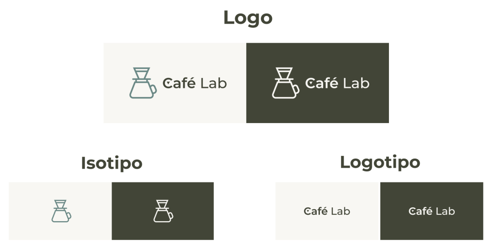

# cafeLaf-iot-report

# Capítulo I: Introducción

## 1.1. Startup Profile

En esta sección se brinda la descripción de nuestra startup, nuestro producto y de los miembros del equipo que llevará a cabo el proyecto.

### 1.1.1. Descripción de la Startup

**Café Metrix** es una startup enfocada en desarrollar soluciones tecnológicas para la industria del café de especialidad. Así, nace de la pasión por combinar tecnología accesible con el arte del café para lograr una mejor conservación y preparación del mismo, apuntando a la comodidad tanto de los baristas y demás profecionales como del consumidor final.

De esta manera, llega **Café Lab**, el cual es un sistema integral diseñado para baristas profesionales y cafeterías de especialidad que busca resolver dos problemas fundamentales en la industria: la falta de herramientas integradas para documentar, replicar y compartir procesos clave del café, y la desarticulación entre el tueste del grano y la experiencia final en taza.

La solución consiste en una plataforma dual que combina software y componentes IoT, proporcionando control total sobre el café desde el grano verde hasta la preparación final. Permite documentar perfiles de tueste, controlar el almacenamiento del café verde mientras mantiene un monitoreo de su estado, asegurar su óptima conservación, digitalizar procesos de calibración, conectar la forma en que tuestan el café con cómo sabe finalmente (alineando parámetros técnicos del tostado con el perfil en taza) y reforzar la transparencia de la cadena productiva (mostrando de dónde viene el café y cómo se ha procesado en cada etapa).

Con esto, aseguramos que el proceso será mucho más claro para ambas partes y se logrará tanto facilitar el monitoreo del proceso con registro de acciones y posibles errores como proteger la calidad del grano mediante nuestro sistema de detección de humedad y regulación de tempratura mediante deshumidificación.

**Misión**: Elevar la calidad y consistencia del café, documentando cada etapa del proceso y gestionando una correcta conservación del grano para garantizar resultados excepcionales y sostenibles.

**Visión**: Ser líder a nivel nacional en el estándar tecnológico que revoluciona la industria del café de especialidad.

#### Logo, isotipo y logotipo de Café Lab:

### 1.1.2. Perfiles de integrantes del equipo
<table border="1">
  <tr>
    <td></td>
    <td>Mi nombre es <strong>Adrian Donayre</strong>, tengo 19 
    años y actualmente estoy cursando el quinto ciclo de la 
    carrera de Ingeniería de Software en la UPC. Tengo habilidad en los lenguajes C++ y javascript. Así mismo, cuento con experiencia en monitoreo de infraestructura en herramientas como Azure, NR y Kemp. Personalmente, opino que lo que hagamos en la universidad se verá reflejado en nuestra vida profesional. Por ello me esfuerzo en ampliar mis conocimientos y conseguir nuevas experiencias que me sumen para seguir mejorando.</td>
  </tr>
  <tr>
    <td> </td>
    <td>Mi nombre es <strong>Natalia Roman</strong>, tengo 20 años y me encuentro cursando el séptimo ciclo de la carrera de ingeniería de software. Desde los primeros ciclos me ha apasionado la programación, siendo los lenguajes que mejor manejo java, javascript, C++ y C#, y me he centrado en aprender lo más posible en cuanto a optimización de procesos y nuevas tecnologías. Me interesa aprender sobre elementos IoT para poder integrarlos en nuevos proyectos.</td>
  </tr>
  <tr>
  <td> </td>
    <td>Mi nombre es <strong>Jorge Suin Yum Gonzales</strong>, Soy estudiante del 7° ciclo con 21 años. Tengo experiencia con diferentes lenguajes de programación y desarrollo de aplicaciones web en diversos frameworks ambos en frontend y backend. Soy una persona responsable y puntual, interesado en tecnologias emergentes y sus aplicaciones, cualidades que aplico al trabajar de manera colaborativa con los integrantes de nuestro equipo.
</td>
  </tr>
  <tr> 
    <td>   </td>
    <td> Mi nombre es <strong>Carlos Fredy Fernandez Camayo</strong>.Soy estudiante de ingenieria de software. Tengo experiencia en desarrollo de proyectos Frontend y Backend con Angular y Spring boot, asimismo considero que cada paso en la universidad contribuye en mi avance como desarollo profesional. Estoy interesado en continuar mi aprendizaje, por lo que estoy dispuesto a participar en la adecuada realizacion de proyectos.  </td>
  </tr>
  <tr> 
    <td>   </td>
    <td> Mi nombre es <strong>...</strong>, ... </td>
  </tr>
  <tr> 
    <td>   </td>
    <td> Mi nombre es <strong>...</strong>, ... </td>
  </tr>
</table>

## 1.2. Solution Profile

### 1.2.1 Antecedentes y problemática

**Who (¿Quiénes?):** 

Nuestros principales usuarios serán baristas profesionales y dueños de cafeterías de especialidad que manejan procesos desde el tueste hasta la preparación, así como emprendedores del rubro que buscan escalar su operación manteniendo la calidad e integrando elementos tecnológicos.

**What (¿Qué sucede?):**

Actualmente, la mayoría de cafeterías de especialidad utilizan herramientas manuales o genéricas que no permiten documentar ni replicar parámetros técnicos clave, lo que genera inconsistencias en la calidad del café, desconexión entre procesos y pérdida de trazabilidad. Además, al tener que ser controlado manualmente, el café tiende a humedecerse de más, lo que puede provocar la aparición de hongos.

**When (¿Cuándo ocurre?):**

Los problemas detectados suelen surigr cuando se intenta replicar perfiles de tueste, preparar recetas específicas o cumplir con estándares de calidad de forma profesional sin contar con herramientas digitales adaptadas al rubro que faciliten el control y desarrollo de los procesos.

**Where (¿Dónde ocurre?):**

Esto ocurre en laboratorios de café, tostadores pequeños, cafeterías urbanas o rurales y negocios en expansión que buscan formalizar su operación, es decir, cualquier establecimiento en el que se conserve o realiza la preparación de café donde no se cuente con herramientas tecnológicas de apoyo.

**Why (¿Por qué es un problema?):**

Esto es porblema dado que existe una falta de integración entre los procesos técnicos (almacenamiento, tueste, calibración, cata, extracción) que dificulta la estandarización, dificulta la conservación del café, reduce la calidad percibida y limita la posibilidad de crecer o competir en el mercado de cafés de especialidad.

**How (¿Cómo lo solucionan hoy?):**

La solución que se utiliza hoy consiste en registros manuales en cuadernos, hojas de Excel, softwares genéricos no adaptados al café, sin conexión entre lotes, recetas y resultados. En el caso de la conversación, parte del personal debe tomar mediciones de humedad manualmente y alterar la temperatura sin medición, es decir, no se está seguro de si es la adecuada, lo que pone en riesgo la calidad del grano.

**How much (¿Cuánto cuesta no resolverlo?):**

Al no tomar acciones para implementar una solución, se genera pérdida de reputación en las cafeterías, inconsistencias en la calidad, dificultad para cumplir certificaciones y pérdida de clientes exigentes. Además, impide escalar el negocio con eficiencia.

### 1.2.2 Lean UX Process

#### 1.2.2.1. Lean UX Problem Statements

Nuestro sistema para baristas y cafeterías de especialidad fue diseñado para lograr que los usuarios puedan documentar, replicar y mejorar procesos como el tueste, la preparación y la cata, además de asegurar trazabilidad y control desde el grano verde hasta la taza.

Hemos observado que el producto no está cumpliendo completamente con estos objetivos, ya que los procesos están desarticulados, no hay conexión entre etapas como el almacenamiento, el tueste y la extracción, la conservación del grano no se realiza adecuadamente, y muchos datos importantes se pierden o no quedan registrados. Esto provoca errores, variabilidad en la calidad, pérdida de información y poca confianza del cliente final.

¿Cómo podríamos mejorar la plataforma para que los usuarios sean más exitosos mediante una integración real de procesos, alertas en tiempo real sobre el estado del grano, cuidado de la conservación del grano automatizada y herramientas que permitan ver y comparar datos técnicos y sensoriales, basándonos en métricas como consistencia en recetas, reducción de pérdidas y mejora en la trazabilidad?

#### 1.2.2.2. Lean UX Assumptions

**¿Quién es el usuario?**

El usuario principal de este producto son baristas profesionales y los de encargados de cafeterías de especialidad. Los baristas profesionales se encargan de gestionar todo el proceso del café, desde la compra del café verde hasta su preparación en taza. Ellos buscan consistencia, calidad y trazabilidad para ofrecer un café superior, ya sea en competencias, consultorías o para clientes exigentes. Por otro lado, las cafeterías de especialidad se enfocan en ofrecer cafés de origen con características únicas y diferenciadas. Estas cafeterías necesitan herramientas para asegurar la calidad y correcta conservación del café, cumplir con certificaciones y fidelizar a sus clientes a través de la transparencia y el seguimiento de cada etapa del proceso.

**¿Dónde encaja nuestro producto en su vida?**

El producto encaja perfectamente en el flujo de trabajo diario de los baristas y las cafeterías, proporcionando una herramienta integral para documentar, estandarizar y optimizar cada uno de los pasos del proceso de preparación del café. Desde el tueste del grano, pasando por la calibración de los molinos, hasta la cata y la preparación final. El producto facilita la replicabilidad de los procesos logrando mantener un monitoreo óptimo y automatizar un proceso tan delicado e importante como lo es la conservación del grano, así como mejora la consistencia de la calidad del café. Además, el sistema ayuda a las cafeterías a gestionar la trazabilidad del café, asegurando que cumplan con las normativas de certificación y mantengan un registro detallado desde el origen del grano hasta la taza que llega al cliente.

**¿Qué problemas tiene nuestro producto y cómo se pueden resolver?**

Un problema que podría presentar nuestro producto es que necesita conexión a internet, electricidad y ciertos elementos tecnológicos para su funcionamiento completo. Esto podría ser un limitante para las cafeterías con menor presupuesto, espacios menos preparados o de lugares lejanos en los que la señal de internet no es la ideal todo el tiempo. La solución que podemos ofrecer es recortar funcionalidades como el monitoreo de conservación con IoT para las áreas en las que el uso de elementos IoT se dificulte, de forma en que las demás funcionalidades sigan estando disponibles. Asimismo, intentaremos ofrecer un producto de bajo costo pero alta calidad considerando tanto la aplicación como los elementos IoT de forma en que sea más accesible para todas las cafeterías.
Por otro lado, podría ser complicado para personas mayores comprender y adaptarse a la aplicación y sus funcionalidades en un principio, por lo que dentro del sistema ofrecemos una guía de uso detallada y nos aseguramos de hacer la UI lo más intuitiva posible.

**¿Cuándo y cómo se usará nuestro producto?**

El producto se utilizará en todo el ciclo de vida del café. Desde la recepción y almacenamiento del café verde hasta el proceso de tueste, calibración, cata y preparación final. Los baristas y administradores de cafeterías utilizarán la plataforma de manera continua en su jornada diaria, ajustando los parámetros de tueste, calibrando los molinos, y evaluando las catas de café. La herramienta será accesible tanto en plataformas web como móviles, lo que permitirá a los usuarios acceder a los datos y realizar ajustes desde cualquier lugar. 

**¿Qué características son importantes?**

Las características clave de nuestro producto incluyen una interfaz intuitiva, que permita a los baristas y administradores navegar y usar la plataforma sin complicaciones. La trazabilidad completa es otra característica esencial, permitiendo que los usuarios rastreen el café desde su origen hasta la taza, asegurando que cada variable crítica sea registrada y controlada. También es crucial que el sistema envíe alertas automáticas sobre el estado del café verde, como cambios en la temperatura o humedad, para prevenir el deterioro del grano, así como realice la regulación de humedad de ser necesario. La documentación y comparativa de los diferentes perfiles de tueste y catas permite replicar los procesos exitosos y mejorar la calidad. Además, el producto debe incluir capacitación y soporte, proporcionando guías de uso y recursos educativos para maximizar la efectividad del sistema.

**¿Cómo debe verse nuestro producto y cómo debe comportarse?**

Visualmente, el producto debe ser claro, moderno y profesional, con un diseño minimalista que facilite la comprensión de los datos. La interfaz debe incluir gráficos fáciles de interpretar y una visualización intuitiva de los diferentes parámetros del proceso de café, como las curvas de tueste, los parámetros de extracción y los perfiles sensoriales. En cuanto a su comportamiento, la plataforma debe ser rápida y confiable, con tiempos de respuesta mínimos para que los usuarios puedan tomar decisiones en tiempo real. Las alertas automáticas deben ser precisas y oportunas, mientras que la navegación debe ser fluida tanto en la aplicación web como móvil. Además, el sistema debe permitir una rápida configuración de los perfiles de tueste, calibraciones y ajustes según las necesidades de cada usuario.

# Capítulo II:  Requirements Elicitation & Analysis

### 2.1.1. Análisis competitivo

#### Competitive Analysis

<table border="1" cellpadding="8" cellspacing="0" style="border-collapse: collapse; width: 100%;">

  <!-- Título -->
  <tr>
    <th colspan="6" style="text-align:center; border: 1px solid #000;">
      Competitive Analysis Landscape
    </th>
  </tr>

  <!-- Descripción -->
  <tr>
    <th style="text-align:center; border: 1px solid #000;">
      ¿Por qué llevar a cabo este análisis?
    </th>
    <td colspan="5" style="border: 1px solid #000;">
      Este análisis identifica las capacidades, limitaciones y enfoques estratégicos de soluciones que gestionan el café de especialidad (tueste, trazabilidad, inventario y calidad), con el fin de posicionar CaféLab como una plataforma integral que incorpora monitoreo IoT del estado del grano (verde y tostado), optimizando la calidad y reduciendo pérdidas.
    </td>
  </tr>

  <!-- Encabezados de comparación -->
  <tr>
    <th style="border: 1px solid #000;"></th>
    <th style="text-align:center; border: 1px solid #000;">Criterio</th>
    <th style="text-align:center; border: 1px solid #000;">CaféLab</th>
    <th style="text-align:center; border: 1px solid #000;">Cropster</th>
    <th style="text-align:center; border: 1px solid #000;">Artisan</th>
    <th style="text-align:center; border: 1px solid #000;">RoastLog</th>
  </tr>

<!-- PERFIL -->
<tr>
    <th rowspan="3" style="text-align:center; border: 1px solid #000;">Perfil</th>
    <td><strong>Overview</strong></td>
    <td>Plataforma web integral para gestión de café de especialidad con módulos de trazabilidad, tueste, cata, inventario y monitoreo IoT del almacenamiento.</td>
    <td>Software líder en la industria para gestión de tueste, control de calidad y trazabilidad en operaciones de café.</td>
    <td>Software open source para registro y análisis de perfiles de tueste en tiempo real.</td>
    <td>Software especializado en gestión de tostadores pequeños con enfoque en control de producción y perfiles.</td>
</tr>
<tr>
    <td><strong>Ventaja competitiva</strong></td>
    <td>Integración única de software + sensores IoT para monitorear temperatura, humedad y condiciones del grano en almacenamiento.</td>
    <td>Ecosistema robusto, integración con maquinaria industrial y estandarización de procesos.</td>
    <td>Flexibilidad, personalización y comunidad activa de usuarios técnicos.</td>
    <td>Interfaz simple y enfoque accesible para pequeños tostadores.</td>
</tr>
<tr>
    <td><strong>Clientes</strong></td>
    <td>Cafeterías de especialidad, tostadores pequeños/medianos y negocios que buscan control de calidad integral.</td>
    <td>Tostadores industriales, empresas consolidadas y cadenas de café.</td>
    <td>Tostadores técnicos y entusiastas avanzados.</td>
    <td>Pequeños tostadores y negocios en crecimiento.</td>
</tr>

<!-- MARKETING -->
<tr>
    <th rowspan="2">Perfil de Marketing</th>
    <td><strong>Mercado objetivo</strong></td>
    <td>Latinoamérica (inicial), con enfoque en digitalización de cafeterías y tostadores emergentes.</td>
    <td>Mercado global consolidado (Europa, EE.UU.).</td>
    <td>Usuarios técnicos a nivel global.</td>
    <td>Mercado internacional de pequeños tostadores.</td>
</tr>
<tr>
    <td><strong>Estrategias de marketing</strong></td>
    <td>Educación sobre calidad del café, alianzas con cafeterías, enfoque en innovación IoT.</td>
    <td>Eventos internacionales, alianzas industriales, marketing de contenido técnico.</td>
    <td>Comunidad open source, foros y contribuciones técnicas.</td>
    <td>Marketing digital y posicionamiento como solución simple.</td>
</tr>

<!-- PRODUCTO -->
<tr>
    <th rowspan="3">Perfil de Producto</th>
    <td><strong>Productos & Servicios</strong></td>
    <td>Software SaaS + dispositivo IoT (sensores de temperatura/humedad, control de deshumidificación, alertas).</td>
    <td>Software SaaS con integración a maquinaria de tueste y análisis de datos.</td>
    <td>Software open source de escritorio para monitoreo de tueste.</td>
    <td>Software SaaS para gestión de tueste y producción.</td>
</tr>
<tr>
    <td><strong>Precios & Costos</strong></td>
    <td>Suscripción escalonada + posible costo de hardware IoT.</td>
    <td>Suscripción premium con costos adicionales por integración.</td>
    <td>Gratuito (open source).</td>
    <td>Suscripción accesible para pequeños negocios.</td>
</tr>
<tr>
    <td><strong>Canales de distribución</strong></td>
    <td>Plataforma web + integración con dispositivos físicos.</td>
    <td>Web + integraciones industriales.</td>
    <td>Aplicación de escritorio.</td>
    <td>Plataforma web.</td>
</tr>

<!-- NUEVA FILA CLAVE -->
<tr>
    <th rowspan="2">Gestión de Calidad del Grano</th>
    <td><strong>Monitoreo de almacenamiento</strong></td>
    <td>Monitoreo en tiempo real de temperatura y humedad del grano (verde y tostado).</td>
    <td>No enfocado en almacenamiento físico.</td>
    <td>No disponible.</td>
    <td>No disponible.</td>
</tr>
<tr>
    <td><strong>Control ambiental / IoT</strong></td>
    <td>Control remoto de deshumidificación y alertas automáticas vía sensores.</td>
    <td>No disponible.</td>
    <td>No disponible.</td>
    <td>No disponible.</td>
</tr>

<!-- SWOT -->
<tr>
    <th rowspan="4">ANÁLISIS SWOT</th>
    <td><strong>Fortalezas</strong></td>
    <td>Diferenciación clara mediante IoT, enfoque en calidad post-tueste y almacenamiento, solución integral.</td>
    <td>Reputación global, integración con maquinaria, robustez del sistema.</td>
    <td>Flexibilidad y costo cero.</td>
    <td>Facilidad de uso y accesibilidad.</td>
</tr>
<tr>
    <td><strong>Debilidades</strong></td>
    <td>Dependencia de adopción de hardware IoT, producto en fase de introducción.</td>
    <td>Alto costo y complejidad.</td>
    <td>Falta de soporte empresarial.</td>
    <td>Funcionalidades limitadas frente a soluciones completas.</td>
</tr>
<tr>
    <td><strong>Oportunidades</strong></td>
    <td>Creciente demanda de trazabilidad y control de calidad en café de especialidad.</td>
    <td>Expansión a mercados emergentes.</td>
    <td>Mejoras mediante comunidad.</td>
    <td>Crecimiento del segmento de pequeños tostadores.</td>
</tr>
<tr>
    <td><strong>Amenazas</strong></td>
    <td>Entrada de grandes plataformas al IoT, resistencia al cambio tecnológico.</td>
    <td>Competencia de soluciones más económicas.</td>
    <td>Limitaciones de escalabilidad.</td>
    <td>Competencia de software más avanzado.</td>
</tr>
</table>

### 2.1.2. Estrategias y tácticas frente a competidores (CaféLab)

En base al análisis competitivo realizado, se identificaron las principales fortalezas, debilidades, oportunidades y amenazas de plataformas como Cropster, Artisan y RoastLog.

Esta información permite definir estrategias orientadas a posicionar CaféLab como una solución innovadora que integra software de gestión con monitoreo IoT del estado del café.

---

#### Afrontando las fortalezas de nuestros competidores:

**Fortalezas identificadas:**
- Ecosistemas robustos y consolidados en la industria del café.
- Integración con maquinaria de tueste y estandarización de procesos.
- Amplia adopción y reconocimiento global.
- Herramientas avanzadas de análisis de perfiles de tueste.

**Comprendemos que nuestras fortalezas son:**
- Integración de IoT para monitoreo del almacenamiento del grano (temperatura, humedad, deshumidificación).
- Plataforma integral que conecta trazabilidad, inventario, cata y calidad.
- Enfoque en control post-tueste y post-cosecha, poco abordado por competidores.

#### Estrategias
- Diferenciar la propuesta de valor mediante el enfoque en calidad del grano en tiempo real, más allá del tueste.
- Posicionar CaféLab como una solución integral que cubre toda la cadena: almacenamiento → tueste → taza.

#### Tácticas
- Implementar dashboards visuales con métricas en tiempo real sobre condiciones ambientales del café.
- Desarrollar alertas inteligentes (ej. riesgo de humedad alta o degradación del grano).
- Integrar reportes comparativos entre condiciones de almacenamiento y resultados en taza.
- Crear demostraciones prácticas donde se evidencie la pérdida de calidad sin monitoreo IoT.

---

#### Afrontando las debilidades de nuestros competidores:

**Debilidades identificadas:**
- Alto costo y complejidad de uso (especialmente en plataformas como Cropster).
- Falta de enfoque en almacenamiento físico del café.
- Curva de aprendizaje elevada.
- Dependencia de procesos manuales para registrar condiciones externas.

**Comprendemos que nuestras debilidades son:**
- Dependencia de adopción de hardware IoT.
- Baja presencia en el mercado en etapas iniciales.
- Necesidad de educar al usuario sobre el valor del monitoreo ambiental.

#### Estrategias
- Reducir la barrera de entrada mediante una experiencia de usuario simple y accesible.
- Educar al mercado sobre la importancia del control ambiental en la calidad del café.

#### Tácticas
- Ofrecer un plan gratuito con funcionalidades básicas para captación de usuarios.
- Diseñar una interfaz intuitiva con onboarding guiado para nuevos usuarios.
- Crear tutoriales y contenido educativo sobre almacenamiento del café.
- Implementar soporte técnico accesible y acompañamiento en la instalación del IoT.

---

#### Afrontando las oportunidades de nuestros competidores:

**Oportunidades identificadas:**
- Crecimiento del mercado de café de especialidad.
- Mayor interés en trazabilidad, sostenibilidad y calidad.
- Tendencia hacia la digitalización de procesos productivos.
- Baja adopción de tecnologías IoT en el sector cafetero.

**Comprendemos que nuestras oportunidades son:**
- Posicionarnos como pioneros en IoT aplicado al café.
- Atender el mercado emergente en Latinoamérica.
- Integrar educación + tecnología como propuesta de valor.

#### Estrategias
- Desarrollar una propuesta centrada en la digitalización del control de calidad del café.
- Generar alianzas estratégicas con actores del ecosistema cafetero.

#### Tácticas
- Colaborar con certificadoras como Rainforest Alliance y Fairtrade International para validar trazabilidad.
- Participar en eventos y ferias de café de especialidad.
- Crear contenido educativo (blogs, webinars, redes sociales) sobre buenas prácticas.
- Implementar campañas que demuestren el impacto del almacenamiento en la calidad final.

---

#### Afrontando las amenazas de nuestros competidores:

**Amenazas identificadas:**
- Posible entrada de grandes plataformas al uso de IoT.
- Resistencia al cambio tecnológico en cafeterías tradicionales.
- Existencia de soluciones gratuitas o de bajo costo.
- Limitaciones en adopción tecnológica en mercados emergentes.

**Comprendemos que nuestras amenazas son:**
- Dificultad en demostrar el retorno de inversión del IoT.
- Diversidad de prácticas de almacenamiento entre cafeterías.
- Competencia futura con soluciones más integradas.

#### Estrategias
- Demostrar el valor económico y operativo del uso de IoT en la gestión del café.
- Adaptar la solución a diferentes niveles de madurez tecnológica del cliente.

#### Tácticas
- Desarrollar casos de estudio que evidencien reducción de pérdidas de café.
- Implementar métricas de impacto (ej. mejora en consistencia de taza, reducción de desperdicio).
- Ofrecer versiones modulares del sistema (software sin IoT / con IoT escalable).
- Realizar encuestas y validaciones continuas con usuarios del sector.

## 2.3. Needfinding
### 2.3.1. User Personas
**Administradores y dueños de cafeterias de especialidad**
<td></td>

**Barista Profesional**
<td></td>

### 2.3.2. User Task Matrix

En esta sección se presentan los User Task Matrix correspondientes a los segmentos objetivos del proyecto (barista profesional y dueño de cafetería de especialidad).

A continuación, se detallan las tareas que ambos realizan en su rutina profesional, incorporando no solo actividades relacionadas con la preparación y análisis del café, sino también aquellas vinculadas al monitoreo del estado del grano (verde y tostado), condiciones de almacenamiento y toma de decisiones basada en datos, aspectos clave dentro de la propuesta de valor de CaféLab.

---

#### User Task Matrix

| TASK | Barista Profesional (Frecuencia) | Barista Profesional (Importancia) | Dueño de Cafetería (Frecuencia) | Dueño de Cafetería (Importancia) |
|------|--------------------------------|----------------------------------|--------------------------------|----------------------------------|
| Calibrar máquina de espresso | Always | High | Sometimes | Medium |
| Registrar parámetros de extracción | Always | High | Sometimes | Medium |
| Cata sensorial de cafés | Often | High | Often | High |
| Registrar recetas de preparación | Always | High | Sometimes | Medium |
| Recomendar mejoras en recetas | Often | Medium | Often | High |
| Registrar consumo de café molido/tostado | Often | High | Always | High |
| Monitorear condiciones del café (temperatura, humedad) | Rarely | Medium | Often | High |
| Detectar cambios en la calidad del grano almacenado | Sometimes | Medium | Often | High |
| Compartir información con el equipo | Always | Medium | Always | High |
| Documentar perfiles de tueste | Sometimes | Medium | Always | High |
| Supervisar procesos de calidad | Rarely | Medium | Always | High |
| Realizar pedidos o gestionar inventario | Sometimes | Medium | Always | High |
| Analizar datos para mejorar procesos | Sometimes | Medium | Often | High |
| Buscar registros históricos (tueste, cata, almacenamiento) | Sometimes | Medium | Often | High |
| Coordinar con proveedores de café | Never | Low | Often | High |
| Usar herramientas digitales de control y trazabilidad | Often | Medium | Often | High |
| Capacitarse o aprender sobre café | Always | High | Sometimes | Medium |

---

El análisis de las tareas de baristas profesionales y dueños de cafeterías de especialidad evidencia una diferencia clara en el enfoque operativo y estratégico dentro del negocio del café.

Por un lado, los baristas se concentran en tareas técnicas y operativas del día a día, como la calibración de la máquina de espresso, el registro de parámetros de extracción, la preparación de recetas y la evaluación sensorial. Su objetivo principal es garantizar la consistencia y calidad en taza, con un alto interés en la mejora continua y el aprendizaje. Sin embargo, su participación en procesos de monitoreo del estado del grano o control de almacenamiento es limitada, siendo estas actividades menos frecuentes en su rutina.

Por otro lado, los dueños de cafeterías adoptan un rol más estratégico y de control integral del negocio. Sus tareas incluyen la gestión de inventarios, la supervisión de la calidad del café, la documentación de perfiles de tueste, el análisis de datos históricos y la toma de decisiones basadas en información. Además, muestran una mayor preocupación por factores relacionados con la conservación del café, como las condiciones de almacenamiento (temperatura y humedad) y el impacto de estas variables en la calidad final del producto.

Ambos perfiles coinciden en la importancia de las catas sensoriales, el uso de herramientas digitales y el registro de información para mejorar procesos. No obstante, se identifica una oportunidad clave: la falta de monitoreo sistemático y automatizado de las condiciones físicas del café, lo que puede afectar la calidad del grano sin ser detectado a tiempo.

En este contexto, CaféLab se posiciona como una solución que permite integrar las tareas técnicas y estratégicas mediante el uso de software y dispositivos IoT, facilitando el monitoreo en tiempo real, la trazabilidad completa y la toma de decisiones informadas para mejorar la calidad del café desde el almacenamiento hasta la taza.

### 2.3.3 User Journey Mapping
**Administradores y dueños de cafeterias de especialidad**

**Barista Profesional**

### 2.3.4. Empathy Mapping.
**Administradores y dueños de cafeterias de especialidad**

**Barista Profesional**

## 2.4. Big Picture EventStorming.

# Capítulo III: Requirements Specification

## 3.1. User Stories

Las user stories son una forma de convertir el lenguaje informal de los usuarios del sistema en requerimientos de software que deben ser considerados durante el desarrollo de la plataforma. Para el proyecto CaféLab IoT, se presenta un conjunto de user stories y technical stories que guían el desarrollo del sistema de monitoreo ambiental TrackSilo, incluyendo la gestión de lecturas del sensor, activación de actuadores y visualización de condiciones de almacenamiento del café verde.

<table border="1">
<tr>
<th>Epic/User Story ID</th>
<th>Título</th>
<th>Descripción</th>
<th>Criterios de Aceptación</th>
<th>Relacionado con (Epic ID)</th>
</tr>

<tr>
<td>US01</td>
<td>Registro de Proveedores</td>
<td>Como dueño de cafetería de especialidad, quiero registrar y evaluar a mis proveedores para mantener un control de calidad y trazabilidad de origen</td>
<td><strong>Escenario 1:</strong> Creación de nuevo proveedor. <strong>Dado que</strong> se establece relación con un nuevo proveedor de café <strong>Cuando</strong> el usuario inresa los datos completos (nombre, ubicación, contacto, tipos de café) <strong>Entonces</strong> el sistema registra la información y genera un perfil de proveedor.  <strong>Escenario 2:</strong> Evaluación de proveedor. <strong>Dado que</strong> se han recibido lotes de un proveedor específico <strong>Cuando</strong> el usuario completa el formulario de evaluación con criterios definidos <strong>Entonces</strong> el sistema guarda la evaluación en el historial del proveedor.</td>
<td>EP02</td>
</tr>

<tr>
<td>US02</td>
<td>Gestión de Lotes de Café Verde</td>
<td>Como barista profesional o dueño de cafetería de especialidad, quiero registrar y hacer seguimiento de cada lote de café verde para mantener control de inventario y trazabilidad</td>
<td><strong>Escenario 1:</strong> Ingreso de nuevo lote. <strong>Dado que</strong> se recibe un nuevo lote de café verde <strong>Cuando</strong> el usuario registra sus características completas (origen, variedad, proceso, altitud, peso) <strong>Entonces</strong> el sistema guarda la información para asegurar la trazabilidad para ese lote.  <strong>Escenario 2:</strong> Actualización de estado. <strong>Dado que</strong> un lote cambia de condición durante su ciclo de vida <strong>Cuando</strong> el usuario actualiza su estado (almacenado, en tueste, agotado) <strong>Entonces</strong> el sistema registra la fecha, hora y responsable del cambio de estado.</td>
<td>EP02</td>
</tr>

<tr>
<td>US03</td>
<td>Creación de Perfil de Tueste</td>
<td>Como barista profesional, quiero crear perfiles de tueste personalizados para documentar y replicar mis mejores resultados</td>
<td><strong>Escenario 1:</strong> Creación manual de perfil. <strong>Dado que</strong> el usuario desarrolla un nuevo perfil de tueste <strong>Cuando</strong> ingresa todos los parámetros requeridos (temperatura inicial, curva, tiempo, desarrollo) <strong>Entonces</strong> el sistema guarda el perfil en su biblioteca personal.  <strong>Escenario 2:</strong> Duplicación y modificación. <strong>Dado que</strong> el usuario quiere adaptar un perfil existente <strong>Cuando</strong> selecciona la opción "duplicar" y modifica valores específicos <strong>Entonces</strong> el sistema crea una nueva variante manteniendo referencia al perfil original.</td>

<td>EP02</td>
</tr>

<tr>
<td>US04</td>
<td>Biblioteca de Defectos de Tueste</td>
<td>Como barista profesional, quiero acceder a una biblioteca de defectos comunes para identificar y corregir problemas en mis tuestes</td>
<td><strong>Escenario 1:</strong> Consulta de defecto. <strong>Dado que</strong> el usuario observa anomalías en su café recién tostado <strong>Cuando</strong> busca en el sistema por características visuales o descriptivas del problema <strong>Entonces</strong> el sistema muestra posibles defectos coincidentes con sus causas y soluciones.  <strong>Escenario 2:</strong> Documentación de soluciones. <strong>Dado que</strong> el usuario identifica un defecto específico en su tueste <strong>Cuando</strong> accede a la ficha detallada del defecto en la biblioteca <strong>Entonces</strong> el sistema presenta causas probables y soluciones recomendadas con ejemplos.</td>
<td>EP03</td>
</tr>

<tr>
<td>US05</td>
<td>Cata Digital Estructurada</td>
<td>Como barista profesional, quiero registrar evaluaciones sensoriales estructuradas para documentar las características de cada lote y tueste</td>
<td><strong>Escenario 1:</strong> Creación de nueva cata. <strong>Dado que</strong> el usuario prueba un café recién tostado <strong>Cuando</strong> inicia una nueva sesión de cata vinculada al lote y tueste específicos <strong>Entonces</strong> el sistema presenta el formulario completo de evaluación sensorial.  <strong>Escenario 2:</strong> Evaluación por atributos. <strong>Dado que</strong> el usuario sigue un protocolo estandarizado de cata <strong>Cuando</strong> califica cada atributo sensorial (acidez, cuerpo, dulzor, etc.) en la escala definida <strong>Entonces</strong> el sistema genera automáticamente el perfil sensorial completo.</td>
<td>EP04</td>
</tr>

<tr>
<td>US06</td>
<td>Análisis Comparativo de Tuestes</td>
<td>Como barista profesional, quiero comparar diferentes sesiones de tueste para identificar patrones y optimizar resultados</td>
<td><strong>Escenario 1:</strong> Selección de sesiones a comparar. <strong>Dado que</strong> el usuario tiene múltiples sesiones de tueste registradas <strong>Cuando</strong> selecciona dos o más sesiones para análisis comparativo <strong>Entonces</strong> el sistema muestra las curvas superpuestas con códigos de color diferenciados.  <strong>Escenario 2:</strong> Análisis de variables específicas. <strong>Dado que</strong> el usuario desea estudiar factores concretos del tueste <strong>Cuando</strong> selecciona variables específicas de interés (tiempo desarrollo, temperatura final) <strong>Entonces</strong> el sistema muestra su correlación con los resultados sensoriales registrados.</td>
<td>EP03</td>
</tr>

<tr>
<td>US07</td>
<td>Creación de Recetas de Preparación</td>
<td>Como barista profesional, quiero crear y documentar recetas detalladas para cada método de preparación y tipo de café</td>
<td><strong>Escenario 1:</strong> Creación de receta estándar. <strong>Dado que</strong> el usuario desarrolla una nueva receta de preparación <strong>Cuando</strong> registra todos los parámetros requeridos (ratio, temperatura, tiempo, molienda, método) <strong>Entonces</strong> el sistema guarda la receta completa en su biblioteca personal.  <strong>Escenario 2:</strong> Vinculación a lote específico. <strong>Dado que</strong> el usuario optimiza una receta para un café particular <strong>Cuando</strong> asocia la receta a un lote específico registrado en el sistema <strong>Entonces</strong> el sistema establece la trazabilidad completa desde origen hasta método de preparación.</td>
<td>EP05</td>
</tr>

<tr>
<td>US08</td>
<td>Calibración de Molienda</td>
<td>Como barista profesional, quiero documentar configuraciones de molienda para diferentes equipos y métodos para mantener consistencia entre preparaciones</td>
<td><strong>Escenario 1:</strong> Registro de nueva calibración. <strong>Dado que</strong> el usuario ajusta un molino para un método específico <strong>Cuando</strong> documenta la configuración precisa (número, apertura) en el sistema <strong>Entonces</strong> la calibración queda registrada con fecha, equipo y método asociados.  <strong>Escenario 2:</strong> Referencia visual comparativa. <strong>Dado que</strong> el usuario necesita una referencia objetiva de molienda <strong>Cuando</strong> adjunta foto de la molienda y registra el tiempo resultante de extracción <strong>Entonces</strong> el sistema almacena estos datos como estándar visual para comparaciones futuras.</td>
<td>EP05</td>
</tr>

<tr>
<td>US09</td>
<td>Portafolio de Bebidas</td>
<td>Como barista profesional o dueño de cafetería de especialidad, quiero crear un portafolio digital de bebidas y recetas para presentar a clientes o eventos</td>
<td><strong>Escenario 1:</strong> Creación de ficha de bebida. <strong>Dado que</strong> el usuario desarrolla una bebida especial para su menú <strong>Cuando</strong> completa la ficha técnica (ingredientes, método, presentación, foto) <strong>Entonces</strong> el sistema incorpora la bebida a su portafolio digital profesional.  <strong>Escenario 2:</strong> Organización por categorías personalizadas. <strong>Dado que</strong> el usuario maneja diversas bebidas en su portafolio <strong>Cuando</strong> las clasifica según tipos definidos (espresso, filtrado, signature, estacionales) <strong>Entonces</strong> el sistema genera un catálogo organizado y fácilmente consultable.</td>
<td>EP05</td>
</tr>

<tr>
<td>US10</td>
<td>Visualización de Perfiles Sensoriales</td>
<td>Como barista profesional o dueño de cafetería de especialidad, quiero visualizar perfiles sensoriales en formato de hexágono o gráfico de radar para interpretar y comparar cualidades</td>
<td><strong>Escenario 1:</strong> Generación de hexágono sensorial. <strong>Dado que</strong> el usuario ha completado una evaluación de cata <strong>Cuando</strong> solicita la visualización gráfica de los resultados <strong>Entonces</strong> el sistema genera el hexágono con los seis atributos principales evaluados.  <strong>Escenario 2:</strong> Comparación de perfiles. <strong>Dado que</strong> el usuario desea contrastar diferentes cafés evaluados <strong>Cuando</strong> selecciona múltiples catas para visualización simultánea <strong>Entonces</strong> el sistema muestra los hexágonos superpuestos con códigos de color diferenciados.</td>
<td>EP04</td>
</tr>

<tr>
<td>US11</td>
<td>Control de Inventario Integrado</td>
<td>Como dueño de cafetería de especialidad, quiero gestionar el inventario de café verde y tostado de forma integrada para optimizar recursos y prevenir desabastecimiento</td>
<td><strong>Escenario 1:</strong> Seguimiento centralizado de stock. <strong>Dado que</strong> el usuario maneja múltiples productos y estados del café <strong>Cuando</strong> accede al panel central de inventario <strong>Entonces</strong> el sistema muestra niveles actuales, movimientos recientes y alertas activas.  <strong>Escenario 2:</strong> Registro de consumo con trazabilidad. <strong>Dado que</strong> el usuario utiliza café para producción diaria <strong>Cuando</strong> registra el consumo vinculándolo a lotes específicos y productos finales <strong>Entonces</strong> el sistema actualiza automáticamente las existencias y mantiene la trazabilidad.</td>
<td>EP06</td>
</tr>

<tr>
<td>US12</td>
<td>Correlación Tueste-Sabor</td>
<td>Como barista profesional, quiero visualizar la correlación entre parámetros de tueste y resultados sensoriales para optimizar mis perfiles</td>
<td><strong>Escenario 1:</strong> Análisis de factor específico. <strong>Dado que</strong> el usuario busca entender la influencia de un parámetro técnico <strong>Cuando</strong> selecciona una variable concreta de tueste (ej. tiempo de desarrollo) <strong>Entonces</strong> el sistema muestra gráficos de correlación con atributos sensoriales registrados.  <strong>Escenario 2:</strong> Identificación de patrones. <strong>Dado que</strong> el usuario busca consistencia en resultados sensoriales <strong>Cuando</strong> analiza múltiples sesiones que produjeron perfiles similares <strong>Entonces</strong> el sistema identifica y destaca patrones comunes en los perfiles de tueste.</td>
<td>EP04</td>
</tr>

<tr>
<td>US13</td>
<td>Compartir Recetas</td>
<td>Como barista profesional, quiero compartir mis recetas con mi equipo para mantener consistencia en la preparación</td>
<td><strong>Escenario 1:</strong> Compartir con equipo interno. <strong>Dado que</strong> el usuario desarrolla una receta exitosa que debe estandarizarse <strong>Cuando</strong> la marca como "compartida con equipo" y define permisos <strong>Entonces</strong> el sistema la pone a disposición de todos los miembros autorizados.  <strong>Escenario 2:</strong> Sugerencia de mejoras. <strong>Dado que</strong> un miembro del equipo prueba una receta compartida <strong>Cuando</strong> implementa variaciones y propone ajustes documentados <strong>Entonces</strong> el sistema notifica al creador original y registra las sugerencias manteniendo la versión original.</td>
<td>EP05</td>
</tr>

<tr>
<td>US14</td>
<td>Análisis de Eficiencia y Rendimiento</td>
<td>Como dueño de cafetería de especialidad, quiero monitorear y comparar el rendimiento productivo entre distintos lotes para identificar factores que afectan la eficiencia</td>
<td><strong>Escenario 1:</strong> Registro automático de indicadores de rendimiento. <strong>Dado que</strong> un lote ha sido procesado completamente <strong>Cuando</strong> el usuario finaliza el registro de tueste y producción <strong>Entonces</strong> el sistema calcula automáticamente métricas de rendimiento (% de merma, tiempo efectivo, productividad por hora).  <strong>Escenario 2:</strong> Comparativa avanzada entre lotes. <strong>Dado que</strong> el usuario busca optimizar su producción <strong>Cuando</strong> accede a la herramienta de análisis y selecciona múltiples lotes con atributos similares <strong>Entonces</strong> el sistema genera una tabla comparativa que resalta variaciones significativas en rendimiento y señala posibles causas basadas en parámetros registrados.</td>
<td>EP06</td>
</tr>

<tr>
<td>US15</td>
<td>Reportes de Trazabilidad</td>
<td>Como dueño de cafetería de especialidad, quiero generar reportes de trazabilidad completa para comunicar transparencia y valor agregado</td>
<td><strong>Escenario 1:</strong> Generación de reporte integral por lote. <strong>Dado que</strong> el usuario necesita documentar la trazabilidad completa <strong>Cuando</strong> selecciona un lote específico que ha sido procesado <strong>Entonces</strong> el sistema genera un informe detallado con toda la cadena documentada desde origen.  <strong>Escenario 2:</strong> Ficha técnica comercial para cliente. <strong>Dado que</strong> el usuario necesita comunicar el valor diferencial de su producto <strong>Cuando</strong> solicita generar una ficha para un producto específico de su catálogo <strong>Entonces</strong> el sistema produce un documento que incluye origen, procesamiento, tueste y perfil sensorial.</td>
<td>EP06</td>
</tr>

<tr>
<td>US16</td>
<td>Información del Producto</td>
<td>Como visitante de la landing page, quiero encontrar información clara sobre la plataforma para entender sus beneficios y decidir si me interesa</td>
<td><strong>Escenario 1:</strong> Primera visita al sitio. <strong>Dado que</strong> el visitante accede por primera vez al sitio web <strong>Cuando</strong> carga la página de inicio <strong>Entonces</strong> visualiza el mensaje principal (value proposition) y beneficios clave.  <strong>Escenario 2:</strong> Exploración de características. <strong>Dado que</strong> el visitante desea conocer las funcionalidades <strong>Cuando</strong> navega por la sección de características destacadas <strong>Entonces</strong> encuentra información clara con ilustraciones visuales de cada funcionalidad.</td>
<td>EP07</td>
</tr>

<tr>
<td>US17</td>
<td>Secciones Específicas por Segmento</td>
<td>Como visitante de la landing page, quiero encontrar información adaptada a mi perfil profesional para evaluar si la solución responde a mis necesidades específicas</td>
<td><strong>Escenario 1:</strong> Sección para baristas. <strong>Dado que</strong> el visitante se identifica como barista profesional <strong>Cuando</strong> accede a la sección "Para Baristas" <strong>Entonces</strong> encuentra contenido adaptado a sus desafíos específicos y testimonios relevantes.  <strong>Escenario 2:</strong> Sección para cafeterías. <strong>Dado que</strong> el visitante administra o es dueño de una cafetería <strong>Cuando</strong> accede a la sección "Para Cafeterías" <strong>Entonces</strong> encuentra contenido enfocado en gestión de negocios, trazabilidad y certificaciones.</td>
<td>EP07</td>
</tr>

<tr>
<td>US18</td>
<td>Contacto con Equipo</td>
<td>Como visitante de la landing page, quiero contactar con el equipo del sistema para resolver dudas específicas antes de registrarme</td>
<td><strong>Escenario 1:</strong> Envío de consulta. <strong>Dado que</strong> el visitante tiene preguntas sobre la plataforma <strong>Cuando</strong> completa el formulario de contacto con sus datos y consulta <strong>Entonces</strong> el sistema envía la información al equipo y muestra confirmación.  <strong>Escenario 2:</strong> Solicitud de demostración. <strong>Dado que</strong> el visitante quiere ver el sistema en funcionamiento <strong>Cuando</strong> solicita una demostración personalizada mediante el formulario específico <strong>Entonces</strong> el sistema agenda la cita y envía confirmación con los detalles de conexión.</td>
<td>EP07</td>
</tr>

<tr>
<td>US19</td>
<td>Acceso directo a plataforma</td>
<td>Como visitante de la landing page, quiero redirigirme hacia la aplicación principal desde la landing page para comenzar a usar el sistema inmediatamente</td>
<td><strong>Escenario 1:</strong> Navegación exitosa <strong>Dado que</strong> el visitante quiere empezar a usar el sistema <strong>Cuando</strong> navegue por la landing page y pulse el botón de acceso a la plataforma <strong>Entonces</strong> será transferido correctamente a la interfaz principal del sistema.  <strong>Escenario 2:</strong> Error de conexión <strong>Dado que</strong> el visitante intenta ingresar al sistema <strong>Cuando</strong> pulse el botón de acceso en la landing page y exista un problema de conexión o disponibilidad del servidor <strong>Entonces</strong> visualizará una notificación clara explicando el problema.</td>
<td>EP07</td>
</tr>

<tr>
<td>US20</td>
<td>Registro y Autenticación (Usuarios)</td>
<td>Como barista profesional o dueño de cafetería de especialidad, quiero registrarme y acceder de forma segura para mantener la confidencialidad de mis datos</td>
<td><strong>Escenario 1:</strong> El usuario accede a la pantalla de registro. <strong>Dado que</strong> el usuario no tiene una cuenta en el sistema <strong>Cuando</strong> visualiza las opciones de registro (correo, Google, Facebook) <strong>Entonces</strong> el sistema permite elegir su método preferido y completar el registro.  <strong>Escenario 2:</strong> El usuario inicia sesión. <strong>Dado que</strong> el usuario ya tiene una cuenta registrada <strong>Cuando</strong> ingresa sus credenciales correctamente <strong>Entonces</strong> el sistema le permite acceder a su panel personalizado.  <strong>Escenario 3:</strong> El usuario ingresa credenciales incorrectas. <strong>Dado que</strong> el usuario tiene una cuenta <strong>Cuando</strong> ingresa datos erróneos <strong>Entonces</strong> el sistema muestra un mensaje de error y opciones de recuperación.</td>
<td>EP01</td>
</tr>

<tr>
<td>US21</td>
<td>Perfil Personalizado</td>
<td>Como barista profesional o dueño de cafetería de especialidad, quiero configurar mi perfil profesional para personalizar mi experiencia y mostrar mi identidad dentro del sistema</td>
<td><strong>Escenario 1:</strong> Configuración inicial de perfil. <strong>Dado que</strong> el usuario ha completado el registro exitosamente <strong>Cuando</strong> accede por primera vez al sistema <strong>Entonces</strong> el sistema solicita completar información básica (nombre, rol, experiencia).  <strong>Escenario 2:</strong> Actualización de perfil. <strong>Dado que</strong> el usuario desea modificar sus datos personales <strong>Cuando</strong> accede a la sección de perfil y realiza cambios <strong>Entonces</strong> el sistema guarda la información actualizada correctamente.</td>
<td>EP01</td>
</tr>

<tr>
<td>US22</td>
<td>Selección de Plan</td>
<td>Como barista profesional o dueño de cafetería de especialidad, quiero elegir entre los diferentes planes disponibles para acceder a las funcionalidades que mejor se adapten a mis necesidades</td>
<td><strong>Escenario 1:</strong> Visualización de planes. <strong>Dado que</strong> el usuario está registrado en el sistema <strong>Cuando</strong> accede a la sección de planes disponibles <strong>Entonces</strong> el sistema muestra una comparativa detallada de funcionalidades y precios.  <strong>Escenario 2:</strong> Selección de plan gratuito. <strong>Dado que</strong> el usuario desea utilizar funcionalidades básicas <strong>Cuando</strong> selecciona "Plan Base Cafetal" <strong>Entonces</strong> el sistema le otorga acceso inmediato a las funcionalidades correspondientes.</td>
<td>EP01</td>
</tr>

<!-- ==================== EP08 ==================== -->

<tr>
<td>US23</td>
<td>Visualización de condiciones del almacén en tiempo real</td>
<td>Como dueño de cafetería de especialidad, quiero visualizar la temperatura y humedad del almacén en tiempo real desde el dashboard de CaféLab para tomar decisiones oportunas sobre la conservación del café verde.</td>
<td>
<strong>Escenario 1:</strong> Visualización de datos actuales. 
<strong>Dado que</strong> el sensor TrackSilo está activo y conectado 
<strong>Cuando</strong> el usuario accede al panel de monitoreo 
<strong>Entonces</strong> el sistema muestra la temperatura y humedad actuales del almacén junto con su estado (óptimo, alerta, peligro).  
<strong>Escenario 2:</strong> Sensor sin señal. 
<strong>Dado que</strong> el TrackSilo ha dejado de enviar lecturas 
<strong>Cuando</strong> el usuario accede al panel de monitoreo 
<strong>Entonces</strong> el sistema muestra un aviso indicando que el sensor no responde desde hace X minutos.
</td>
<td>EP08</td>
</tr>

<tr>
<td>US24</td>
<td>Consulta de historial ambiental por lote</td>
<td>Como dueño de cafetería de especialidad o barista profesional, quiero consultar el historial de temperatura y humedad registrado durante el almacenamiento de un lote específico para entender las condiciones en que estuvo conservado.</td>
<td>
<strong>Escenario 1:</strong> Consulta exitosa de historial. 
<strong>Dado que</strong> el lote tiene lecturas ambientales registradas durante su período de almacenamiento 
<strong>Cuando</strong> el usuario selecciona un lote y accede a su historial ambiental 
<strong>Entonces</strong> el sistema muestra un gráfico de temperatura y humedad en el tiempo con marcadores de eventos y alertas ocurridas.  
<strong>Escenario 2:</strong> Lote sin datos ambientales. 
<strong>Dado que</strong> el lote fue registrado antes de que el TrackSilo estuviera activo 
<strong>Cuando</strong> el usuario intenta consultar el historial ambiental 
<strong>Entonces</strong> el sistema informa que no hay datos de monitoreo para ese período.
</td>
<td>EP08</td>
</tr>

<tr>
<td>US25</td>
<td>Recepción de alertas por condiciones fuera de rango</td>
<td>Como dueño de cafetería de especialidad, quiero recibir una notificación inmediata cuando la temperatura o humedad del almacén superen los umbrales configurados para actuar antes de que el café se vea afectado.</td>
<td>
<strong>Escenario 1:</strong> Alerta por humedad elevada. 
<strong>Dado que</strong> el TrackSilo detecta humedad relativa superior al 65% 
<strong>Cuando</strong> la lectura supera el umbral configurado 
<strong>Entonces</strong> el sistema envía una notificación por email al dueño indicando el valor registrado, el umbral superado y la hora del evento.  
<strong>Escenario 2:</strong> Alerta por temperatura elevada. 
<strong>Dado que</strong> el TrackSilo detecta temperatura superior a 22°C 
<strong>Cuando</strong> la lectura supera el umbral configurado 
<strong>Entonces</strong> el sistema envía una notificación por email indicando el valor registrado y activa la señal del deshumedecedor.
</td>
<td>EP08</td>
</tr>

<tr>
<td>US26</td>
<td>Configuración de umbrales de monitoreo</td>
<td>Como dueño de cafetería de especialidad, quiero configurar los valores de umbral de temperatura y humedad según el tipo de café almacenado para personalizar las alertas a mis necesidades.</td>
<td>
<strong>Escenario 1:</strong> Configuración exitosa de umbrales. 
<strong>Dado que</strong> el usuario accede a la configuración del TrackSilo 
<strong>Cuando</strong> ingresa valores de umbral válidos para temperatura (entre 10°C y 30°C) y humedad (entre 40% y 80%) 
<strong>Entonces</strong> el sistema guarda la configuración y la aplica a las lecturas futuras del sensor.  
<strong>Escenario 2:</strong> Valores fuera del rango permitido. 
<strong>Dado que</strong> el usuario intenta guardar valores de umbral inválidos 
<strong>Cuando</strong> ingresa un valor fuera del rango aceptable 
<strong>Entonces</strong> el sistema muestra un mensaje de error indicando el rango permitido y no guarda los cambios.
</td>
<td>EP08</td>
</tr>

<tr>
<td>US27</td>
<td>Indicador de estado ambiental por lote</td>
<td>Como barista profesional, quiero ver un indicador visual del estado ambiental del lote con el que voy a trabajar para anticipar ajustes en mis parámetros de extracción antes de calibrar.</td>
<td>
<strong>Escenario 1:</strong> Lote en condiciones óptimas. 
<strong>Dado que</strong> el lote activo fue almacenado dentro de los rangos de temperatura y humedad recomendados 
<strong>Cuando</strong> el barista consulta el lote en el sistema 
<strong>Entonces</strong> el sistema muestra un indicador verde con el resumen de condiciones de almacenamiento.  
<strong>Escenario 2:</strong> Lote con desvíos registrados. 
<strong>Dado que</strong> el lote activo registró al menos un período fuera de los rangos óptimos durante su almacenamiento 
<strong>Cuando</strong> el barista consulta el lote 
<strong>Entonces</strong> el sistema muestra un indicador amarillo o rojo con el detalle de los períodos y valores fuera de rango.
</td>
<td>EP08</td>
</tr>

<tr>
<td>US28</td>
<td>Activación automática del deshumedecedor</td>
<td>Como dueño de cafetería de especialidad, quiero que el sistema active automáticamente la señal de deshumidificación cuando las condiciones del almacén lo requieran para no depender de intervención manual.</td>
<td>
<strong>Escenario 1:</strong> Activación por condiciones fuera de rango. 
<strong>Dado que</strong> el sensor detecta temperatura superior a 22°C o humedad superior al 65% 
<strong>Cuando</strong> se supera el umbral configurado 
<strong>Entonces</strong> el sistema activa la señal del actuador (LED de deshumidificación en simulación) y registra el evento con hora de inicio.  
<strong>Escenario 2:</strong> Desactivación al recuperar condiciones normales. 
<strong>Dado que</strong> el deshumedecedor está activo 
<strong>Cuando</strong> la temperatura baja de 20°C y la humedad baja del 60% durante al menos 5 minutos consecutivos 
<strong>Entonces</strong> el sistema desactiva el actuador y registra la hora de fin del evento.
</td>
<td>EP08</td>
</tr>

<tr>
<td>TS01</td>
<td>POST HTTPS Proveedores</td>
<td>Como desarrollador, quiero registrar nuevos proveedores mediante una API para ampliar la red de suministro</td>
<td><strong>Escenario 1:</strong> <strong>Dado que</strong> tengo acceso a la API de proveedores <strong>Cuando</strong> solicito registrar un proveedor con datos completos <strong>Entonces</strong> recibo confirmación del proveedor creado con su identificador.  <strong>Escenario 2:</strong> <strong>Dado que</strong> tengo acceso a la API de proveedores <strong>Cuando</strong> solicito registrar un proveedor con datos incompletos <strong>Entonces</strong> recibo un mensaje con los campos requeridos faltantes.</td>
<td>N/A</td>
</tr>

<tr>
<td>TS02</td>
<td>GET HTTPS Proveedores</td>
<td>Como desarrollador, quiero consultar proveedores mediante una API para mostrar opciones disponibles</td>
<td><strong>Escenario 1:</strong> <strong>Dado que</strong> tengo acceso a la API de proveedores <strong>Cuando</strong> solicito la lista de proveedores con filtros <strong>Entonces</strong> recibo los proveedores que cumplen los criterios.  <strong>Escenario 2:</strong> <strong>Dado que</strong> tengo acceso a la API de proveedores <strong>Cuando</strong> solicito proveedores con parámetros incorrectos <strong>Entonces</strong> recibo un mensaje indicando los parámetros inválidos.</td>
<td>N/A</td>
</tr>

<tr>
<td>TS03</td>
<td>POST HTTPS Lotes</td>
<td>Como desarrollador, quiero registrar nuevos lotes de café mediante una API para mantener el inventario actualizado</td>
<td><strong>Escenario 1:</strong> <strong>Dado que</strong> tengo acceso a la API de lotes <strong>Cuando</strong> solicito registrar un lote con datos completos <strong>Entonces</strong> recibo confirmación del lote creado con su código de trazabilidad.  <strong>Escenario 2:</strong> <strong>Dado que</strong> tengo acceso a la API de lotes <strong>Cuando</strong> solicito registrar un lote con un proveedor inexistente <strong>Entonces</strong> recibo un mensaje indicando que el proveedor no existe.</td>
<td>N/A</td>
</tr>

<tr>
<td>TS04</td>
<td>PATCH HTTPS Lotes</td>
<td>Como desarrollador, quiero actualizar el estado de lotes mediante una API para reflejar cambios en el ciclo de vida</td>
<td><strong>Escenario 1:</strong> <strong>Dado que</strong> tengo acceso a la API de lotes <strong>Cuando</strong> solicito cambiar el estado de un lote a un valor válido <strong>Entonces</strong> recibo el lote con su estado actualizado.  <strong>Escenario 2:</strong> <strong>Dado que</strong> tengo acceso a la API de lotes <strong>Cuando</strong> solicito un cambio de estado no permitido <strong>Entonces</strong> recibo un mensaje con los cambios de estado permitidos.</td>
<td>N/A</td>
</tr>

<tr>
<td>TS05</td>
<td>POST HTTPS Perfiles-Tueste</td>
<td>Como desarrollador, quiero crear perfiles de tueste mediante una API para estandarizar procesos</td>
<td><strong>Escenario 1:</strong> <strong>Dado que</strong> tengo acceso a la API de perfiles de tueste <strong>Cuando</strong> solicito crear un perfil con parámetros completos <strong>Entonces</strong> recibo confirmación del perfil creado en la biblioteca.  <strong>Escenario 2:</strong> <strong>Dado que</strong> tengo acceso a la API de perfiles de tueste <strong>Cuando</strong> solicito crear un perfil con temperaturas fuera de rango <strong>Entonces</strong> recibo un mensaje con los rangos permitidos.</td>
<td>N/A</td>
</tr>

<tr>
<td>TS06</td>
<td>GET HTTPS DefectosTueste</td>
<td>Como desarrollador, quiero consultar defectos comunes en tueste mediante una API para asistir en diagnóstico de problemas</td>
<td><strong>Escenario 1:</strong> <strong>Dado que</strong> tengo acceso a la API de defectos <strong>Cuando</strong> busco defectos con criterios específicos <strong>Entonces</strong> recibo los defectos coincidentes y sus soluciones.  <strong>Escenario 2:</strong> <strong>Dado que</strong> tengo acceso a la API de defectos <strong>Cuando</strong> busco sin especificar ningún criterio <strong>Entonces</strong> recibo un mensaje solicitando al menos un parámetro de búsqueda.</td>
<td>N/A</td>
</tr>

<tr>
<td>TS07</td>
<td>POST HTTPS Catas</td>
<td>Como desarrollador, quiero registrar evaluaciones sensoriales mediante una API para documentar características del café</td>
<td><strong>Escenario 1:</strong> <strong>Dado que</strong> tengo acceso a la API de catas <strong>Cuando</strong> envío una evaluación completa de un café <strong>Entonces</strong> recibo confirmación de la cata registrada.  <strong>Escenario 2:</strong> <strong>Dado que</strong> tengo acceso a la API de catas <strong>Cuando</strong> envío una cata sin identificar el lote o tueste <strong>Entonces</strong> recibo un mensaje indicando que se requiere identificar el café.</td>
<td>N/A</td>
</tr>

<tr>
<td>TS08</td>
<td>GET HTTPS PerfilesSensoriales</td>
<td>Como desarrollador, quiero obtener perfiles sensoriales mediante una API para visualizar y comparar cualidades</td>
<td><strong>Escenario 1:</strong> <strong>Dado que</strong> tengo acceso a la API de perfiles sensoriales <strong>Cuando</strong> solicito un perfil sensorial existente <strong>Entonces</strong> recibo los datos para generar el hexágono sensorial.  <strong>Escenario 2:</strong> <strong>Dado que</strong> tengo acceso a la API de perfiles sensoriales <strong>Cuando</strong> solicito un perfil que no existe <strong>Entonces</strong> recibo un mensaje indicando que el perfil no se encontró.</td>
<td>N/A</td>
</tr>

<tr>
<td>TS08</td>
<td>POST HTTPS SesionesTueste</td>
<td>Como desarrollador, quiero registrar sesiones de tueste mediante una API para documentar cada proceso</td>
<td><strong>Escenario 1:</strong> <strong>Dado que</strong> tengo acceso a la API de sesiones de tueste <strong>Cuando</strong> solicito iniciar una sesión con lote y perfil válidos <strong>Entonces</strong> recibo confirmación de la sesión iniciada.  <strong>Escenario 2:</strong> <strong>Dado que</strong> tengo acceso a la API de sesiones de tueste <strong>Cuando</strong> solicito iniciar sesión con un lote ya agotado <strong>Entonces</strong> recibo un mensaje indicando que el lote no está disponible.</td>
<td>N/A</td>
</tr>

<tr>
<td>TS09</td>
<td>POST HTTPS Recetas</td>
<td>Como desarrollador, quiero registrar recetas de preparación mediante una API para documentar métodos óptimos</td>
<td><strong>Escenario 1:</strong> <strong>Dado que</strong> tengo acceso a la API de recetas <strong>Cuando</strong> envío una receta completa de preparación <strong>Entonces</strong> recibo confirmación de la receta guardada.  <strong>Escenario 2:</strong> <strong>Dado que</strong> tengo acceso a la API de recetas <strong>Cuando</strong> envío una receta con método de preparación inválido <strong>Entonces</strong> recibo un mensaje con los métodos válidos.</td>
<td>N/A</td>
</tr>

<tr>
<td>TS09</td>
<td>PATCH HTTPS SesionesTueste</td>
<td>Como desarrollador, quiero actualizar lecturas de una sesión de tueste mediante una API para construir la curva real</td>
<td><strong>Escenario 1:</strong> <strong>Dado que</strong> tengo acceso a la API de sesiones de tueste <strong>Cuando</strong> envío nuevas lecturas de tiempo y temperatura <strong>Entonces</strong> recibo confirmación de la lectura registrada.  <strong>Escenario 2:</strong> <strong>Dado que</strong> tengo acceso a la API de sesiones de tueste <strong>Cuando</strong> envío lecturas a una sesión ya finalizada <strong>Entonces</strong> recibo un mensaje indicando que la sesión está cerrada.</td>
<td>N/A</td>
</tr>

<tr>
<td>TS10</td>
<td>POST HTTPS Calibraciones</td>
<td>Como desarrollador, quiero registrar calibraciones de molienda mediante una API para mantener consistencia entre preparaciones</td>
<td><strong>Escenario 1:</strong> <strong>Dado que</strong> tengo acceso a la API de calibraciones <strong>Cuando</strong> envío una nueva calibración con todos los datos <strong>Entonces</strong> recibo confirmación de la calibración registrada.  <strong>Escenario 2:</strong> <strong>Dado que</strong> tengo acceso a la API de calibraciones <strong>Cuando</strong> envío una imagen en formato no soportado <strong>Entonces</strong> recibo un mensaje con los formatos de imagen permitidos.</td>
<td>N/A</td>
</tr>

<tr>
<td>TS10</td>
<td>GET HTTPS Análisis-Tueste</td>
<td>Como desarrollador, quiero obtener análisis comparativo de tuestes mediante una API para identificar patrones</td>
<td><strong>Escenario 1:</strong> <strong>Dado que</strong> tengo acceso a la API de análisis <strong>Cuando</strong> solicito comparar varias sesiones de tueste <strong>Entonces</strong> recibo las curvas comparativas y correlaciones.  <strong>Escenario 2:</strong> <strong>Dado que</strong> tengo acceso a la API de análisis <strong>Cuando</strong> solicito comparar demasiadas sesiones <strong>Entonces</strong> recibo un mensaje indicando el límite máximo permitido.</td>
<td>N/A</td>
</tr>

<tr>
<td>TS11</td>
<td>GET HTTPS DefectosTueste</td>
<td>Como desarrollador, quiero consultar defectos comunes en tueste mediante una API para asistir en diagnóstico de problemas</td>
<td><strong>Escenario 1:</strong> <strong>Dado que</strong> tengo acceso a la API de defectos <strong>Cuando</strong> busco defectos con criterios específicos <strong>Entonces</strong> recibo los defectos coincidentes y sus soluciones.  <strong>Escenario 2:</strong> <strong>Dado que</strong> tengo acceso a la API de defectos <strong>Cuando</strong> busco sin especificar ningún criterio <strong>Entonces</strong> recibo un mensaje solicitando al menos un parámetro de búsqueda.</td>
<td>N/A</td>
</tr>

<tr>
<td>TS12</td>
<td>POST HTTPS Catas</td>
<td>Como desarrollador, quiero registrar evaluaciones sensoriales mediante una API para documentar características del café</td>
<td><strong>Escenario 1:</strong> <strong>Dado que</strong> tengo acceso a la API de catas <strong>Cuando</strong> envío una evaluación completa de un café <strong>Entonces</strong> recibo confirmación de la cata registrada.  <strong>Escenario 2:</strong> <strong>Dado que</strong> tengo acceso a la API de catas <strong>Cuando</strong> envío una cata sin identificar el lote o tueste <strong>Entonces</strong> recibo un mensaje indicando que se requiere identificar el café.</td>
<td>N/A</td>
</tr>

<tr>
<td>TS13</td>
<td>GET HTTPS PerfilesSensoriales</td>
<td>Como desarrollador, quiero obtener perfiles sensoriales mediante una API para visualizar y comparar cualidades</td>
<td><strong>Escenario 1:</strong> <strong>Dado que</strong> tengo acceso a la API de perfiles sensoriales <strong>Cuando</strong> solicito un perfil sensorial existente <strong>Entonces</strong> recibo los datos para generar el hexágono sensorial.  <strong>Escenario 2:</strong> <strong>Dado que</strong> tengo acceso a la API de perfiles sensoriales <strong>Cuando</strong> solicito un perfil que no existe <strong>Entonces</strong> recibo un mensaje indicando que el perfil no se encontró.</td>
<td>N/A</td>
</tr>

<tr>
<td>TS14</td>
<td>GET HTTPS Correlaciones</td>
<td>Como desarrollador, quiero obtener correlaciones entre tueste y sabor mediante una API para optimizar procesos</td>
<td><strong>Escenario 1:</strong> <strong>Dado que</strong> tengo acceso a la API de análisis <strong>Cuando</strong> solicito correlaciones entre parámetros específicos <strong>Entonces</strong> recibo los datos de correlación estadística.  <strong>Escenario 2:</strong> <strong>Dado que</strong> tengo acceso a la API de análisis <strong>Cuando</strong> solicito correlacionar parámetros incompatibles <strong>Entonces</strong> recibo un mensaje con los parámetros que pueden correlacionarse.</td>
<td>N/A</td>
</tr>

<tr>
<td>TS15</td>
<td>POST HTTPS Recetas</td>
<td>Como desarrollador, quiero registrar recetas de preparación mediante una API para documentar métodos óptimos</td>
<td><strong>Escenario 1:</strong> <strong>Dado que</strong> tengo acceso a la API de recetas <strong>Cuando</strong> envío una receta completa de preparación <strong>Entonces</strong> recibo confirmación de la receta guardada.  <strong>Escenario 2:</strong> <strong>Dado que</strong> tengo acceso a la API de recetas <strong>Cuando</strong> envío una receta con método de preparación inválido <strong>Entonces</strong> recibo un mensaje con los métodos válidos.</td>
<td>N/A</td>
</tr>

<tr>
<td>TS16</td>
<td>POST HTTPS Calibraciones</td>
<td>Como desarrollador, quiero registrar calibraciones de molienda mediante una API para mantener consistencia entre preparaciones</td>
<td><strong>Escenario 1:</strong> <strong>Dado que</strong> tengo acceso a la API de calibraciones <strong>Cuando</strong> envío una nueva calibración con todos los datos <strong>Entonces</strong> recibo confirmación de la calibración registrada.  <strong>Escenario 2:</strong> <strong>Dado que</strong> tengo acceso a la API de calibraciones <strong>Cuando</strong> envío una imagen en formato no soportado <strong>Entonces</strong> recibo un mensaje con los formatos de imagen permitidos.</td>
<td>N/A</td>
</tr>

<tr>
<td>TS17</td>
<td>GET HTTPS Inventario</td>
<td>Como desarrollador, quiero consultar el inventario integrado mediante una API para visualizar existencias</td>
<td><strong>Escenario 1:</strong> <strong>Dado que</strong> tengo acceso a la API de inventario <strong>Cuando</strong> solicito el inventario con filtros específicos <strong>Entonces</strong> recibo el listado de existencias actualizado.  <strong>Escenario 2:</strong> <strong>Dado que</strong> tengo acceso a la API de inventario <strong>Cuando</strong> solicito información sin tener permisos suficientes <strong>Entonces</strong> recibo un mensaje indicando acceso denegado.</td>
<td>N/A</td>
</tr>

<tr>
<td>TS18</td>
<td>PATCH HTTPS Inventario</td>
<td>Como desarrollador, quiero actualizar el consumo de inventario mediante una API para mantener existencias actualizadas</td>
<td><strong>Escenario 1:</strong> <strong>Dado que</strong> tengo acceso a la API de inventario <strong>Cuando</strong> registro el consumo de un producto con cantidad válida <strong>Entonces</strong> recibo confirmación del inventario actualizado.  <strong>Escenario 2:</strong> <strong>Dado que</strong> tengo acceso a la API de inventario <strong>Cuando</strong> registro un consumo mayor al disponible <strong>Entonces</strong> recibo un mensaje indicando stock insuficiente.</td>
<td>N/A</td>
</tr>

<tr>
<td>TS19</td>
<td>POST HTTPS Contacto</td>
<td>Como desarrollador, quiero procesar formularios de contacto mediante una API para gestionar comunicaciones con visitantes</td>
<td><strong>Escenario 1:</strong> <strong>Dado que</strong> tengo acceso a la API pública <strong>Cuando</strong> envío un formulario de contacto completo <strong>Entonces</strong> recibo confirmación del mensaje enviado.  <strong>Escenario 2:</strong> <strong>Dado que</strong> tengo acceso a la API pública <strong>Cuando</strong> envío un formulario sin email de contacto <strong>Entonces</strong> recibo un mensaje indicando que el email es obligatorio.</td>
<td>N/A</td>
</tr>

<tr>
<td>TS20</td>
<td>POST HTTPS Usuarios</td>
<td>Como desarrollador, quiero registrar nuevos usuarios mediante una API para permitir el acceso al sistema</td>
<td><strong>Escenario 1:</strong> <strong>Dado que</strong> tengo acceso a la API de registro de usuarios <strong>Cuando</strong> solicito registrar un usuario con datos válidos <strong>Entonces</strong> recibo confirmación de usuario creado con su identificador.  <strong>Escenario 2:</strong> <strong>Dado que</strong> tengo acceso a la API de registro de usuarios <strong>Cuando</strong> solicito registrar un usuario con email ya existente <strong>Entonces</strong> recibo un mensaje indicando que el email ya está registrado.</td>
<td>N/A</td>
</tr>

<tr>
<td>TS21</td>
<td>POST HTTPS Autenticación</td>
<td>Como desarrollador, quiero autenticar usuarios mediante una API para validar credenciales y permitir acceso seguro</td>
<td><strong>Escenario 1:</strong> <strong>Dado que</strong> tengo acceso a la API de autenticación <strong>Cuando</strong> envío credenciales válidas de un usuario <strong>Entonces</strong> recibo confirmación de acceso autorizado.  <strong>Escenario 2:</strong> <strong>Dado que</strong> tengo acceso a la API de autenticación <strong>Cuando</strong> envío credenciales incorrectas <strong>Entonces</strong> recibo un mensaje indicando error de autenticación.</td>
<td>N/A</td>
</tr>

<tr>
<td>TS22</td>
<td>GET HTTPS Planes</td>
<td>Como desarrollador, quiero obtener información sobre planes disponibles mediante una API para mostrar opciones de suscripción</td>
<td><strong>Escenario 1:</strong> <strong>Dado que</strong> tengo acceso a la API de planes <strong>Cuando</strong> solicito la lista de planes disponibles <strong>Entonces</strong> recibo todos los planes con sus características y precios.  <strong>Escenario 2:</strong> <strong>Dado que</strong> tengo acceso a la API de planes <strong>Cuando</strong> solicito los planes y hay un problema técnico <strong>Entonces</strong> recibo un mensaje indicando que el servicio no está disponible.</td>
<td>N/A</td>
</tr>

<tr>
<td>TS23</td>
<td>POST HTTPS Planes</td>
<td>Como desarrollador, quiero suscribir usuarios a planes mediante una API para gestionar acceso a funcionalidades</td>
<td><strong>Escenario 1:</strong> <strong>Dado que</strong> tengo acceso a la API de suscripciones <strong>Cuando</strong> solicito una suscripción con plan y pago válidos <strong>Entonces</strong> recibo confirmación de la suscripción activada.  <strong>Escenario 2:</strong> <strong>Dado que</strong> tengo acceso a la API de suscripciones <strong>Cuando</strong> solicito una suscripción con método de pago rechazado <strong>Entonces</strong> recibo un mensaje sobre el problema de pago.</td>
<td>N/A</td>
</tr>

<!-- ==================== EP09 ==================== -->

<tr>
<td>TS24</td>
<td>POST API SensorReadings</td>
<td>Como desarrollador, quiero registrar lecturas del sensor TrackSilo mediante una API REST para almacenar los datos de temperatura y humedad en la base de datos.</td>
<td>
<strong>Escenario 1:</strong> Lectura válida registrada. 
<strong>Dado que</strong> el ESP32 tiene acceso al endpoint de lecturas 
<strong>Cuando</strong> envía una lectura con temperatura y humedad dentro de rangos físicamente posibles 
<strong>Entonces</strong> el sistema registra la lectura con timestamp y devuelve confirmación 201.  
<strong>Escenario 2:</strong> Lectura con datos inválidos. 
<strong>Dado que</strong> el ESP32 envía una lectura con valores fuera de rango físico 
<strong>Cuando</strong> el sistema valida los datos 
<strong>Entonces</strong> devuelve un error 400 indicando los campos inválidos y no almacena la lectura.
</td>
<td>EP09</td>
</tr>

<tr>
<td>TS25</td>
<td>GET API SensorReadings</td>
<td>Como desarrollador, quiero consultar el historial de lecturas del sensor mediante una API REST para construir el gráfico de condiciones ambientales en el dashboard.</td>
<td>
<strong>Escenario 1:</strong> Consulta con rango de fechas. 
<strong>Dado que</strong> tengo acceso al endpoint de lecturas 
<strong>Cuando</strong> solicito lecturas filtrando por fecha de inicio y fin 
<strong>Entonces</strong> recibo el listado paginado de lecturas ordenadas cronológicamente.  
<strong>Escenario 2:</strong> Consulta sin parámetros. 
<strong>Dado que</strong> tengo acceso al endpoint de lecturas 
<strong>Cuando</strong> solicito lecturas sin especificar filtros 
<strong>Entonces</strong> recibo las últimas 100 lecturas por defecto.
</td>
<td>EP09</td>
</tr>

<tr>
<td>TS26</td>
<td>GET API SensorStatus</td>
<td>Como desarrollador, quiero consultar el estado actual del sensor TrackSilo mediante una API para mostrar en el dashboard si el dispositivo está activo o desconectado.</td>
<td>
<strong>Escenario 1:</strong> Sensor activo. 
<strong>Dado que</strong> el TrackSilo ha enviado al menos una lectura en los últimos 2 minutos 
<strong>Cuando</strong> se consulta el estado del sensor 
<strong>Entonces</strong> el sistema devuelve estado "online" con la última lectura registrada.  
<strong>Escenario 2:</strong> Sensor sin respuesta. 
<strong>Dado que</strong> el TrackSilo no ha enviado lecturas en más de 2 minutos 
<strong>Cuando</strong> se consulta el estado 
<strong>Entonces</strong> el sistema devuelve estado "offline" con la marca de tiempo de la última lectura recibida.
</td>
<td>EP09</td>
</tr>

<tr>
<td>TS27</td>
<td>POST API ActuatorEvents</td>
<td>Como desarrollador, quiero registrar eventos de activación y desactivación del deshumedecedor mediante una API para mantener el historial de intervenciones del sistema.</td>
<td>
<strong>Escenario 1:</strong> Registro de activación. 
<strong>Dado que</strong> el sistema detecta condiciones fuera de rango 
<strong>Cuando</strong> se activa el actuador 
<strong>Entonces</strong> el sistema registra un evento con tipo "ACTIVATE", timestamp y los valores del sensor que lo dispararon, devolviendo 201.  
<strong>Escenario 2:</strong> Registro de desactivación. 
<strong>Dado que</strong> el actuador está activo y las condiciones vuelven a rango óptimo 
<strong>Cuando</strong> el sistema desactiva el actuador 
<strong>Entonces</strong> registra un evento "DEACTIVATE" con timestamp y calcula la duración del ciclo de deshumidificación.
</td>
<td>EP09</td>
</tr>

<tr>
<td>TS28</td>
<td>POST API AlertNotifications</td>
<td>Como desarrollador, quiero enviar notificaciones por email cuando se superen los umbrales configurados para mantener informado al dueño de la cafetería en tiempo real.</td>
<td>
<strong>Escenario 1:</strong> Notificación enviada correctamente. 
<strong>Dado que</strong> el sistema detecta una lectura fuera del umbral configurado 
<strong>Cuando</strong> se activa el servicio de notificaciones 
<strong>Entonces</strong> se envía un email al dueño con el tipo de alerta, valor registrado, umbral superado y timestamp, y se registra el envío en la base de datos.  
<strong>Escenario 2:</strong> Error en el envío. 
<strong>Dado que</strong> el servicio de email no está disponible 
<strong>Cuando</strong> el sistema intenta enviar la notificación 
<strong>Entonces</strong> registra el intento fallido y lo encola para reintento en los próximos 5 minutos.
</td>
<td>EP09</td>
</tr>

</table>

## 3.2. Impact Mapping.  

## 3.3. Product Backlog.
